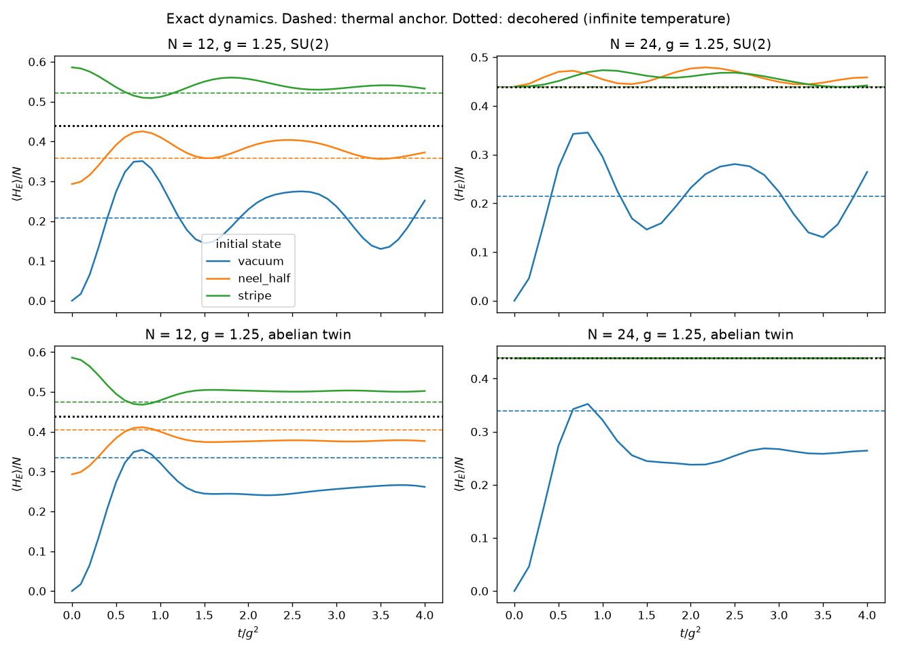
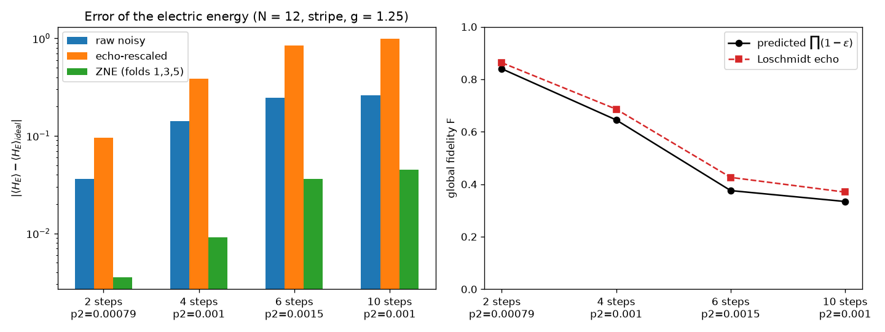
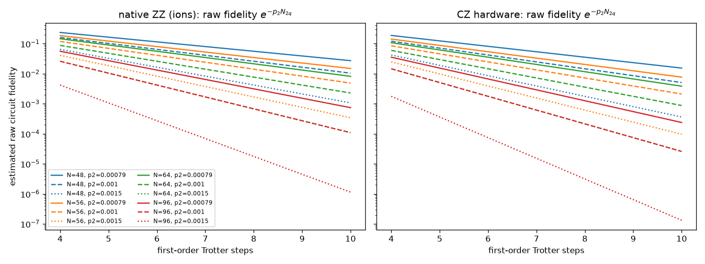
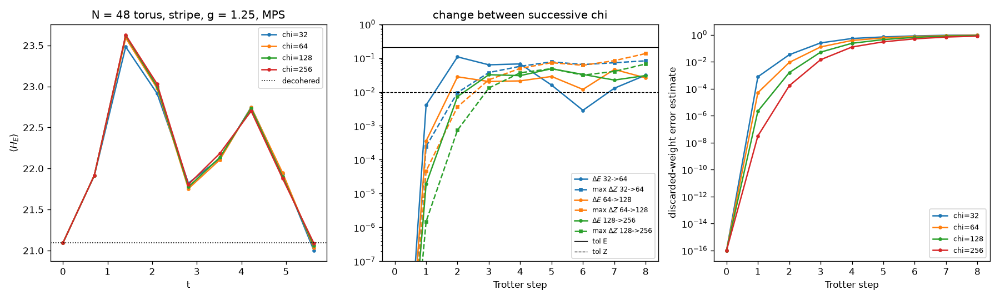
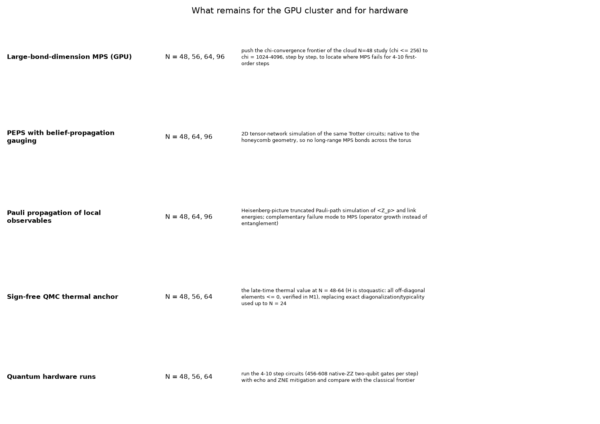

# SU(2) torus frontier run — collaborator summary (cloud phase, pre-cluster)

Every number taken from a result file carries a hidden tag. `python3 scripts/check_summary.py` re-reads them from the JSON files and checks them. Technical terms are defined in the Glossary at the end.

## 1. What is being asked
We want a lattice-gauge-theory simulation that a quantum computer can run and that is hard to reproduce classically. The model is the minimal truncation of pure SU(2) gauge theory on the triangular lattice, with one qubit per plaquette (Ciavarella et al.). The plaquettes form a honeycomb graph, and the Hamiltonian is
$$H=\frac{3g^2}{16}\sum_{\langle pq\rangle}(1-Z_pZ_q)\;-\;\frac1{g^2}\sum_p\Big[\prod_{q\in nb(p)}c(n_q)\Big]X_p,\qquad c(0)=1,\ c(1)=\tfrac12 .$$
The *abelian twin* sets $c\equiv1$ (transverse-field Ising model) and is the control.

The cloud phase had to deliver four things before any GPU-cluster time is spent:
- validated code;
- exact small-system physics;
- a noisy-hardware emulation with error mitigation;
- MPS classical-simulation code, with evidence of where it stops converging at N = 48.

## 2. What was done (milestones M1–M6, all with locked acceptance tests)
- **Model and circuits.** The circuits match brute-force matrices to $10^{-12}$. A first-order Trotter step costs exactly $9.5n$ two-qubit gates on trapped ions (native $ZZ$) and $11n$ on CZ hardware, as claimed.
- **Exact dynamics** at N = 12 and 24, with thermal anchors (§3).
- **Noisy emulation and mitigation** at N = 12 (§4).
- **Classical code for the cluster.** MPS code, a resource table, config-driven runs and Slurm templates (§5).
- **MPS convergence study** at N = 48 (§6).

## 3. Exact dynamics and the thermal / decohered anchors

Figure (i): electric energy per plaquette versus $t/g^2$ for the SU(2) model and its abelian twin at N = 12 and N = 24, $g=1.25$. Dashed lines are thermal anchors; the dotted line is the decohered value. Data: `results/m3/summary.json`.

- **Thermalization.** From the vacuum, the SU(2) model relaxes toward a thermal state at $\beta=$ <!--num:results/m3/summary.json#runs/N=24,g=1.25,state=vacuum,model=su2/thermal/beta-->1.440 (N = 24). At N = 12 it is $\beta=$ <!--num:results/m3/summary.json#runs/N=12,g=1.25,state=vacuum,model=su2/thermal/beta-->1.448. The two agree within the typicality uncertainty ($\pm0.04$ at N = 24, from 4 random vectors), so no finite-size shift is resolved.
- **SU(2) versus abelian twin.** At $g\le1.25$ the abelian twin relaxes more slowly; at $g=1.4$ both reach their anchors within about 4% (details in `reports/m3_physics.md`). Its thermal electric energy is <!--num:results/m3/summary.json#runs/N=24,g=1.25,state=vacuum,model=abelian/thermal/electric_energy-->8.13, against <!--num:results/m3/summary.json#runs/N=24,g=1.25,state=vacuum,model=su2/thermal/electric_energy-->5.15 for SU(2).
- **Stripe and Néel-half sit at infinite temperature on even-$L_1$ tori.** In these states exactly half the bonds are cut, so $\beta=0$ on the N = 24 and N = 48 tori, and their late-time values coincide with the decohered values. For the abelian twin, $\langle H_E\rangle(t)$ is then exactly constant, by a symmetry described in `reports/m3_physics.md`.
- **Recommended physics target:** the SU(2) vacuum at $g\approx1.25$–$1.4$.

## 4. Noisy emulation and mitigation (N = 12, stripe, $g=1.25$, $\delta t=0.45g^2$)

Figure (ii): left, errors of $\langle H_E\rangle$ for raw noisy, echo-rescaled and zero-noise-extrapolated values in four (steps, $p_2$) configurations; right, predicted versus echo-measured global fidelity. Data: `results/m4/noise_runs.json`.

At 10 steps with $p_2=10^{-3}$ there are 1140 two-qubit gates:

| quantity | value |
|---|---|
| noiseless circuit $\langle H_E\rangle$ | <!--num:results/m4/noise_runs.json#configs/steps=10/ideal_electric_energy-->6.27 |
| raw noisy value | <!--num:results/m4/noise_runs.json#configs/steps=10/raw_electric_energy-->6.01 |
| zero-noise extrapolation | <!--num:results/m4/noise_runs.json#configs/steps=10/zne_electric_energy-->6.22 |
| predicted global fidelity $\prod(1-\epsilon)$ | <!--num:results/m4/noise_runs.json#configs/steps=10/F_predicted-->0.334 |
| Loschmidt-echo fidelity | <!--num:results/m4/noise_runs.json#configs/steps=10/F_echo-->0.370 |

ZNE reduces the error 5.8–15.5× in all four configurations. Rescaling by the *global* fidelity over-corrects local observables and should not be used.

## 5. Resources for the frontier tori

Figure (iii): estimated raw circuit fidelity $e^{-p_2N_{2q}}$ versus number of first-order steps, for N = 48, 56, 64, 96 and $p_2\in\{7.9\times10^{-4},10^{-3},1.5\times10^{-3}\}$. Data: `results/m5/resources.json`.

At N = 48 a first-order step needs <!--num:results/m5/resources.json#tori/N=48/per_step/native_zz-->456 native-$ZZ$ two-qubit gates. With $p_2=10^{-3}$ the raw fidelity is <!--num:results/m5/resources.json#rows/N=48,steps=4,gate_set=native_zz,p2=0.001/raw_fidelity-->0.161 after 4 steps and <!--num:results/m5/resources.json#rows/N=48,steps=10,gate_set=native_zz,p2=0.001/raw_fidelity-->0.0105 after 10. ZNE was validated here down to $F\approx0.33$; that makes about 4 steps at N = 48 ($F\approx0.16$–$0.24$ raw) a plausible but not yet validated hardware target with $p_2\lesssim10^{-3}$. N = 96 at 10 steps is not (raw fidelity <!--num:results/m5/resources.json#rows/N=96,steps=10,gate_set=native_zz,p2=0.0015/raw_fidelity-->1.15e-6 at $p_2=1.5\times10^{-3}$).

The MPS code reproduces the exact Trotter state at N = 24 with bond dimension 256 to fidelity <!--num:results/m5/mps_check.json#runs/N=24/fidelity-->0.999999999 (4 steps, $\delta t=0.2$).

## 6. Where MPS stops converging at N = 48

Figure (iv): N = 48 ($4\times6$) torus, stripe state, $g=1.25$, $\delta t=0.703$ ($2\delta t/g^2=0.9$), 8 first-order steps at $\chi=32,64,128,256$. Left: $\langle H_E\rangle(t)$. Middle: change between successive $\chi$, against the tolerances. Right: the discarded-weight error estimate. Data: `results/m6/convergence.json` and `results/m6/n48_stripe_g1.25.json`.

- **Criterion.** At each step, successive bond dimensions must agree in $\langle H_E\rangle$ to 1% of the decohered value (<!--num:results/m6/convergence.json#tol_electric_energy-->0.211) and in every $\langle Z_p\rangle$ to 0.01.
- **Headline.** $\chi=256$ agrees with $\chi=128$ through step <!--num:results/m6/convergence.json#last_converged_step/2-->2, i.e. $t=$ <!--num:results/m6/convergence.json#steps/2/time-->1.41.
  - Step 3 is marginal: the largest plaquette-magnetization difference is <!--num:results/m6/convergence.json#steps/3/d_z_max/2-->0.013, with 4 of 48 plaquettes over the 0.01 tolerance, and the gap roughly halves with each doubling of $\chi$.
  - From step 4 on, the results are clearly unconverged.
- **Truncation error.** The error estimate is cumulative, $1-\prod_k(1-w_k)$ over all truncations. By step 8 it is <!--num:results/m6/convergence.json#steps/8/error_estimate/3-->0.79 for $\chi=256$, i.e. an estimated overlap of only about 0.21 with the untruncated state. The weight kept per Trotter step falls from 0.986 at step 3 to about 0.64 at steps 7–8.
- **Why the energy alone is misleading.** $\langle H_E\rangle$ varies between 21.0 and 23.6 during the run, yet successive $\chi$ agree on it to within 0.11 at every step (`last_converged_step_electric_energy` = <!--num:results/m6/convergence.json#last_converged_step_electric_energy/2-->8). It is a sum over 72 bonds, so its tolerance acts on an average, while the $Z$ test takes the maximum over plaquettes. Local magnetizations are the sensitive probe.
- **Cost.** The $\chi=256$ run took <!--num:results/m6/n48_stripe_g1.25.json#runs/chi=256/wall_time_s-->6935 s with single-threaded linear algebra on a shared cloud machine, close to the 2 h cloud limit.
- **What it means.** At these step sizes, exact-quality classical MPS simulation at N = 48 fails after 2–3 Trotter steps at $\chi\le256$. Larger $\chi$ (GPU) and 2D methods must show whether 4–8 steps are reachable classically. That decides the advantage claim.

## 7. What remains for the GPU cluster and hardware

Figure (v): remaining classical and hardware work with target sizes. Data: `results/m6/roadmap.json`.

1. **Large-$\chi$ MPS on GPU.** Use $\chi=1024$–$4096$ at N = 48–96 to push the convergence frontier of §6 (`configs/n96_stripe_g1.25_gpu.json`, `scripts/slurm/mps_gpu.sbatch`).
2. **PEPS with belief-propagation gauging.** A 2D tensor network matched to the honeycomb geometry.
3. **Pauli propagation** of local observables, which fails in a different way from MPS.
4. **Sign-free quantum Monte Carlo** for the thermal anchor at N = 48–64. This is possible because $H$ is stoquastic, as verified in M1. **Caveat (M6 audit):** at $2\delta t/g^2=0.9$ the Trotter circuit departs strongly from continuous-time dynamics. In an exact N = 12/16 check from the vacuum, Trotter $\langle H_E\rangle/E_\infty$ was 0.54 against 0.31 exact at step 8, and $\langle H\rangle$ drifted by up to +3.1. A thermal anchor of $H$ is therefore the right reference only if $\delta t$ is reduced; settle $\delta t$ before spending on QMC.
5. **Hardware runs** of 4–10 steps with echo and ZNE.

**Decision for the team.** Use an initial state that is not at $\beta=0$, such as the vacuum or a state with an odd number of excited rows, for the physics comparison at N = 48–64.

## 8. Problems and assumptions
- **Noise model.** Depolarizing and Markovian only; no coherent errors or crosstalk.
- **ZNE statistics.** ZNE was evaluated with exact (infinite-shot) values; on hardware it amplifies shot noise by about 2.3×.
- **Open-lattice $H_E$ form.** METHODS writes two forms of $H_E$ as equal, but they agree only when every plaquette has three neighbours. The code uses the bond form, which matters only on open lattices.
- **Large Trotter step.** $2\delta t/g^2=0.9$ (M4, M6) makes the circuit a Floquet-like evolution that differs strongly from $e^{-iHt}$. Comparisons with thermal anchors of $H$ are therefore approximate at this $\delta t$.
- **Thermal anchors at N = 24** use quantum typicality with 4 random vectors and a Chebyshev $e^{-\beta H/2}$ instead of `expm_multiply`, for speed. A unit test shows they agree.

## Glossary
- **Plaquette**: an elementary triangle of the lattice. Here each plaquette is one qubit: $|1\rangle$ means the plaquette carries one unit of SU(2) electric flux around it.
- **Trotter step**: an approximation of $e^{-iH\delta t}$ by a product of exponentials of the parts of $H$ ($H_E$, then the two sublattice magnetic parts). It is exact as $\delta t\to0$.
- **Matrix product state (MPS)**: a classical representation of a many-qubit state as a chain of tensors. Its cost grows with the entanglement across each cut of the chain.
- **Bond dimension ($\chi$)**: the maximum size of the indices that link MPS tensors. Larger $\chi$ captures more entanglement at higher cost ($\propto\chi^3$).
- **Fidelity**: the overlap $|\langle\psi|\phi\rangle|^2$ between two states; 1 means identical. A circuit's global fidelity is the probability that it ran without any error.
- **Decohered value**: the value an observable takes in the maximally mixed (infinite-temperature) state, which is what a completely noisy quantum computer outputs.
- **Thermal value (anchor)**: the canonical average $\mathrm{Tr}(e^{-\beta H}O)/Z$ at the temperature fixed by the initial energy. A thermalizing system approaches it at late times.
- **Loschmidt echo**: run a circuit forward and then backward and measure the probability of returning to the start. This estimates the circuit's global fidelity.
- **Zero-noise extrapolation (ZNE)**: deliberately amplify the noise (here by gate folding, factors 1, 3, 5) and extrapolate the measured values back to zero noise.
- **PEPS**: projected entangled pair state, the 2D generalization of an MPS.
- **Belief propagation**: an approximate message-passing method used to gauge and contract PEPS tensor networks efficiently.
- **Pauli propagation**: simulating observables in the Heisenberg picture as sums of Pauli strings, truncating small or high-weight terms.
- **Quantum Monte Carlo (QMC)**: stochastic sampling of thermal averages. It is free of the sign problem when all off-diagonal elements of $H$ are $\le0$ (stoquastic), as here.
