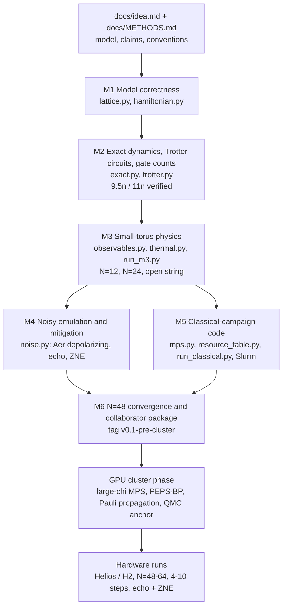
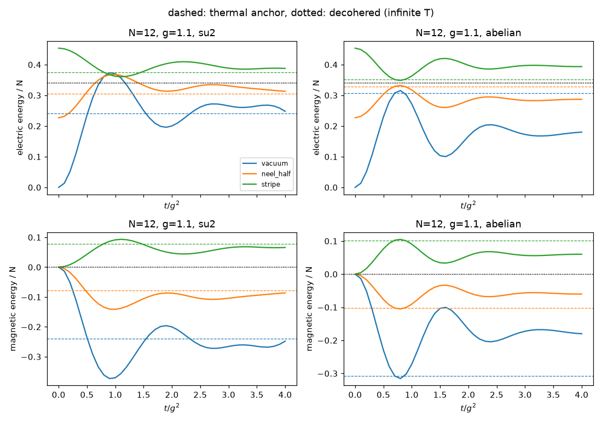
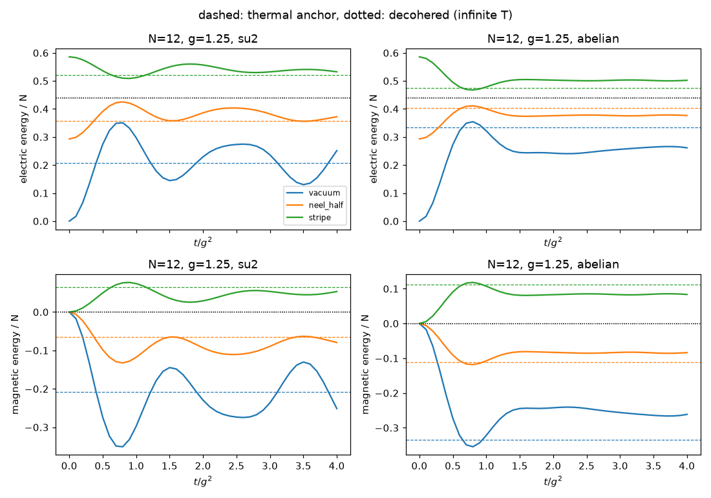
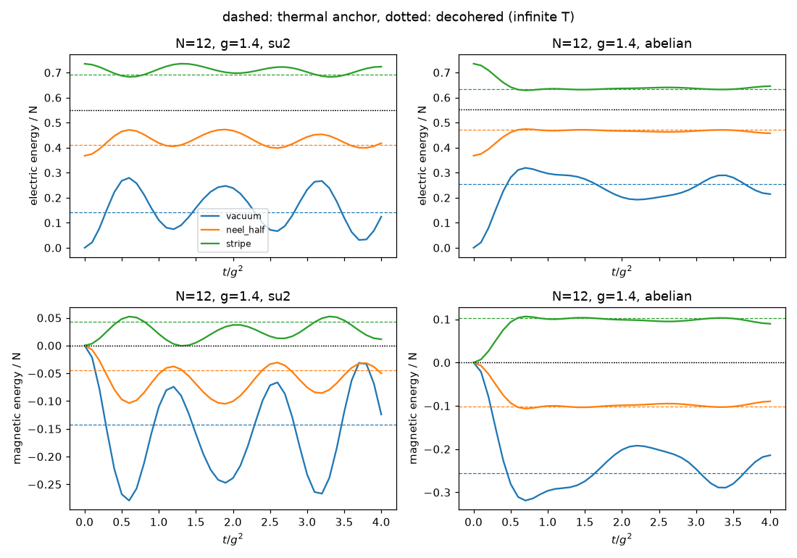
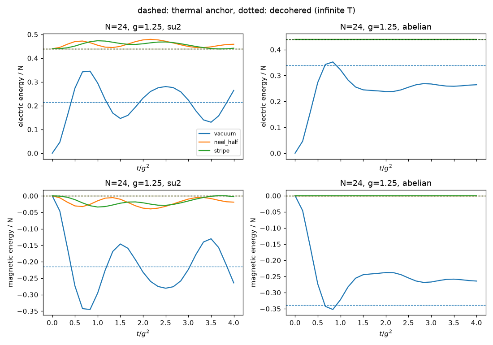
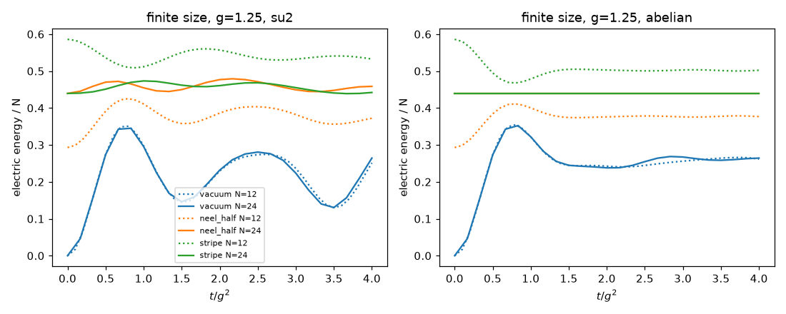
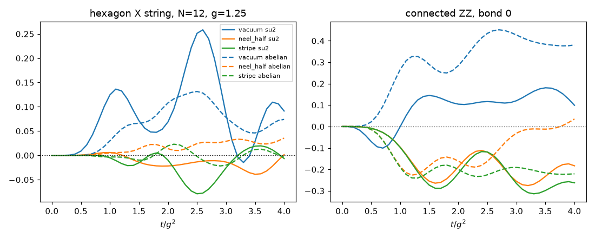
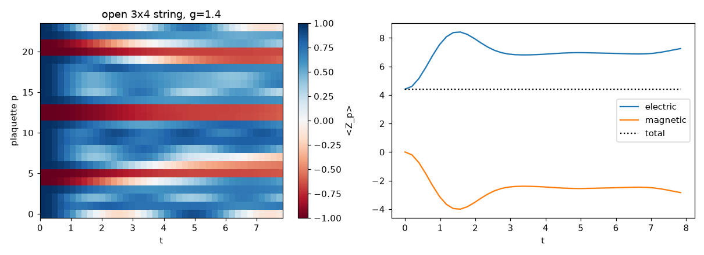
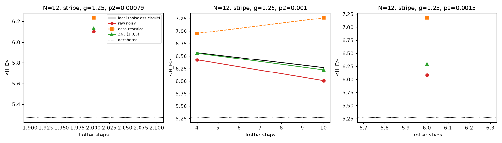

# su2qc-qcadvantage: final project report for Digonto (cloud phase M1 to M6)

*Prepared 2026-10-06 for Digonto (physicist, project owner). Final state of the repository: commit `6e47dcf`, local tag `v0.1-pre-cluster`. Every number below was read from the final JSON result files or from the reports and audits in the repository; nothing was re-simulated for this report. Plain English; mathematics in LaTeX; each technical term is defined where it first appears (a short glossary is at the end).*

## Contents
1. Executive summary
2. The physics and the quantum-advantage argument
3. How the project reaches its goal (pipeline, milestones, locked tests, audits)
4. Repository layout
5. Results by milestone (M1 to M6, then the audits)
6. Data for plotting (every figure: what it shows, the data as CSV, and re-plot code)
7. Known issues and decisions for Digonto
8. What remains (cluster roadmap)
9. Glossary

---

## 1. Executive summary

**What was asked.** Build and validate, without a GPU cluster, everything that the "SU(2) torus frontier run" of `docs/idea.md` needs: the model and its quantum circuits, exact small-system physics, a noisy-hardware emulation with error mitigation, classical tensor-network (MPS) simulation code, and evidence about where classical simulation stops converging at 48 plaquettes. The frontier run itself is a *quench* (a sudden start from a simple product state that then evolves under the full Hamiltonian) of the minimally truncated $(2+1)$-dimensional SU(2) lattice gauge theory on a periodic lattice (a *torus*) of 48 to 64 plaquettes, to be run on trapped-ion quantum computers for 4 to 10 Trotter steps.

**What was done.** Six milestones, M1 to M6, were built in order. Each milestone has acceptance tests that are written before the implementation and then *locked* (hashed, so they cannot be edited). Each milestone passed an independent audit by a separate reviewer agent; where the audit found problems, they were fixed (Section 5.7).

**Status.** All six milestones are done, the full test suite shows **167 passed**, the audits passed after fixes (M1 PASS; M2, M4, M5 PASS; M3 report text fixed after three blocking findings; M6 PASS-WITH-FIXES, three text fixes applied), and the repository is tagged `v0.1-pre-cluster` (locally; see decision 4 below). Work stopped there, as the project rules require.

| Milestone | Content | Key result | Audit |
|---|---|---|---|
| M1 | Lattice and Hamiltonian | Sparse, Pauli and matrix-free forms agree with brute force to $\sim4\times10^{-15}$ | PASS |
| M2 | Exact evolution, Trotter circuits, gate counts | $9.5n$ (native ZZ) and $11n$ (CZ) two-qubit gates per first-order step, exactly as claimed | PASS |
| M3 | Small-torus physics, N = 12 and 24, open string | 24 runs plus string; energy conserved to $<10^{-7}$; stripe and Neel-half sit at infinite temperature on even-$L_1$ tori | text fixed (B1 to B3) |
| M4 | Noisy emulation and mitigation, N = 12 | Zero-noise extrapolation (ZNE) cuts the error of $\langle H_E\rangle$ by 5.8 to 15.5 times in 4 of 4 configurations | PASS |
| M5 | MPS code, resource table, cluster entry points | MPS equals the exact state at N = 24 to $1-F=1.1\times10^{-9}$ | PASS |
| M6 | N = 48 convergence study, collaborator package | MPS converged through step 2, marginal at step 3, unconverged from step 4 (bond dimension up to 256) | PASS-WITH-FIXES |

**Headline numbers.**
- Two-qubit gates per plaquette per first-order Trotter step on a torus: **9.5** (native ZZ) and **11.0** (CZ hardware). At N = 48 that is 456 gates per step.
- Raw circuit fidelity $e^{-p_2N_{2q}}$ at N = 48 with $p_2=10^{-3}$: 0.161 after 4 steps and 0.0105 after 10 steps. Zero-noise extrapolation was validated only down to a circuit fidelity of about 0.33.
- ZNE error reduction: **5.8 to 15.5 times** at 2 to 10 steps (N = 12). Rescaling by the global echo fidelity makes the error 2.7 to 3.8 times *worse*.
- Loschmidt-echo fidelity agrees with the noise-model prediction to within 3 to 13% (limit 25%).
- MPS at bond dimension $\chi=256$ reproduces the exact Trotter state: $1-F=2.1\times10^{-10}$ (N = 12) and $1.1\times10^{-9}$ (N = 24), with $\delta t=0.2$.
- N = 48 torus, stripe, $g=1.25$, $2\delta t/g^2=0.9$, 8 steps, $\chi=32,64,128,256$: **converged through step 2** ($t=1.41$), **marginal at step 3** (largest change of a plaquette magnetization $\langle Z_p\rangle$ between $\chi=128$ and 256 is 0.013 against a tolerance of 0.01), **unconverged from step 4**. Cumulative truncation error estimate at step 8 for $\chi=256$: 0.79. Wall times 75 / 265 / 1201 / 6935 s for $\chi=32/64/128/256$.
- The vacuum start is the clean physics target: inverse temperature $\beta=1.448$ (N = 12, exact) and $1.44\pm0.04$ (N = 24, typicality).
- **Surprise:** the stripe and Neel-half initial states have $\beta=0$ (they look like infinite temperature) on tori with an even number of cells in the first direction, including the N = 48 frontier torus. The PLAN prescribes the stripe, so this needs your decision.

**Decisions waiting for Digonto** (from `notes/STATUS.md`; details in Section 7):
1. **Initial state at N = 48 to 64.** The stripe is at $\beta=0$ there (thermal value equals decohered value). Recommendation: the SU(2) vacuum ($\beta\approx1.4$) or a state with an odd number of excited rows. Evidence: `reports/m3_physics.md` section on $\beta=0$.
2. **Open-lattice $H_E$ form.** The code uses the bond form; METHODS' $3n_p$ form differs on open lattices (string $E_E(0)=4.41$ versus 5.88). Evidence: `reports/audits/m1_audit.md`, item N1.
3. **Trotter step $2\delta t/g^2=0.9$.** It departs strongly from $e^{-iHt}$ (audit: N = 12/16 Trotter $\langle H_E\rangle=0.54$ of the decohered value against 0.31 exact at step 8). Decide $\delta t$ before spending cluster time on a thermal anchor (QMC). Evidence: `reports/audits/m6_audit.md`, B3.
4. **Tags are local only.** The proxy accepts branch pushes only. Run `git push origin --tags` from a machine with tag-push rights.

---

## 2. The physics and the quantum-advantage argument

### 2.1 What was asked
Explain the model and why a quantum computer might beat classical computers on it, using only what is established in `docs/idea.md`, `docs/METHODS.md` and the cited paper (Ciavarella, de Putter, Younis, Rrapaj, arXiv:2608.28752).

### 2.2 The model
In Hamiltonian *lattice gauge theory* (LGT) space is a lattice and time is continuous. The gauge field lives on the links. The energy has an *electric* part (a cost per unit of flux on a link) and a *magnetic* part (an operator that flips the flux around a *plaquette*, the smallest closed loop). *Gauss's law* is the constraint that flux lines cannot end in empty space. The *minimal truncation* keeps only the lowest SU(2) link states (spin $j\le\tfrac12$); the *local Krylov* construction builds the kept states by acting with plaquette operators on the empty vacuum, which satisfies Gauss's law automatically. The result is **one qubit per plaquette**: $|0\rangle$ is unexcited and $|1\rangle$ is excited ($n_p=1$, $Z_p=-1$). The basis index is $b=\sum_pn_p2^p$ (Qiskit little-endian).

On the triangular lattice, each triangle shares a link with exactly three others, so the plaquettes form a **honeycomb graph** (bipartite: sublattice A is the 'up' triangles, B the 'down' triangles). A torus with $L_1\times L_2$ cells has $N=2L_1L_2$ plaquettes, $3N/2$ bonds, and the plaquette index $p=2(iL_2+j)+\text{kind}$. With $\langle pq\rangle$ the bonds and $nb(p)$ the three neighbours of $p$:

$$H=H_E+H_B,\qquad H_E=\frac{3g^2}{16}\sum_{\langle pq\rangle}(1-Z_pZ_q)=\frac{g^2}{2}\sum_{\langle pq\rangle}E^2_{pq},\quad E^2_{pq}=\tfrac38(1-Z_pZ_q),$$
$$H_B=\sum_pa_pX_p,\qquad a_p=-\frac1{g^2}\prod_{q\in nb(p)}c(n_q),\quad c(0)=1,\ c(1)=\tfrac12 .$$

$H_E$ is a ferromagnetic Ising coupling (a flux line is a domain wall). $H_B$ flips plaquette $p$ with amplitude $1/g^2$ **halved for every excited neighbour**. That factor $\tfrac12$ is the SU(2) recoupling, and it is the only place where the non-Abelian structure survives at this truncation. In Pauli form $c(n_q)=(3+Z_q)/4$. The *abelian twin* sets $c\equiv1$; it is the transverse-field Ising model on the honeycomb graph and serves as the control. The two models run on identical qubits at identical depth and differ only by the factors of $\tfrac12$. $H$ is *stoquastic* (all off-diagonal elements $-\frac1{g^2}\prod c\le0$ in the $Z$ basis), so its *thermal* properties can be computed classically with sign-free quantum Monte Carlo (QMC) at any size, while its real-time dynamics cannot.

### 2.3 Circuits and observables
A *Trotter step* approximates $e^{-iH\delta t}$ by a product of exponentials of the parts $H_E$, $H_B^A$, $H_B^B$ (the two sublattice parts of $H_B$, each a sum of commuting terms). Order 1: $U(\delta t)=U_B(\delta t)U_A(\delta t)U_E(\delta t)$ with $U_E$ first. Order 2: $U_E(\tfrac{\delta t}2)U_A(\tfrac{\delta t}2)U_B(\delta t)U_A(\tfrac{\delta t}2)U_E(\tfrac{\delta t}2)$. $U_E$ is one `rzz` gate per bond ($1.5$ per plaquette). Each plaquette flip is a *uniformly controlled* $R_z$ (a rotation whose angle depends on the control qubits) built with a Gray code and $2^3=8$ `cx` gates. Total $8+1.5=9.5$ two-qubit gates per plaquette per step on native-ZZ hardware (trapped ions), and 11 on CZ hardware where an `rzz` costs 2.

Observables: $\langle Z_p\rangle$, link energies $\langle E^2_{pq}\rangle$, connected $\langle Z_pZ_q\rangle_c$, $\langle H_E\rangle$ (called $E_E$), $\langle H_B\rangle$ ($E_B$), and the closed-hexagon string $\langle\prod_{p\in\text{hex}}X_p\rangle$. The total energy $E_E+E_B$ is conserved by the exact dynamics. Initial product states (all gauge invariant): `vacuum` (nothing excited), `neel_half` (up plaquettes with $i<\lfloor L_1/2\rfloor$), `stripe` (up plaquettes with even $i$), `string` (a line of excited plaquettes across an open lattice).

**Two reference values for late times.** (i) The **decohered (infinite-temperature) value** is what a fully depolarized quantum computer returns: link energy $3/8$, $\langle H_E\rangle_\infty=\frac{g^2}{2}\cdot\frac38\cdot n_\text{bonds}$, and $0$ for $H_B$, $Z_p$, connected $ZZ$ and the hexagon string. An observable whose late-time value lies within 10% of this is **flagged**: it cannot distinguish a working device from a dead one. (ii) The **thermal anchor** is the canonical average $\mathrm{Tr}(e^{-\beta H}O)/Z$ at the inverse temperature $\beta$ for which $\langle H\rangle_\beta$ equals the initial energy ($\beta<0$ means negative temperature). A closed chaotic system is expected to approach it (*eigenstate thermalization hypothesis*, ETH). For $n\le14$ it comes from full diagonalization; at $n=24$ from *quantum typicality* (a random vector $\psi$ gives $\langle\psi|e^{-\beta H/2}Oe^{-\beta H/2}|\psi\rangle/\langle\psi|e^{-\beta H}|\psi\rangle\approx$ the thermal value).

### 2.4 The quantum-advantage argument
No theorem says that real-time dynamics of a Kogut-Susskind gauge theory is classically hard. 'Advantage' here therefore means the empirical standard of the 2026 beyond-classical papers: a regime where every known classical method is unconverged or mutually inconsistent, while the quantum data pass an independent trust ladder and are posted for classical attack (the Quantum Advantage Tracker). The case in `docs/idea.md`:
- **1+1D SU(2) is lost to MPS.** A laptop MPS with $\chi=800$ reproduced the 120-qubit IBM run.
- **Open lattices on 156-qubit IBM chips stay within MPS reach** (MPS cut at most 13 bonds). **A torus doubles the cut**; Quantinuum's 56-qubit periodic Ising run already defeated $\chi=4000$ MPS beyond 9 steps.
- **All-to-all trapped-ion connectivity makes the torus free.** Helios: 98 qubits, two-qubit infidelity $7.9\times10^{-4}$. H2: 56 qubits, about $10^{-3}$. IBM Heron: about $1.5\times10^{-3}$.
- **Step size.** Choosing $2\delta t/g^2\approx0.9$ rad and 7 to 9 steps reaches $t/g^2\approx3$ to 4, past the point where classical large-scale methods disagree for near-critical 2D quenches.
- **Cost.** 9.5 gates per plaquette per step; the 48-plaquette torus needs 456 per step, so 8 steps are 3648 gates (raw fidelity of a few percent on Helios). The 96-plaquette torus (about 8000 gates for 9 steps) escapes MPS by construction but needs two-qubit error near $4$ to $5\times10^{-4}$.

**Honest risk** (from `docs/idea.md`): at 48 to 64 plaquettes and 7 to 9 steps the run sits at the scale of the existing Quantinuum claim, and a very large MPS ($\chi\sim10^5$) might still reproduce it. The claim is about the truncated Hamiltonian ($j_{\max}=1/2$), not the continuum theory. The cloud phase adds two cautions of its own (Section 5.3 and 5.6): the stripe state is physically uninformative at N = 48, and at $2\delta t/g^2=0.9$ the circuit is far from continuous-time dynamics.

---

## 3. How the project reaches its goal

### 3.1 What was asked
Bring everything that can be built and validated without a GPU cluster to a finished, tested and documented state, together with an evidence package for collaborators (`plan/PLAN.md`).

### 3.2 Pipeline



**Role of each milestone.**
- **M1** fixes the model and conventions (bit order, neighbour rule, hexagons). Everything downstream is only as trustworthy as this.
- **M2** provides exact time evolution (Chebyshev expansion and `expm_multiply`, which apply $e^{-iHt}$ to a vector without building the matrix), the Trotter circuits, and the measured gate counts.
- **M3** gives exact small-size anchors (N = 12 and 24) with thermal and decohered lines, used to choose coupling, initial state and observables, and to flag observables that decoherence would fake.
- **M4** tests, on 12 qubits, whether hardware-level noise at frontier-like gate counts can be mitigated.
- **M5** makes the same circuits runnable as an MPS (the classical baseline), produces the resource table for the frontier tori, and provides config-driven entry points and Slurm templates with placeholders only.
- **M6** measures where MPS stops converging at N = 48 and packages everything (collaborator summary, figures, number checker, roadmap).

### 3.3 Process: roles, locked tests and audits


- The **builder/coordinator** (main session, Sonnet 5.5) writes code, unit tests, runs, commits and `notes/STATUS.md`.
- The **reviewer** (Opus 5.5) writes the acceptance tests for M4 to M6 from the PLAN criteria *before* any implementation, and audits every milestone gate independently. Acceptance tests for M1 to M3 were pre-written.
- The **fixer** (Opus 5.5) is called only after 3 failed attempts on one test. It was never needed (the attempt log in STATUS is empty).
- **Locked tests.** Acceptance tests for M1 to M6, the shared reference `_ref.py`, `conftest.py`, `tools/check_lock.py`, `tools/lock.py` and `.claude/` are hashed in `tests/acceptance/LOCK.json`; a hook blocks edits and `python3 tools/check_lock.py` must print `LOCK OK`. A locked test that looks wrong is never edited; the evidence goes to STATUS and the run stops.
- **Stop rules.** Three failures plus the fixer; a package that cannot be installed; a job above 12 GB RAM or 2 h CPU; failure of the model or cost claims (G2, G3, G5, G8) after the fixer; and completion of M6.

---

## 4. Repository layout

Every tracked file or directory, one line each. `logs/` is git-ignored but exists locally.

```text
su2qc-qcadvantage/
|-- CLAUDE.md                      project rules for the coding agent: roles, build loop, stop rules, credit-saving rules
|-- START_HERE.md                  how to upload the repository to GitHub and start a cloud session
|-- README.md                      overview, layout, and the reproduction commands with run times
|-- requirements.txt               numpy, scipy, qiskit, qiskit-aer, matplotlib, pytest, quimb, numba (unpinned)
|-- pytest.ini                     test configuration (testpaths = tests, pythonpath = .)
|-- .gitignore                     ignores caches, logs/, scratch/ and large array files
|-- .claude/                       agent configuration (protected by the lock hook)
|   |-- settings.json              permissions and hook wiring
|   |-- agents/reviewer.md         definition of the reviewer subagent (test writer and auditor)
|   |-- agents/fixer.md            definition of the fixer subagent (escalation only)
|   `-- hooks/guard.py, session_start.sh   block edits to locked files; session start checks
|-- claude-setup-backup/           copy of the agent setup in case hidden folders are lost on upload
|-- docs/
|   |-- idea.md                    the idea, literature check, hardware fit and 6-9 month plan
|   `-- METHODS.md                 binding specification: lattice, H, bit order, circuits, gate counting, outputs
|-- plan/PLAN.md                   milestones M1-M6 with acceptance criteria
|-- notes/STATUS.md                progress record, attempt log, decisions waiting for Digonto
|-- su2torus/                      the Python package
|   |-- __init__.py                package marker
|   |-- lattice.py                 honeycomb plaquette graph on tori and open lattices, hexagons, initial states
|   |-- hamiltonian.py             H_E, H_B: sparse matrices, Pauli form, numba matrix-free apply_h, Chebyshev recurrence
|   |-- exact.py                   exact time evolution (expm_multiply and Chebyshev), spectral bounds
|   |-- trotter.py                 order-1 and order-2 Trotter circuits (Qiskit) and two-qubit gate counts
|   |-- observables.py             Z, link energies, connected ZZ, H_E, H_B, hexagon string (fast numba path above n=16)
|   |-- thermal.py                 thermal anchors: full diagonalization (n<=14), Chebyshev typicality (n=24), beta search
|   |-- noise.py                   Aer depolarizing + readout noise, Loschmidt echo, gate folding, ZNE
|   `-- mps.py                     quimb CircuitMPS simulation of the same Trotter circuits, observables, error estimate
|-- scripts/
|   |-- gate_counts.py             M2: gate counts per plaquette per step -> results/m2/gate_counts.json
|   |-- run_m3.py                  M3: N=12, N=24, open-string runs, assembly, figures -> results/m3
|   |-- run_m3_batch.sh            M3 driver: N=12, string, six N=24 runs (one process each), assemble
|   |-- run_m4.py                  M4: exact noisy density-matrix runs, echo, ZNE -> results/m4
|   |-- run_m5_check.py            M5: MPS (chi=256) versus exact statevector at N=12 and 24 -> results/m5/mps_check.json
|   |-- resource_table.py          M5: gates and raw fidelity for N=48, 56, 64, 96 -> results/m5/resources.json
|   |-- run_classical.py           config-driven MPS campaign (cluster entry point)
|   |-- analyze_convergence.py     M6: per-step chi convergence -> results/m6/convergence.json
|   |-- make_figures.py            M6: reports/figures/fig1..fig5 from the JSON files
|   |-- check_summary.py           re-reads every tagged number of collaborator_summary.md from the JSON and checks it
|   `-- slurm/mps_cpu.sbatch, mps_gpu.sbatch   cluster job templates with <PARTITION>, <ACCOUNT>, <ENV> placeholders only
|-- configs/
|   |-- n48_stripe_g1.25.json      the cloud N=48 MPS campaign (chi 32-256, numpy backend)
|   `-- n96_stripe_g1.25_gpu.json  cluster template: N=96, chi 256-2048, cupy backend
|-- tests/
|   |-- acceptance/                locked milestone tests: m1..m6 (+ _ref.py brute-force reference, conftest.py, LOCK.json)
|   `-- unit/                      builder's unit tests: exact, hamiltonian, observables, thermal
|-- tools/check_lock.py, lock.py   verify and create the sha256 lock of acceptance tests
|-- results/
|   |-- m2/gate_counts.json        gate counts, 16 lattice/model/order rows
|   |-- m3/summary.json            24 exact runs (18 at N=12, 6 at N=24): time series, thermal and decohered anchors, flags
|   |-- m3/string_open_3x4_g1.4.json   open 3x4 string quench time series
|   |-- m3/parts/*.json            per-run intermediate files and spectral bounds that assemble into summary.json
|   |-- m3/figures/*.png           7 M3 figures
|   |-- m4/noise_runs.json         4 noisy configurations with ideal, raw, echo-rescaled and ZNE values, fidelities
|   |-- m4/figures/noise_mitigation.png   raw versus mitigated <H_E> versus steps
|   |-- m5/mps_check.json          MPS versus exact at N=12 and 24
|   |-- m5/resources.json          168 rows: gates and raw fidelity for 4 tori x 7 step counts x 2 gate sets x 3 p2
|   |-- m6/n48_stripe_g1.25.json   N=48 MPS runs at chi=32, 64, 128, 256 (energies, Z, error estimates, wall times)
|   |-- m6/convergence.json        per-step chi-to-chi differences and convergence verdicts
|   `-- m6/roadmap.json            five cluster/hardware work items with sizes and needs
|-- reports/
|   |-- project_report.md          this report
|   |-- collaborator_summary.md    plain-English evidence package with 20 verified numbers
|   |-- m2_gate_counts.md          M2 gate-count report
|   |-- m3_physics.md              M3 physics report (curves, flags, recommendation)
|   |-- m4_noise.md                M4 noise and mitigation report
|   |-- audits/m1_audit.md, m2_m5_audit.md, m6_audit.md   independent reviewer audits
|   `-- figures/fig1..fig5 *.png   collaborator-summary figures
`-- logs/m3.log, m4.log, m5_check.log, m6_n48.log   run logs (git-ignored)
```

---

## 5. Results by milestone

### 5.1 M1: lattice and Hamiltonian
**Asked.** Implement the honeycomb plaquette graph and $H$ so that they match the specification and an independent brute-force reference (locked tests G1 to G5).
**Done and checked** (reviewer audit, `reports/audits/m1_audit.md`): the bit order $b=\sum_pn_p2^p$ is respected; the neighbour rule of METHODS section 1 is implemented exactly; the hexagon cyclic order was verified by hand; the Pauli form and the sparse form agree with the brute-force reference to about $4\times10^{-15}$ on open (3,3) and (2,3) lattices; the matrix-free numba `apply_h` equals the numpy fallback exactly at $n=24$ and is Hermitian to $6\times10^{-17}$; a warm call at $n=24$ takes 0.55 s (6 to 10 s without numba). The off-diagonal elements are $\le0$, so the model is stoquastic.
**Meaning.** The model is correct. **Problems:** the audit raised four non-blocking items. N1 (open-lattice $H_E$ form) is a decision for you (Section 7). N2 (a torus needs $L_1,L_2\ge2$) is implemented in `lattice.py`. N3 (a memory guard for the sparse builders above $n=20$) and N4 (METHODS does not say that open lattices keep only complete hexagons) are not confirmed as applied in the code.

### 5.2 M2: exact dynamics, Trotter circuits, gate counts
**Asked.** Count the two-qubit gates the circuits actually use, per plaquette per step, for orders 1 and 2 under two conventions (native ZZ: `cx` = `rzz` = 1; CZ hardware: `cx` = 1, `rzz` = 2), and test the claim of about 9.5. **Done.** `scripts/gate_counts.py` builds each step circuit and counts `cx` and `rzz` gates without transpilation (`results/m2/gate_counts.json`).

| lattice | $n$ | model | order | native ZZ per step | CZ per step | native ZZ per $n$ | CZ per $n$ |
|---|---|---|---|---|---|---|---|
| torus 3x2 | 12 | SU(2) | 1 | 114 | 132 | 9.50 | 11.00 |
| torus 3x2 | 12 | SU(2) | 2 | 180 | 216 | 15.00 | 18.00 |
| torus 3x2 | 12 | abelian | 1 | 18 | 36 | 1.50 | 3.00 |
| torus 3x2 | 12 | abelian | 2 | 36 | 72 | 3.00 | 6.00 |
| torus 4x3 | 24 | SU(2) | 1 | 228 | 264 | 9.50 | 11.00 |
| torus 4x3 | 24 | SU(2) | 2 | 360 | 432 | 15.00 | 18.00 |
| torus 4x3 | 24 | abelian | 1 | 36 | 72 | 1.50 | 3.00 |
| torus 4x3 | 24 | abelian | 2 | 72 | 144 | 3.00 | 6.00 |
| torus 4x6 | 48 | SU(2) | 1 | 456 | 528 | 9.50 | 11.00 |
| torus 4x6 | 48 | SU(2) | 2 | 720 | 864 | 15.00 | 18.00 |
| torus 4x6 | 48 | abelian | 1 | 72 | 144 | 1.50 | 3.00 |
| torus 4x6 | 48 | abelian | 2 | 144 | 288 | 3.00 | 6.00 |
| open 3x4 | 24 | SU(2) | 1 | 169 | 198 | 7.04 | 8.25 |
| open 3x4 | 24 | SU(2) | 2 | 268 | 326 | 11.17 | 13.58 |
| open 3x4 | 24 | abelian | 1 | 29 | 58 | 1.21 | 2.42 |
| open 3x4 | 24 | abelian | 2 | 58 | 116 | 2.42 | 4.83 |

Fused order 2 (the $U_E$ half-steps of neighbouring steps merged, computed by subtraction): 13.5 (native) and 15.0 (CZ) per plaquette per step on every torus.

**Meaning.** The first-order claim holds exactly on every torus: there are $1.5n$ bonds with one `rzz` each, and each plaquette flip needs $2^3=8$ `cx`, so $8n+1.5n=9.5n$ (native) and $8n+3n=11n$ (CZ). The open lattice needs fewer gates because boundary plaquettes have fewer neighbours. Order 2 costs 1.4 to 1.6 times as much per step, so it pays only if it permits steps more than about 1.4 times larger at the same accuracy. The abelian twin needs only the $1.5n$ `rzz` layer.
**Assumptions.** No transpiler optimisation was applied. The audit (N10) notes that $2^k$ `cx` is the minimum for a *generic* uniformly controlled rotation; the product structure of the SU(2) angles has not been exploited, so 9.5 is an upper bound on what a clever compiler might achieve.

### 5.3 M3: small-torus physics (N = 12 and N = 24)
**Asked.** Compute the exact real-time dynamics of the SU(2) model and its abelian twin from three product states: on the 12-plaquette torus ($3\times2$) at $g\in\{1.1,1.25,1.4\}$, on the 24-plaquette torus ($4\times3$) at $g=1.25$, and for an open $3\times4$ string at $g=1.4$. Compare late-time values with the thermal and decohered values, flag indistinguishable observables, and recommend a state and coupling for the frontier run.

**Done.** N = 12: sparse $H$, `expm_multiply` evolution on 41 times in $t\in[0,4g^2]$, $\beta$ from full diagonalization. N = 24: matrix-free numba $H$, Chebyshev propagation on 25 times, thermal values by typicality with 4 random vectors and a Chebyshev $e^{-\beta H/2}$, $\beta$ by bracketed false position in at most 8 evaluations. Total energy is conserved to $<10^{-7}$ in every run ($\sim10^{-14}$ at N = 12; at most $6\times10^{-12}$ at N = 24 per the audit). The thermal energies match $E(0)$ within the 2% tolerance (worst N = 24 mismatch 0.002). Data: `results/m3/summary.json` (24 runs, final) and `results/m3/string_open_3x4_g1.4.json`.

**Table columns.** $E_0=\langle H_E\rangle(0)$; *late* is the mean of $\langle H_E\rangle$ over the last 25% of the time window ($t\ge3g^2$); *thermal* is the thermal anchor; *decohered* is $\langle H_E\rangle_\infty$; $\beta$ is the inverse temperature of the anchor; *flags* lists observables whose late-time mean is within 10% of the decohered value (for observables whose decohered value is 0, 10% of the largest $|O(t)|$ along the run). Flag names: `E_E` electric energy, `E_B` magnetic energy, `link` mean link energy, `hex` hexagon string, `z` mean $Z$, `zz` connected $ZZ$ on bond 0.

**N = 12 (18 runs; $\beta$ exact by diagonalization).**

| N | g | model | state | $E_0$ | late | thermal | decohered | $\beta$ | late vs thermal | flags |
|---|---|---|---|---|---|---|---|---|---|---|
| 12 | 1.1 | SU(2) | vacuum | 0.000 | 3.146 | 2.883 | 4.084 | 1.100 | 9.1% | none |
| 12 | 1.1 | SU(2) | neel_half | 2.723 | 3.857 | 3.662 | 4.084 | 0.452 | 5.3% | E_E, link |
| 12 | 1.1 | SU(2) | stripe | 5.445 | 4.646 | 4.508 | 4.084 | -0.460 | 3.1% | none |
| 12 | 1.25 | SU(2) | vacuum | 0.000 | 2.178 | 2.488 | 5.273 | 1.448 | 12.5% | none |
| 12 | 1.25 | SU(2) | neel_half | 3.516 | 4.385 | 4.298 | 5.273 | 0.618 | 2.0% | none |
| 12 | 1.25 | SU(2) | stripe | 7.031 | 6.447 | 6.263 | 5.273 | -0.632 | 2.9% | hex |
| 12 | 1.4 | SU(2) | vacuum | 0.000 | 1.773 | 1.710 | 6.615 | 1.624 | 3.7% | none |
| 12 | 1.4 | SU(2) | neel_half | 4.410 | 5.106 | 4.939 | 6.615 | 0.662 | 3.4% | none |
| 12 | 1.4 | SU(2) | stripe | 8.820 | 8.405 | 8.307 | 6.615 | -0.670 | 1.2% | none |
| 12 | 1.1 | abelian | vacuum | 0.000 | 2.071 | 3.682 | 4.084 | 0.477 | 43.7% | none |
| 12 | 1.1 | abelian | neel_half | 2.723 | 3.418 | 3.946 | 4.084 | 0.150 | 13.4% | none |
| 12 | 1.1 | abelian | stripe | 5.445 | 4.749 | 4.222 | 4.084 | -0.150 | 12.5% | hex |
| 12 | 1.25 | abelian | vacuum | 0.000 | 3.147 | 4.009 | 5.273 | 0.981 | 21.5% | z |
| 12 | 1.25 | abelian | neel_half | 3.516 | 4.524 | 4.854 | 5.273 | 0.277 | 6.8% | zz, z |
| 12 | 1.25 | abelian | stripe | 7.031 | 6.023 | 5.693 | 5.273 | -0.277 | 5.8% | hex, z |
| 12 | 1.4 | abelian | vacuum | 0.000 | 3.076 | 3.067 | 6.615 | 1.567 | 0.3% | none |
| 12 | 1.4 | abelian | neel_half | 4.410 | 5.588 | 5.640 | 6.615 | 0.408 | 0.9% | z |
| 12 | 1.4 | abelian | stripe | 8.820 | 7.642 | 7.590 | 6.615 | -0.408 | 0.7% | hex, z |

**N = 24 (6 runs; $g=1.25$; thermal values by typicality).**

| N | g | model | state | $E_0$ | late | thermal | decohered | $\beta$ | late vs thermal | flags |
|---|---|---|---|---|---|---|---|---|---|---|
| 24 | 1.25 | SU(2) | vacuum | 0.000 | 4.466 | 5.154 | 10.547 | 1.440 | 13.4% | none |
| 24 | 1.25 | SU(2) | neel_half | 10.547 | 10.818 | 10.547 | 10.547 | 0.000 | 2.6% | E_E, link |
| 24 | 1.25 | SU(2) | stripe | 10.547 | 10.662 | 10.548 | 10.547 | 0.000 | 1.1% | E_E, link |
| 24 | 1.25 | abelian | vacuum | 0.000 | 6.292 | 8.129 | 10.547 | 0.998 | 22.6% | none |
| 24 | 1.25 | abelian | neel_half | 10.547 | 10.547 | 10.546 | 10.547 | 0.000 | 0.0% | E_E, E_B, link |
| 24 | 1.25 | abelian | stripe | 10.547 | 10.547 | 10.547 | 10.547 | 0.000 | 0.0% | E_E, E_B, link, hex |

**Statistical uncertainty of the N = 24 anchors.** The 4-vector typicality estimate has an uncertainty of about $\pm0.2$ in $\langle H_E\rangle$ (about 4%) and $\pm0.04$ in $\beta$. This comes from the reviewer's re-run with 8 fresh random vectors for the SU(2) vacuum, which gave $\langle H_E\rangle=5.27\pm0.16$ (jackknife) and a per-vector spread implying about 0.22 for 4 vectors. The code does not store an error bar (open audit item). Consequences: the vacuum $\beta$ of 1.448 (N = 12) and 1.440 (N = 24) agree within the error, so **no finite-size shift is resolved**; the SU(2) vacuum at N = 24 is still $13\%\pm4\%$ below its anchor (4.47 versus 5.15) at $t=4g^2$, with undamped oscillations.

**Finding 1: $\beta=0$ for the stripe and Neel-half on even-$L_1$ tori.** Any initial product state with exactly half of the bonds cut has $E_E(0)=\langle H_E\rangle_\infty$ and $E_B(0)=0$, hence total energy equal to the infinite-temperature average $\mathrm{Tr}\,H/D$ and $\beta=0$. This holds for both states on the $4\times3$ torus (18 of 36 bonds cut, $E_E=10.547$) and for the stripe on the $4\times6$ frontier torus (36 of 72 bonds). Their thermal values *are* the decohered values, so $E_E$ is flagged in all four N = 24 SU(2)/abelian runs (and further observables for the abelian twin).

**Symmetry argument (exact for the abelian twin).** Let $U=\prod_{p\in A}X_p\prod_pZ_p$. Then $UHU^\dagger=K-H$ and $UH_EU^\dagger=K-H_E$ with $K=2\langle H_E\rangle_\infty$, so for an initial state $\psi$ one has $\langle H_E\rangle_\psi(t)=K-\langle H_E\rangle_{U\psi}(-t)$. For the stripe and Neel-half states, $U\psi$ is a translate of $\psi$, and translations commute with $H$ and $H_E$, so $\langle H_E\rangle_{U\psi}=\langle H_E\rangle_\psi$ for all times. Because $H$ and the initial state are real, $\langle H_E\rangle(t)$ is even in $t$ (time-reversal symmetry). Combining: $\langle H_E\rangle(t)=K-\langle H_E\rangle(t)$, i.e. $\langle H_E\rangle(t)=\langle H_E\rangle_\infty$ **exactly constant**. This was confirmed numerically: the N = 24 abelian runs have a standard deviation of $1.3\times10^{-13}$, and the reviewer verified it on a $4\times2$ torus ($7.03125$ to $10^{-14}$ over $t\in[0,6]$). For SU(2) the argument fails: $\prod_{p\in A}X_p$ changes the neighbour-dependent amplitudes $c(n_q)$ of the B-sublattice flips, so $UHU^\dagger\ne K-H$ and $\langle H_E\rangle$ is not constant (7.01 to 7.65 on the reviewer's $4\times2$ check; 10.53 to 11.36 for the N = 24 SU(2) stripe and 10.55 to 11.50 for Neel-half).

**Finding 2: coupling-dependent relaxation.** Late-time distance from the thermal anchor, $|E_\text{late}-E_\text{th}|/E_\text{th}$, at N = 12:

| g | SU(2): vacuum / neel_half / stripe | abelian: vacuum / neel_half / stripe |
|---|---|---|
| 1.1 | 9.1% / 5.3% / 3.1% | 43.7% / 13.4% / 12.5% |
| 1.25 | 12.5% / 2.0% / 2.9% | 21.5% / 6.8% / 5.8% |
| 1.4 | 3.7% / 3.4% / 1.2% | 0.3% / 0.9% / 0.7% |

At $g\le1.25$ the abelian twin is much further from its anchor than SU(2) at $t=4g^2$, most clearly from the vacuum (at N = 24: late 6.29 against anchor 8.13, while SU(2) is 13% below its own). At $g=1.4$ both are within about 4% and the abelian twin is closer. **'SU(2) relaxes faster' therefore holds only for $g\lesssim1.25$ and a window of $4g^2$.** (This is the corrected wording after audit finding B1.)

**Finding 3: signal fraction of the vacuum start.** The late-time $E_E$ is 77%, 41% and 27% of the decohered value at $g=1.1$, 1.25, 1.4 (N = 12) and 42% at N = 24 ($g=1.25$), with no flags for SU(2), a finite positive temperature and a clear SU(2)/abelian difference.

**Open string ($3\times4$ open lattice, 24 plaquettes, $g=1.4$).** The string has 6 excited plaquettes. $E_E(0)=4.41$ and $E_E+E_B=4.41$ is conserved. Mean $\langle Z\rangle$ on the string plaquettes goes $-1.00\to-0.78$ ($t=1.96$) $\to-0.46$ ($3.92$) $\to-0.26$ ($7.84$); off the string it goes $+1\to0.35$ at $t=7.84$. The string melts but has not dissolved by $t=4g^2$.

**Recommendation.** The SU(2) vacuum at $g\approx1.25$ to 1.4 is the best candidate. If an imbalanced state is preferred, the N = 12 stripe works ($\beta\approx-0.6$) but on tori with even $L_1$ (N = 24, 48) it must be replaced by a state with an odd number of excited rows. The PLAN's N = 48 stripe remains useful as an MPS-entanglement stress test but is not a good physics target (decision 1).

**Problems and assumptions.** (i) At N = 24 $\langle Z_p\rangle$ is not stored (optional in the schema, to keep `summary.json` small). (ii) METHODS section 5 specifies `expm_multiply` for typicality; at N = 24 it cost about 186 s per vector per $\beta$, so a Chebyshev expansion of $e^{-\beta H/2}$ was used instead; it equals `expm_multiply` to $10^{-9}$ in a unit test and to $1.3\times10^{-14}$ in the audit. (iii) The flag rule (last 25% of the window, 10%) is a choice, and slow abelian runs have not fully relaxed at $t=4g^2$. (iv) N = 12 is a $3\times2$ torus with only 3 cells in one direction, so finite-size offsets are large.

### 5.4 M4: noisy emulation and error mitigation (N = 12, stripe, $g=1.25$)
**Asked.** Emulate the first-order Trotter circuits of the 12-plaquette torus under hardware noise and test two mitigation methods; criteria: noiseless emulation equals the statevector to $10^{-10}$; echo-estimated fidelity within 25% of the predicted one; mitigated $\langle H_E\rangle$ error at most 0.5 times the raw error in at least 3 of 4 configurations; seeded and reproducible.

**Definitions.** *Depolarizing noise*: after a gate on $k$ qubits ($d=2^k$) the state becomes $(1-p)\rho+p\,\mathrm{Tr}_k(\rho)\otimes I/d$, with $p=p_2$ for two-qubit gates, $p_1=3\times10^{-5}$ for one-qubit gates, plus readout flips with probability $10^{-3}$. *Global fidelity* $F$: the probability that the whole circuit runs without any error, predicted as $F_\text{pred}=\prod_\text{gates}(1-\epsilon)$ with $\epsilon=p(1-1/d^2)$, i.e. $\tfrac{15}{16}p_2$ per two-qubit gate and $\tfrac34p_1$ per one-qubit gate (readout excluded). *Loschmidt echo*: run the circuit forward then backward and measure the probability $P$ of returning to the initial string; $F_\text{echo}=\sqrt{(P-1/D)/(1-1/D)}$ with $D=2^{12}$. *Echo rescaling*: $\langle O\rangle_\text{mit}=O_\infty+(\langle O\rangle_\text{noisy}-O_\infty)/F$ with $O_\infty=\langle H_E\rangle_\infty=5.2734$. *Zero-noise extrapolation* (ZNE): every gate $G$ is replaced by $G(G^{-1}G)^k$ (folding) to scale the noise by 1, 3, 5, then $\langle O\rangle_0=\tfrac{15}{8}O_1-\tfrac54O_3+\tfrac38O_5$ (Richardson extrapolation).

**Done.** `su2torus/noise.py` + `scripts/run_m4.py`: exact Aer density-matrix emulation (no shot noise; readout applied analytically), $\delta t=0.703125=0.45g^2$ ($2\delta t/g^2=0.9$). The reference ('ideal') is the noiseless *Trotter* circuit, since mitigation targets hardware noise rather than Trotter error. A seeded 4000-shot run (2 steps, $p_2=10^{-3}$, raw $\langle H_E\rangle=6.0943$) is reproducible bit for bit. Data: `results/m4/noise_runs.json`.

| steps | $p_2$ | 2q gates | ideal | raw (error) | echo-rescaled (error) | ZNE (error) | ZNE gain | $F_\text{pred}$ | $F_\text{echo}$ | $F$ deviation |
|---|---|---|---|---|---|---|---|---|---|---|
| 2 | 0.00079 | 228 | 6.1378 | 6.1019 (0.036) | 6.2332 (0.095) | 6.1343 (0.0035) | 10.1x | 0.840 | 0.863 | 2.8% |
| 4 | 0.001 | 456 | 6.5661 | 6.4246 (0.141) | 6.9514 (0.385) | 6.5569 (0.0091) | 15.5x | 0.645 | 0.686 | 6.4% |
| 6 | 0.0015 | 684 | 6.3286 | 6.0836 (0.245) | 7.1750 (0.846) | 6.2925 (0.0361) | 6.8x | 0.376 | 0.426 | 13.4% |
| 10 | 0.001 | 1140 | 6.2695 | 6.0087 (0.261) | 7.2613 (0.992) | 6.2245 (0.0450) | 5.8x | 0.334 | 0.370 | 10.7% |

**Meaning.** (i) The echo measures the fidelity: $F_\text{echo}$ is within 3 to 13% of the prediction (limit 25%) and always slightly higher, because some errors (for instance $Z$ errors on qubits in a $Z$ eigenstate) do not change the returned bit string. (ii) **ZNE passes in 4 of 4 configurations, reducing the error by 5.8 to 15.5 times** (required: 2 times). (iii) **Global echo rescaling fails**: it makes the error 2.7 to 3.8 times larger than the raw error. A single depolarizing error damages only a few local link energies, so $\langle H_E\rangle$ moves toward its decohered value far more slowly than $F$ decays, and dividing by the global $F$ overcorrects. Use ZNE or observable-specific decay factors for local observables. (iv) At 10 steps (1140 two-qubit gates, $F\approx0.33$) raw noise biases $\langle H_E\rangle$ by 0.26, about 25% of the distance between the ideal and decohered values.

**Problems and assumptions.** Only the four required (steps, $p_2$) points were run (6 to 45 minutes each; the full grid would take about 4.5 h); N = 16 was not run. Values are exact (infinite shots); with hardware shot budgets ZNE amplifies statistical noise by $\sqrt{(15/8)^2+(5/4)^2+(3/8)^2}\approx2.3$. The noise is depolarizing and Markovian only (no coherent errors, crosstalk, leakage). Readout error is not folded, so it remains in the ZNE residual (audit N7). $F_\text{pred}$ excludes readout and the initial $X$ gates whereas $F_\text{echo}$ includes them (audit N5; effect about 0.6%).

### 5.5 M5: MPS code and resource table
**Asked.** (a) Simulate the same Trotter circuits as a matrix product state (MPS: the state as a chain of tensors whose cost grows with the entanglement across each cut; the *bond dimension* $\chi$ caps the tensor size) with quimb `CircuitMPS`, snake ordering of plaquettes; (b) a resource table for N = 48, 56, 64, 96; (c) a config-driven entry point and Slurm templates with placeholders only. Criteria: fidelity $>1-10^{-6}$ against the exact statevector at N = 12 and 24 (4 steps, $\chi=256$); error estimate decreasing with $\chi$; the table equal to M2 counts times $N$ times steps.

**MPS check** (`results/m5/mps_check.json`; $\chi=256$, 4 first-order steps, $g=1.25$, stripe, $\delta t=0.2$, cutoff $10^{-12}$):

| N | torus | fidelity | $1-F$ | MPS error estimate | max bond reached | wall time (s) |
|---|---|---|---|---|---|---|
| 12 | 3x2 | 0.9999999998 | 2.06e-10 | 4.37e-10 | 41 | 2.3 |
| 24 | 4x3 | 0.9999999989 | 1.13e-09 | 3.39e-09 | 204 | 61.4 |

**Resources** (`results/m5/resources.json`; first-order SU(2) circuits). Raw circuit fidelity is the PLAN's estimate $e^{-p_2N_{2q}}$ (not the same convention as M4's $15p_2/16$ per gate; do not compare the two directly, audit N8). The three $p_2$ values are Helios $7.9\times10^{-4}$, H2 $10^{-3}$, Heron $1.5\times10^{-3}$. Native-ZZ gate counts; the CZ-hardware table is in the plotting data (Section 6).

| N | torus | native ZZ / step | CZ / step | steps | native 2q gates | raw F at $7.9\times10^{-4}$ | at $10^{-3}$ | at $1.5\times10^{-3}$ |
|---|---|---|---|---|---|---|---|---|
| 48 | 4x6 | 456 | 528 | 4 | 1824 | 0.237 | 0.161 | 0.0648 |
| 48 | 4x6 | 456 | 528 | 6 | 2736 | 0.115 | 0.0648 | 0.0165 |
| 48 | 4x6 | 456 | 528 | 8 | 3648 | 0.056 | 0.026 | 0.0042 |
| 48 | 4x6 | 456 | 528 | 10 | 4560 | 0.0273 | 0.0105 | 0.00107 |
| 56 | 4x7 | 532 | 616 | 4 | 2128 | 0.186 | 0.119 | 0.0411 |
| 56 | 4x7 | 532 | 616 | 6 | 3192 | 0.0803 | 0.0411 | 0.00833 |
| 56 | 4x7 | 532 | 616 | 8 | 4256 | 0.0347 | 0.0142 | 0.00169 |
| 56 | 4x7 | 532 | 616 | 10 | 5320 | 0.015 | 0.00489 | 0.000342 |
| 64 | 4x8 | 608 | 704 | 4 | 2432 | 0.146 | 0.0879 | 0.026 |
| 64 | 4x8 | 608 | 704 | 6 | 3648 | 0.056 | 0.026 | 0.0042 |
| 64 | 4x8 | 608 | 704 | 8 | 4864 | 0.0214 | 0.00772 | 0.000678 |
| 64 | 4x8 | 608 | 704 | 10 | 6080 | 0.0082 | 0.00229 | 0.000109 |
| 96 | 6x8 | 912 | 1056 | 4 | 3648 | 0.056 | 0.026 | 0.0042 |
| 96 | 6x8 | 912 | 1056 | 6 | 5472 | 0.0133 | 0.0042 | 0.000272 |
| 96 | 6x8 | 912 | 1056 | 8 | 7296 | 0.00314 | 0.000678 | 1.77e-05 |
| 96 | 6x8 | 912 | 1056 | 10 | 9120 | 0.000743 | 0.000109 | 1.15e-06 |

**Meaning.** The MPS code is exact to $10^{-9}$ in infidelity where entanglement is small, the estimate (3.4e-9 at N = 24) is conservative relative to the true error (1.1e-9), and the resource table equals $9.5N$ per step (456, 532, 608, 912). At N = 48 and $p_2=10^{-3}$ about 4 steps ($F\approx0.16$) are plausible but not yet validated: ZNE was tested only down to $F\approx0.33$. N = 96 at 10 steps is out of reach (raw $F=1.15\times10^{-6}$ at $p_2=1.5\times10^{-3}$). In the plotted curves, N = 64 at $p_2=1.5\times10^{-3}$ and N = 96 at $p_2=10^{-3}$ coincide exactly because the products $p_2N$ are equal.

**Problems and assumptions.** The check uses $\delta t=0.2$ (the reviewer's choice; at $\delta t\approx0.7$, $\chi=256$ cannot reach $1-10^{-6}$ at N = 24), so it validates the code, not M6 convergence. The MPS observable sweep and the GPU host transfers need optimisation before N = 96 (audit N9). `scripts/slurm/*.sbatch` contain only the placeholders `<PARTITION>`, `<ACCOUNT>`, `<ENV>`, `<CONFIG>`.

### 5.6 M6: N = 48 convergence study and collaborator package
**Asked.** Run the MPS on the $4\times6$ torus (N = 48), stripe, $g=1.25$, 1 to 8 first-order steps with $2\delta t/g^2\approx0.9$ ($\delta t=0.703125$), at $\chi\in\{32,64,128,256\}$ within 2 h and 12 GB per run; record where observables stop converging in $\chi$; write the collaborator summary with five figures and a checker for every quoted number.

**Convergence criterion** (`scripts/analyze_convergence.py`): at each step, successive $\chi$ agree if $|\Delta\langle H_E\rangle|\le1\%$ of the decohered value ($0.2109$) *and* every $|\Delta\langle Z_p\rangle|\le0.01$. A step counts as converged only if all earlier steps agree too (prefix rule), because truncation errors propagate forward. Table A lists the changes between successive bond dimensions (`d_E` = change of $\langle H_E\rangle$, `d_Z` = largest change of any $\langle Z_p\rangle$); a value above the tolerance is marked with an asterisk.

**Table A. Differences between successive $\chi$.**

| step | $t$ | dE 32-64 | dE 64-128 | dE 128-256 | dZ 32-64 | dZ 64-128 | dZ 128-256 |
|---|---|---|---|---|---|---|---|
| 0 | 0.000 | 0.000 | 0.000 | 0.000 | 0.0000 | 0.0000 | 0.0000 |
| 1 | 0.703 | 0.004 | 0.000 | 0.000 | 0.0002 | 0.0000 | 0.0000 |
| 2 | 1.406 | 0.109 | 0.028 | 0.007 | 0.0096 | 0.0036 | 0.0007 |
| 3 | 2.109 | 0.063 | 0.020 | 0.032 | 0.0374* | 0.0229* | 0.0130* |
| 4 | 2.812 | 0.067 | 0.021 | 0.030 | 0.0573* | 0.0497* | 0.0368* |
| 5 | 3.516 | 0.016 | 0.029 | 0.049 | 0.0774* | 0.0731* | 0.0488* |
| 6 | 4.219 | 0.003 | 0.012 | 0.033 | 0.0645* | 0.0614* | 0.0314* |
| 7 | 4.922 | 0.013 | 0.046 | 0.022 | 0.0729* | 0.0838* | 0.0404* |
| 8 | 5.625 | 0.031 | 0.026 | 0.030 | 0.0831* | 0.1361* | 0.0669* |

Tolerances: dE $\le0.211$, dZ $\le0.01$. The $\langle H_E\rangle$ criterion is met at **all 8 steps for all pairs** (maximum difference 0.109, at step 2 between $\chi=32$ and 64; 0.049 between 128 and 256). The $Z$ criterion fails first at step 3 for every pair.

**Table B. Truncation error estimates and kept weight.** The error estimate is *cumulative*: $1-\prod_k(1-w_k)$ over all truncations since $t=0$ (quimb `fidelity_estimate`), a heuristic global infidelity. *Kept weight* is the per-step factor $F_k/F_{k-1}=(1-e_k)/(1-e_{k-1})$. The last three columns compare $\chi=128$ with $\chi=256$: number of plaquettes (of 48) whose $\langle Z_p\rangle$ differs by more than 0.01 and the mean difference.

| step | est. $\chi$=32 | 64 | 128 | 256 | kept weight $\chi$=32 | 64 | 128 | 256 | plaquettes >0.01 | mean $\overline{\Delta Z}$ |
|---|---|---|---|---|---|---|---|---|---|---|
| 0 | 0.00e+00 | 0.00e+00 | 0.00e+00 | 0.00e+00 | - | - | - | - | 0 | 0.0000 |
| 1 | 7.66e-04 | 5.05e-05 | 2.17e-06 | 3.15e-08 | 0.9992 | 0.9999 | 1.0000 | 1.0000 | 0 | 0.0000 |
| 2 | 0.033 | 8.92e-03 | 1.56e-03 | 1.66e-04 | 0.9676 | 0.9911 | 0.9984 | 0.9998 | 0 | 0.0002 |
| 3 | 0.250 | 0.125 | 0.052 | 0.014 | 0.7758 | 0.8825 | 0.9500 | 0.9860 | 4 | 0.0042 |
| 4 | 0.529 | 0.380 | 0.234 | 0.124 | 0.6278 | 0.7092 | 0.8077 | 0.8890 | 32 | 0.0151 |
| 5 | 0.691 | 0.578 | 0.438 | 0.300 | 0.6568 | 0.6798 | 0.7332 | 0.7991 | 35 | 0.0174 |
| 6 | 0.824 | 0.741 | 0.640 | 0.501 | 0.5697 | 0.6145 | 0.6405 | 0.7131 | 31 | 0.0131 |
| 7 | 0.916 | 0.859 | 0.796 | 0.679 | 0.4749 | 0.5432 | 0.5682 | 0.6423 | 23 | 0.0109 |
| 8 | 0.961 | 0.924 | 0.882 | 0.795 | 0.4613 | 0.5364 | 0.5789 | 0.6403 | 33 | 0.0145 |

**Table C. Cost.** $\chi=32$: 75 s (max bond 32, final cumulative error estimate 0.961); $\chi=64$: 265 s (max bond 64, final cumulative error estimate 0.924); $\chi=128$: 1201 s (max bond 128, final cumulative error estimate 0.882); $\chi=256$: 6935 s (max bond 256, final cumulative error estimate 0.795). Ratios per doubling of $\chi$: 3.5x, 4.5x, 5.8x (approaching the asymptotic $\chi^3=8$). All runs used `OPENBLAS_NUM_THREADS=1` and overlapped the M3 batch, so these are single-thread timings under contention, not a clean benchmark; the $\chi=256$ run (6935 s) is just under the 7200 s cap.

**Headline.** The state is **converged through step 2** ($t=1.41$): no $\langle Z_p\rangle$ differs by more than 0.0007 between $\chi=128$ and 256, and the cumulative error is 0.0002. Step 3 is **marginal**: the largest difference is 0.013 (4 of 48 plaquettes above 0.01, by at most 0.003), and it roughly halves with each doubling of $\chi$ (0.037, 0.023, 0.013), so $\chi=512$ would probably converge it. From **step 4** the results are **unconverged** (32 of 48 plaquettes above tolerance at step 4, 33 at step 8). The kept weight per step falls from 0.986 (step 3) through 0.889, 0.799 and 0.713 to about 0.64 per step at steps 7 to 8. The $\chi=256$ cumulative error estimate reaches 0.79 at step 8, i.e. an estimated overlap of only 0.21 with the untruncated Trotter state. This is a global-infidelity heuristic; local observables degrade more slowly (mean $|\Delta Z|\approx0.015$) but are not converged.

**Why the energy alone misleads.** $\langle H_E\rangle$ swings between 21.0 and 23.6 (up to 12% from the decohered 21.09), yet successive $\chi$ agree on it within the tolerance at every step. It is a sum over 72 bonds, so its tolerance acts on a mean per-bond error of about 0.01, whereas the $Z$ test takes the maximum over 48 plaquettes. Local magnetizations are the sensitive probe. (This is the corrected explanation after audit finding B1.)

**Meaning.** At these step sizes exact-quality classical MPS simulation of N = 48 fails after 2 to 3 Trotter steps at $\chi\le256$. Whether 4 to 8 steps are classically reachable must be decided by larger $\chi$ (GPU) and by two-dimensional methods; that decides the advantage claim. **Caveats:** the stripe starts at $\beta=0$, and the Trotter step is coarse (Section 7), so this is an entanglement stress test of the *circuit*, not a statement about continuous-time physics.

**Collaborator package.** `reports/collaborator_summary.md` contains five figures and 20 hidden-tagged numbers that `scripts/check_summary.py` re-reads from the JSON files (the M6 audit confirmed 20 markers, 0 failures; STATUS records 21 verified numbers after the text fixes). `results/m6/roadmap.json` holds the five roadmap items of Section 8.

### 5.7 Audit findings and how they were fixed
Independent reviewer audits: `reports/audits/m1_audit.md`, `m2_m5_audit.md`, `m6_audit.md`. At the M1 audit only the not-yet-implemented M3 tests failed (63 passed); at the M2 to M5 and M6 audits the full suite showed 167 passed, and `LOCK OK` each time.

| gate | verdict | blocking findings | how fixed |
|---|---|---|---|
| M1 | PASS | none | four non-blocking items; N2 applied (torus needs $L\ge2$); N1 pending your decision |
| M2 | PASS | none | N10 (the 9.5 is the *generic* Gray-code count) noted, wording not yet added to `m2_gate_counts.md` |
| M3 | BLOCKING (report text only; code and data correct) | B1 'SU(2) thermalizes faster' unsupported (abelian g=1.4 rows hidden, SU(2) 1.2 to 12.5% not 2 to 9%); B2 '40 to 45%' wrong at g=1.4 (it is 27%); B3 N = 24 anchors quoted without error bar, finite-size claim below the error | `reports/m3_physics.md` rewritten: full table with abelian rows, coupling-dependent wording (Finding 2), signal fractions 77/41/27/42% (Finding 3), anchors given as $1.44\pm0.04$ and $\pm0.2$ (commit `42e03a7`). The same fixes are applied in this report |
| M4 | PASS | none | N5, N6, N7 (readout, private Aer attribute) noted; readout caveat now stated in `m4_noise.md` |
| M5 | PASS | none | N8 (two fidelity conventions) and N9 (GPU performance) noted |
| M6 | PASS-WITH-FIXES | B1 wrong reason for $\langle H_E\rangle$ insensitivity; B2 cumulative error over-read as accuracy; B3 Trotter-step caveat missing | text fixes in `collaborator_summary.md` (commit `a049a01`): sum-over-72-bonds explanation, 'cumulative, global heuristic', and the Trotter/QMC caveat; plus figure, README and requirements fixes (`mkdir -p logs`, `numba` added) |

The audit also *confirmed* (no action needed): Chebyshev propagation agrees with `expm_multiply` to $1.1\times10^{-14}$ with padded spectral bounds safe by four orders of magnitude; imaginary-time Chebyshev agrees to $1.3\times10^{-14}$; fast observables agree with brute force to $4\times10^{-15}$; the symmetry claim; the Aer depolarizing conventions and Richardson weights; the MPS environment sweep to $9\times10^{-16}$ (dense contraction of the same MPS) and to $5\times10^{-12}$ in $\langle H_E\rangle$ against the exact Trotter state; the M6 numbers were recomputed from the JSON and `analyze_convergence.py` reproduced `convergence.json` byte for byte.

---

## 6. Data for plotting

For every figure: the path, what it shows, the data as CSV (time series subsampled to at most about 21 points: every 2nd of the 41 points at N = 12, every 2nd of 25 at N = 24; short series are complete), and a short matplotlib snippet that re-plots it from the JSON file. Run the snippets from the repository root. All values are rounded to 4 decimals; the full-resolution data are in the JSON files.

**Common preamble** for all snippets:
```python
import json, numpy as np, matplotlib.pyplot as plt
R = lambda p: json.load(open(p))
runs = R("results/m3/summary.json")["runs"]
get = lambda N, g, st, m: next(r for r in runs if r["N"] == N and abs(r["g"] - g) < 1e-9
                                and r["state"] == st and r["model"] == m)
STATES = ["vacuum", "neel_half", "stripe"]; COL = {"vacuum": "C0", "neel_half": "C1", "stripe": "C2"}
```

### 6.1 `results/m3/figures/energies_N12_g1.1.png`


**Shows.** N = 12, $g=1.1$: electric energy (top row) and magnetic energy (bottom row), SU(2) (left) and abelian twin (right), for the three initial states, versus $t/g^2$. In the figure the energies are divided by $N=12$; the CSV gives raw values (divide by 12 to reproduce the plot). Dashed lines: thermal anchors; dotted: decohered values. Data: `results/m3/summary.json`. Time grid: every 2 of 41 points (21 shown).

SU(2), electric energy:
```csv
t_over_g2,vacuum,neel_half,stripe
0,0,2.7225,5.445
0.2,0.6143,2.9353,5.345
0.4,2.0548,3.4483,5.0869
0.6,3.4977,3.9891,4.7698
0.8,4.3407,4.3345,4.4985
1,4.4475,4.4179,4.347
1.2,4.0093,4.3013,4.3418
1.4,3.3356,4.0948,4.4561
1.6,2.7232,3.8987,4.6244
1.8,2.3862,3.7807,4.7792
2,2.401,3.7678,4.8799
2.2,2.6767,3.8401,4.9146
2.4,3.0121,3.9409,4.8893
2.6,3.2266,4.008,4.8208
2.8,3.262,4.013,4.7355
3,3.1878,3.9716,4.6637
3.2,3.1267,3.9186,4.6275
3.4,3.1493,3.8735,4.6292
3.6,3.2105,3.8336,4.6498
3.8,3.1835,3.7931,4.6627
4,2.9756,3.7589,4.6535
```

SU(2), magnetic energy:
```csv
t_over_g2,vacuum,neel_half,stripe
0,0,0,0
0.2,-0.6143,-0.2128,0.1
0.4,-2.0548,-0.7258,0.3581
0.6,-3.4977,-1.2666,0.6752
0.8,-4.3407,-1.612,0.9465
1,-4.4475,-1.6954,1.098
1.2,-4.0093,-1.5788,1.1032
1.4,-3.3356,-1.3723,0.9889
1.6,-2.7232,-1.1762,0.8206
1.8,-2.3862,-1.0582,0.6658
2,-2.401,-1.0453,0.5651
2.2,-2.6767,-1.1176,0.5304
2.4,-3.0121,-1.2184,0.5557
2.6,-3.2266,-1.2855,0.6242
2.8,-3.262,-1.2905,0.7095
3,-3.1878,-1.2491,0.7813
3.2,-3.1267,-1.1961,0.8175
3.4,-3.1493,-1.151,0.8158
3.6,-3.2105,-1.1111,0.7952
3.8,-3.1835,-1.0706,0.7823
4,-2.9756,-1.0364,0.7915
```

Abelian, electric energy:
```csv
t_over_g2,vacuum,neel_half,stripe
0,0,2.7225,5.445
0.2,0.6139,2.9271,5.2404
0.4,2.0352,3.4009,4.7666
0.6,3.3399,3.8358,4.3317
0.8,3.7853,3.9843,4.1832
1,3.2632,3.8103,4.3572
1.2,2.2575,3.4749,4.6926
1.4,1.4373,3.2012,4.9663
1.6,1.2048,3.1238,5.0437
1.8,1.5071,3.2258,4.9417
2,1.9989,3.392,4.7755
2.2,2.3542,3.5104,4.6571
2.4,2.4512,3.5377,4.6298
2.6,2.3545,3.497,4.6705
2.8,2.1949,3.4388,4.7287
3,2.0697,3.4009,4.7666
3.2,2.014,3.3936,4.7739
3.4,2.0214,3.4074,4.7601
3.6,2.0683,3.4273,4.7402
3.8,2.1242,3.4413,4.7262
4,2.1593,3.4435,4.724
```

Abelian, magnetic energy:
```csv
t_over_g2,vacuum,neel_half,stripe
0,0,0,0
0.2,-0.6139,-0.2046,0.2046
0.4,-2.0352,-0.6784,0.6784
0.6,-3.3399,-1.1133,1.1133
0.8,-3.7853,-1.2618,1.2618
1,-3.2632,-1.0878,1.0878
1.2,-2.2575,-0.7524,0.7524
1.4,-1.4373,-0.4787,0.4787
1.6,-1.2048,-0.4013,0.4013
1.8,-1.5071,-0.5033,0.5033
2,-1.9989,-0.6695,0.6695
2.2,-2.3542,-0.7879,0.7879
2.4,-2.4512,-0.8152,0.8152
2.6,-2.3545,-0.7745,0.7745
2.8,-2.1949,-0.7163,0.7163
3,-2.0697,-0.6784,0.6784
3.2,-2.014,-0.6711,0.6711
3.4,-2.0214,-0.6849,0.6849
3.6,-2.0683,-0.7048,0.7048
3.8,-2.1242,-0.7188,0.7188
4,-2.1593,-0.721,0.721
```

Horizontal lines (thermal anchor, decohered value), raw values:
```csv
model,observable,state,thermal,decohered
su2,electric_energy,vacuum,2.8833,4.0838
su2,electric_energy,neel_half,3.6621,4.0838
su2,electric_energy,stripe,4.5076,4.0838
su2,magnetic_energy,vacuum,-2.8833,0
su2,magnetic_energy,neel_half,-0.9396,0
su2,magnetic_energy,stripe,0.9374,0
abelian,electric_energy,vacuum,3.6815,4.0838
abelian,electric_energy,neel_half,3.9459,4.0838
abelian,electric_energy,stripe,4.2216,4.0838
abelian,magnetic_energy,vacuum,-3.6815,0
abelian,magnetic_energy,neel_half,-1.2234,0
abelian,magnetic_energy,stripe,1.2234,0
```

```python
def energies(N, g):
    fig, axs = plt.subplots(2, 2, figsize=(10, 7), sharex=True)
    for j, m in enumerate(["su2", "abelian"]):
        for i, key in enumerate(["electric_energy", "magnetic_energy"]):
            for st in STATES:
                r = get(N, g, st, m); t = np.array(r["times"]) / g**2
                axs[i, j].plot(t, np.array(r[key]) / N, COL[st], label=st)
                axs[i, j].axhline(r["thermal"][key] / N, color=COL[st], ls="--", lw=0.8)
                axs[i, j].axhline(r["infinite_temperature"][key] / N, color="k", ls=":", lw=0.8)
            axs[i, j].set_title(f"N={N}, g={g}, {m}"); axs[i, j].set_ylabel(key.replace("_", " ") + " / N")
    axs[1, 0].set_xlabel("$t/g^2$"); axs[0, 0].legend(); fig.tight_layout(); return fig

energies(12, 1.1); plt.show()
```

### 6.2 `results/m3/figures/energies_N12_g1.25.png`


**Shows.** N = 12, $g=1.25$: electric energy (top row) and magnetic energy (bottom row), SU(2) (left) and abelian twin (right), for the three initial states, versus $t/g^2$. In the figure the energies are divided by $N=12$; the CSV gives raw values (divide by 12 to reproduce the plot). Dashed lines: thermal anchors; dotted: decohered values. Data: `results/m3/summary.json`. Time grid: every 2 of 41 points (21 shown).

SU(2), electric energy:
```csv
t_over_g2,vacuum,neel_half,stripe
0,0,3.5156,7.0312
0.2,0.7805,3.7861,6.9044
0.4,2.4847,4.3951,6.5999
0.6,3.8761,4.928,6.2881
0.8,4.2085,5.1046,6.1179
1,3.5698,4.9298,6.1411
1.2,2.5658,4.6027,6.3074
1.4,1.8551,4.349,6.5141
1.6,1.7789,4.2979,6.6683
1.8,2.2118,4.4333,6.7237
2,2.7525,4.6341,6.6822
2.2,3.1036,4.7827,6.579
2.4,3.25,4.8413,6.4635
2.6,3.2948,4.8254,6.382
2.8,3.2085,4.7409,6.359
3,2.8375,4.5871,6.3873
3.2,2.2016,4.4082,6.438
3.4,1.6575,4.2904,6.4801
3.6,1.6245,4.2847,6.4907
3.8,2.1867,4.3633,6.4584
4,3.0164,4.4673,6.3908
```

SU(2), magnetic energy:
```csv
t_over_g2,vacuum,neel_half,stripe
0,0,0,0
0.2,-0.7805,-0.2705,0.1269
0.4,-2.4847,-0.8795,0.4314
0.6,-3.8761,-1.4124,0.7432
0.8,-4.2085,-1.589,0.9133
1,-3.5698,-1.4142,0.8901
1.2,-2.5658,-1.0871,0.7238
1.4,-1.8551,-0.8334,0.5172
1.6,-1.7789,-0.7823,0.363
1.8,-2.2118,-0.9176,0.3076
2,-2.7525,-1.1185,0.349
2.2,-3.1036,-1.2671,0.4523
2.4,-3.25,-1.3257,0.5678
2.6,-3.2948,-1.3098,0.6493
2.8,-3.2085,-1.2253,0.6723
3,-2.8375,-1.0714,0.644
3.2,-2.2016,-0.8925,0.5932
3.4,-1.6575,-0.7748,0.5512
3.6,-1.6245,-0.7691,0.5406
3.8,-2.1867,-0.8477,0.5729
4,-3.0164,-0.9517,0.6405
```

Abelian, electric energy:
```csv
t_over_g2,vacuum,neel_half,stripe
0,0,3.5156,7.0312
0.2,0.7804,3.7757,6.7711
0.4,2.4811,4.3426,6.2042
0.6,3.866,4.8043,5.7426
0.8,4.2542,4.9339,5.6129
1,3.8621,4.8038,5.7431
1.2,3.3038,4.6175,5.9294
1.4,2.9877,4.5096,6.0373
1.6,2.9233,4.4868,6.0601
1.8,2.931,4.4979,6.049
2,2.9093,4.5116,6.0353
2.2,2.8861,4.5252,6.0216
2.4,2.9076,4.5376,6.0092
2.6,2.9648,4.5398,6.007
2.8,3.0238,4.5277,6.0191
3,3.0725,4.5109,6.036
3.2,3.1152,4.506,6.0409
3.4,3.1531,4.5198,6.0271
3.6,3.1841,4.5394,6.0075
3.8,3.1902,4.5415,6.0053
4,3.138,4.5201,6.0268
```

Abelian, magnetic energy:
```csv
t_over_g2,vacuum,neel_half,stripe
0,0,0,0
0.2,-0.7804,-0.2601,0.2601
0.4,-2.4811,-0.827,0.827
0.6,-3.866,-1.2887,1.2887
0.8,-4.2542,-1.4183,1.4183
1,-3.8621,-1.2882,1.2882
1.2,-3.3038,-1.1019,1.1019
1.4,-2.9877,-0.9939,0.9939
1.6,-2.9233,-0.9711,0.9711
1.8,-2.931,-0.9823,0.9823
2,-2.9093,-0.9959,0.9959
2.2,-2.8861,-1.0096,1.0096
2.4,-2.9076,-1.022,1.022
2.6,-2.9648,-1.0242,1.0242
2.8,-3.0238,-1.0121,1.0121
3,-3.0725,-0.9953,0.9953
3.2,-3.1152,-0.9903,0.9903
3.4,-3.1531,-1.0042,1.0042
3.6,-3.1841,-1.0237,1.0237
3.8,-3.1902,-1.0259,1.0259
4,-3.138,-1.0045,1.0045
```

Horizontal lines (thermal anchor, decohered value), raw values:
```csv
model,observable,state,thermal,decohered
su2,electric_energy,vacuum,2.4881,5.2734
su2,electric_energy,neel_half,4.2981,5.2734
su2,electric_energy,stripe,6.2626,5.2734
su2,magnetic_energy,vacuum,-2.4881,0
su2,magnetic_energy,neel_half,-0.7824,0
su2,magnetic_energy,stripe,0.7687,0
abelian,electric_energy,vacuum,4.0095,5.2734
abelian,electric_energy,neel_half,4.8535,5.2734
abelian,electric_energy,stripe,5.6934,5.2734
abelian,magnetic_energy,vacuum,-4.0095,0
abelian,magnetic_energy,neel_half,-1.3379,0
abelian,magnetic_energy,stripe,1.3379,0
```

```python
energies(12, 1.25); plt.show()   # function defined in Section 6.1
```

### 6.3 `results/m3/figures/energies_N12_g1.4.png`


**Shows.** N = 12, $g=1.4$: electric energy (top row) and magnetic energy (bottom row), SU(2) (left) and abelian twin (right), for the three initial states, versus $t/g^2$. In the figure the energies are divided by $N=12$; the CSV gives raw values (divide by 12 to reproduce the plot). Dashed lines: thermal anchors; dotted: decohered values. Data: `results/m3/summary.json`. Time grid: every 2 of 41 points (21 shown).

SU(2), electric energy:
```csv
t_over_g2,vacuum,neel_half,stripe
0,0,4.41,8.82
0.2,0.943,4.7371,8.667
0.4,2.6692,5.3598,8.3611
0.6,3.3511,5.6538,8.1931
0.8,2.5483,5.4292,8.2996
1,1.3235,5.0223,8.5693
1.2,0.89,4.8612,8.7858
1.4,1.4564,5.0631,8.8144
1.6,2.3445,5.4158,8.6738
1.8,2.9029,5.6481,8.4838
2,2.8656,5.6155,8.3741
2.2,2.1751,5.3168,8.4109
2.4,1.1864,4.9345,8.5517
2.6,0.7965,4.7769,8.6633
2.8,1.5501,4.9778,8.6202
3,2.7866,5.3151,8.4246
3.2,3.2015,5.4377,8.23
3.4,2.213,5.2216,8.2077
3.6,0.7553,4.891,8.379
3.8,0.4005,4.7897,8.5951
4,1.4891,5.0113,8.683
```

SU(2), magnetic energy:
```csv
t_over_g2,vacuum,neel_half,stripe
0,0,0,0
0.2,-0.943,-0.3271,0.153
0.4,-2.6692,-0.9498,0.4589
0.6,-3.3511,-1.2438,0.6269
0.8,-2.5483,-1.0192,0.5204
1,-1.3235,-0.6123,0.2507
1.2,-0.89,-0.4512,0.0342
1.4,-1.4564,-0.6531,0.0056
1.6,-2.3445,-1.0058,0.1462
1.8,-2.9029,-1.2381,0.3362
2,-2.8656,-1.2055,0.4459
2.2,-2.1751,-0.9068,0.4091
2.4,-1.1864,-0.5245,0.2683
2.6,-0.7965,-0.3669,0.1567
2.8,-1.5501,-0.5678,0.1998
3,-2.7866,-0.9051,0.3954
3.2,-3.2015,-1.0277,0.59
3.4,-2.213,-0.8116,0.6123
3.6,-0.7553,-0.481,0.441
3.8,-0.4005,-0.3797,0.2249
4,-1.4891,-0.6013,0.137
```

Abelian, electric energy:
```csv
t_over_g2,vacuum,neel_half,stripe
0,0,4.41,8.82
0.2,0.944,4.7247,8.5053
0.4,2.7181,5.316,7.914
0.6,3.7286,5.6532,7.5768
0.8,3.7686,5.6702,7.5598
1,3.5576,5.6146,7.6154
1.2,3.4843,5.6231,7.6069
1.4,3.4027,5.6513,7.5787
1.6,3.136,5.6435,7.5865
1.8,2.7449,5.614,7.616
2,2.4216,5.5959,7.6341
2.2,2.3052,5.5857,7.6443
2.4,2.3691,5.5655,7.6645
2.6,2.4826,5.5491,7.6809
2.8,2.6349,5.5617,7.6683
3,2.954,5.5994,7.6306
3.2,3.3516,5.6367,7.5933
3.4,3.4711,5.6448,7.5852
3.6,3.1736,5.6051,7.6249
3.8,2.7517,5.5321,7.6979
4,2.572,5.4859,7.7441
```

Abelian, magnetic energy:
```csv
t_over_g2,vacuum,neel_half,stripe
0,0,0,0
0.2,-0.944,-0.3147,0.3147
0.4,-2.7181,-0.906,0.906
0.6,-3.7286,-1.2432,1.2432
0.8,-3.7686,-1.2602,1.2602
1,-3.5576,-1.2046,1.2046
1.2,-3.4843,-1.2131,1.2131
1.4,-3.4027,-1.2413,1.2413
1.6,-3.136,-1.2335,1.2335
1.8,-2.7449,-1.204,1.204
2,-2.4216,-1.1859,1.1859
2.2,-2.3052,-1.1757,1.1757
2.4,-2.3691,-1.1555,1.1555
2.6,-2.4826,-1.1391,1.1391
2.8,-2.6349,-1.1517,1.1517
3,-2.954,-1.1894,1.1894
3.2,-3.3516,-1.2267,1.2267
3.4,-3.4711,-1.2348,1.2348
3.6,-3.1736,-1.1951,1.1951
3.8,-2.7517,-1.1221,1.1221
4,-2.572,-1.0759,1.0759
```

Horizontal lines (thermal anchor, decohered value), raw values:
```csv
model,observable,state,thermal,decohered
su2,electric_energy,vacuum,1.7099,6.615
su2,electric_energy,neel_half,4.939,6.615
su2,electric_energy,stripe,8.3065,6.615
su2,magnetic_energy,vacuum,-1.7099,0
su2,magnetic_energy,neel_half,-0.529,0
su2,magnetic_energy,stripe,0.5135,0
abelian,electric_energy,vacuum,3.0672,6.615
abelian,electric_energy,neel_half,5.6402,6.615
abelian,electric_energy,stripe,7.5898,6.615
abelian,magnetic_energy,vacuum,-3.0672,0
abelian,magnetic_energy,neel_half,-1.2302,0
abelian,magnetic_energy,stripe,1.2302,0
```

```python
energies(12, 1.4); plt.show()   # function defined in Section 6.1
```

### 6.4 `results/m3/figures/energies_N24_g1.25.png`


**Shows.** N = 24, $g=1.25$: electric energy (top row) and magnetic energy (bottom row), SU(2) (left) and abelian twin (right), for the three initial states, versus $t/g^2$. In the figure the energies are divided by $N=24$; the CSV gives raw values (divide by 24 to reproduce the plot). Dashed lines: thermal anchors; dotted: decohered values. Data: `results/m3/summary.json`. Time grid: every 2 of 25 points (13 shown).

SU(2), electric energy:
```csv
t_over_g2,vacuum,neel_half,stripe
0,0,10.5469,10.5469
0.3333,3.7837,11.011,10.6512
0.6667,8.2211,11.331,11.0599
1,7.0929,10.9097,11.3613
1.3333,4.0538,10.6732,11.2123
1.6667,3.8226,11.0258,10.9989
2,5.5628,11.444,11.0529
2.3333,6.6096,11.4432,11.2283
2.6667,6.6265,11.136,11.1739
3,5.3651,10.7826,10.9207
3.3333,3.365,10.666,10.6639
3.6667,3.7641,10.8713,10.5344
4,6.3449,11.0059,10.6081
```

SU(2), magnetic energy:
```csv
t_over_g2,vacuum,neel_half,stripe
0,0,0,0
0.3333,-3.7837,-0.4641,-0.1043
0.6667,-8.2211,-0.7841,-0.513
1,-7.0929,-0.3628,-0.8144
1.3333,-4.0538,-0.1263,-0.6654
1.6667,-3.8226,-0.4789,-0.452
2,-5.5628,-0.8972,-0.506
2.3333,-6.6096,-0.8963,-0.6814
2.6667,-6.6265,-0.5891,-0.627
3,-5.3651,-0.2357,-0.3738
3.3333,-3.365,-0.1191,-0.117
3.6667,-3.7641,-0.3244,0.0125
4,-6.3449,-0.459,-0.0613
```

Abelian, electric energy:
```csv
t_over_g2,vacuum,neel_half,stripe
0,0,10.5469,10.5469
0.3333,3.7807,10.5469,10.5469
0.6667,8.2227,10.5469,10.5469
1,7.7282,10.5469,10.5469
1.3333,6.1329,10.5469,10.5469
1.6667,5.8164,10.5469,10.5469
2,5.709,10.5469,10.5469
2.3333,5.8661,10.5469,10.5469
2.6667,6.3401,10.5469,10.5469
3,6.4142,10.5469,10.5469
3.3333,6.2209,10.5469,10.5469
3.6667,6.2446,10.5469,10.5469
4,6.344,10.5469,10.5469
```

Abelian, magnetic energy:
```csv
t_over_g2,vacuum,neel_half,stripe
0,0,0,0
0.3333,-3.7807,0,0
0.6667,-8.2227,0,0
1,-7.7282,0,0
1.3333,-6.1329,0,0
1.6667,-5.8164,0,0
2,-5.709,0,0
2.3333,-5.8661,0,0
2.6667,-6.3401,0,0
3,-6.4142,0,0
3.3333,-6.2209,0,0
3.6667,-6.2446,0,0
4,-6.344,0,0
```

Horizontal lines (thermal anchor, decohered value), raw values:
```csv
model,observable,state,thermal,decohered
su2,electric_energy,vacuum,5.1542,10.5469
su2,electric_energy,neel_half,10.5469,10.5469
su2,electric_energy,stripe,10.5477,10.5469
su2,magnetic_energy,vacuum,-5.1562,0
su2,magnetic_energy,neel_half,-0.0001,0
su2,magnetic_energy,stripe,0.0005,0
abelian,electric_energy,vacuum,8.1289,10.5469
abelian,electric_energy,neel_half,10.5465,10.5469
abelian,electric_energy,stripe,10.5472,10.5469
abelian,magnetic_energy,vacuum,-8.1309,0
abelian,magnetic_energy,neel_half,-0.001,0
abelian,magnetic_energy,stripe,0.0013,0
```

```python
energies(24, 1.25); plt.show()   # function defined in Section 6.1
```

### 6.5 `results/m3/figures/finite_size_g1.25.png`


**Shows.** Electric energy per plaquette, $\langle H_E\rangle/N$, versus $t/g^2$ at $g=1.25$ for N = 12 (dotted) and N = 24 (solid), three initial states, left SU(2), right abelian. Data: `results/m3/summary.json`. The N = 24 stripe and Neel-half curves for the abelian twin are exactly flat at the decohered value 0.4395 per plaquette.

SU(2), N = 12, $\langle H_E\rangle/N$:
```csv
t_over_g2,vacuum,neel_half,stripe
0,0,0.293,0.5859
0.2,0.065,0.3155,0.5754
0.4,0.2071,0.3663,0.55
0.6,0.323,0.4107,0.524
0.8,0.3507,0.4254,0.5098
1,0.2975,0.4108,0.5118
1.2,0.2138,0.3836,0.5256
1.4,0.1546,0.3624,0.5428
1.6,0.1482,0.3582,0.5557
1.8,0.1843,0.3694,0.5603
2,0.2294,0.3862,0.5569
2.2,0.2586,0.3986,0.5482
2.4,0.2708,0.4034,0.5386
2.6,0.2746,0.4021,0.5318
2.8,0.2674,0.3951,0.5299
3,0.2365,0.3823,0.5323
3.2,0.1835,0.3673,0.5365
3.4,0.1381,0.3575,0.54
3.6,0.1354,0.3571,0.5409
3.8,0.1822,0.3636,0.5382
4,0.2514,0.3723,0.5326
```

SU(2), N = 24, $\langle H_E\rangle/N$:
```csv
t_over_g2,vacuum,neel_half,stripe
0,0,0.4395,0.4395
0.3333,0.1577,0.4588,0.4438
0.6667,0.3425,0.4721,0.4608
1,0.2955,0.4546,0.4734
1.3333,0.1689,0.4447,0.4672
1.6667,0.1593,0.4594,0.4583
2,0.2318,0.4768,0.4605
2.3333,0.2754,0.4768,0.4678
2.6667,0.2761,0.464,0.4656
3,0.2235,0.4493,0.455
3.3333,0.1402,0.4444,0.4443
3.6667,0.1568,0.453,0.4389
4,0.2644,0.4586,0.442
```

Abelian, N = 12, $\langle H_E\rangle/N$:
```csv
t_over_g2,vacuum,neel_half,stripe
0,0,0.293,0.5859
0.2,0.065,0.3146,0.5643
0.4,0.2068,0.3619,0.517
0.6,0.3222,0.4004,0.4785
0.8,0.3545,0.4112,0.4677
1,0.3218,0.4003,0.4786
1.2,0.2753,0.3848,0.4941
1.4,0.249,0.3758,0.5031
1.6,0.2436,0.3739,0.505
1.8,0.2442,0.3748,0.5041
2,0.2424,0.376,0.5029
2.2,0.2405,0.3771,0.5018
2.4,0.2423,0.3781,0.5008
2.6,0.2471,0.3783,0.5006
2.8,0.252,0.3773,0.5016
3,0.256,0.3759,0.503
3.2,0.2596,0.3755,0.5034
3.4,0.2628,0.3767,0.5023
3.6,0.2653,0.3783,0.5006
3.8,0.2659,0.3785,0.5004
4,0.2615,0.3767,0.5022
```

Abelian, N = 24, $\langle H_E\rangle/N$:
```csv
t_over_g2,vacuum,neel_half,stripe
0,0,0.4395,0.4395
0.3333,0.1575,0.4395,0.4395
0.6667,0.3426,0.4395,0.4395
1,0.322,0.4395,0.4395
1.3333,0.2555,0.4395,0.4395
1.6667,0.2423,0.4395,0.4395
2,0.2379,0.4395,0.4395
2.3333,0.2444,0.4395,0.4395
2.6667,0.2642,0.4395,0.4395
3,0.2673,0.4395,0.4395
3.3333,0.2592,0.4395,0.4395
3.6667,0.2602,0.4395,0.4395
4,0.2643,0.4395,0.4395
```

```python
fig, axs = plt.subplots(1, 2, figsize=(10, 4))
for j, m in enumerate(["su2", "abelian"]):
    for st in STATES:
        for N, ls in ((12, ":"), (24, "-")):
            r = get(N, 1.25, st, m)
            axs[j].plot(np.array(r["times"]) / 1.25**2, np.array(r["electric_energy"]) / N, ls, color=COL[st], label=f"{st} N={N}")
    axs[j].set_title(f"g=1.25, {m}"); axs[j].set_xlabel("$t/g^2$"); axs[j].set_ylabel("E_E / N")
axs[0].legend(fontsize=7); plt.tight_layout(); plt.show()
```

### 6.6 `results/m3/figures/strings_zz_N12_g1.25.png`


**Shows.** N = 12, $g=1.25$: left, the hexagon $X$-string expectation $\langle\prod_{p\in\text{hex}}X_p\rangle$; right, the connected $\langle Z_pZ_q\rangle_c$ on bond 0, versus $t/g^2$, for the three states and both models (solid SU(2), dashed abelian). Data: `results/m3/summary.json` (keys `hexagon_x_string`, `zz_connected_bond0`).

Hexagon X-string:
```csv
t_over_g2,su2_vacuum,su2_neel_half,su2_stripe,abelian_vacuum,abelian_neel_half,abelian_stripe
0,0,0,0,0,0,0
0.2,0.0001,0,0,0,0,0
0.4,0.0027,0.0002,0,0,0,0
0.6,0.0216,0.0015,0.0003,0.0011,0.0004,-0.0004
0.8,0.0705,0.0045,0.0002,0.0092,0.0023,-0.0021
1,0.1246,0.0059,-0.005,0.0301,0.005,-0.0033
1.2,0.1326,0.0008,-0.0168,0.0539,0.006,-0.0037
1.4,0.0929,-0.0093,-0.0207,0.0652,0.0093,-0.0077
1.6,0.0559,-0.0178,-0.0064,0.0675,0.019,-0.0092
1.8,0.0474,-0.0216,0.005,0.083,0.0222,0.0036
2,0.0689,-0.0218,-0.0098,0.108,0.0138,0.0198
2.2,0.1335,-0.0194,-0.044,0.1213,0.0101,0.0214
2.4,0.2216,-0.0153,-0.0732,0.1295,0.0191,0.0068
2.6,0.2583,-0.0119,-0.0776,0.1283,0.0268,-0.01
2.8,0.1989,-0.0109,-0.0565,0.1049,0.0262,-0.0201
3,0.084,-0.0137,-0.0256,0.0781,0.029,-0.0202
3.2,-0.0032,-0.023,0,0.0592,0.0333,-0.0078
3.4,-0.0018,-0.0355,0.0154,0.0468,0.0298,0.0077
3.6,0.0658,-0.0379,0.0196,0.0499,0.0238,0.0128
3.8,0.1094,-0.0221,0.0113,0.0653,0.0257,0.0055
4,0.0913,0.0014,-0.0064,0.0741,0.0355,-0.0037
```

Connected ZZ on bond 0:
```csv
t_over_g2,su2_vacuum,su2_neel_half,su2_stripe,abelian_vacuum,abelian_neel_half,abelian_stripe
0,0,0,0,0,0,0
0.2,-0.0041,-0.0002,-0.0002,0.0002,-0.0001,-0.0001
0.4,-0.0413,-0.0035,-0.0035,0.0072,-0.0044,-0.0044
0.6,-0.0944,-0.016,-0.0161,0.0507,-0.0332,-0.0333
0.8,-0.0847,-0.045,-0.0452,0.1514,-0.1038,-0.105
1,0.0007,-0.0966,-0.0978,0.2671,-0.1872,-0.1923
1.2,0.0938,-0.1673,-0.1726,0.3272,-0.2268,-0.2399
1.4,0.1405,-0.2341,-0.2475,0.312,-0.2056,-0.2288
1.6,0.1409,-0.2646,-0.2881,0.2668,-0.1615,-0.1935
1.8,0.1206,-0.244,-0.2748,0.2502,-0.1426,-0.1802
2,0.1044,-0.1879,-0.2182,0.2845,-0.1612,-0.2004
2.2,0.1056,-0.1322,-0.1527,0.3508,-0.187,-0.2272
2.4,0.1149,-0.1115,-0.117,0.4136,-0.1813,-0.2322
2.6,0.1149,-0.1395,-0.1339,0.4474,-0.1361,-0.2153
2.8,0.1096,-0.1998,-0.195,0.4479,-0.0763,-0.1966
3,0.1204,-0.2558,-0.2658,0.4273,-0.0312,-0.191
3.2,0.1499,-0.2757,-0.3086,0.4037,-0.0125,-0.1987
3.4,0.1756,-0.2537,-0.3097,0.3885,-0.0117,-0.2111
3.6,0.1791,-0.2103,-0.2843,0.3804,-0.0105,-0.2201
3.8,0.1523,-0.1774,-0.2606,0.3765,0.0051,-0.2228
4,0.0991,-0.1833,-0.2626,0.3808,0.0352,-0.2207
```

```python
fig, axs = plt.subplots(1, 2, figsize=(10, 4))
for m, ls in (("su2", "-"), ("abelian", "--")):
    for st in STATES:
        r = get(12, 1.25, st, m); t = np.array(r["times"]) / 1.25**2
        axs[0].plot(t, r["hexagon_x_string"], ls, color=COL[st], label=f"{st} {m}")
        axs[1].plot(t, r["zz_connected_bond0"], ls, color=COL[st])
axs[0].set_title("hexagon X string"); axs[1].set_title("connected ZZ, bond 0")
for a in axs: a.set_xlabel("$t/g^2$"); a.axhline(0, color="k", ls=":")
axs[0].legend(fontsize=7); plt.tight_layout(); plt.show()
```

### 6.7 `results/m3/figures/string_open_3x4_g1.4.png`


**Shows.** Open $3\times4$ lattice (24 plaquettes), string initial state (excited plaquettes [4, 5, 12, 13, 20, 21]), $g=1.4$, SU(2). Left: heat map of $\langle Z_p\rangle$ for every plaquette versus $t$ ($-1$ excited, $+1$ vacuum). Right: electric, magnetic and total energy versus $t$ (the total stays at 4.41). Data: `results/m3/string_open_3x4_g1.4.json` ($t$ here is not divided by $g^2$; $4g^2=7.84$).

Energies:
```csv
t,electric,magnetic,total
0,4.41,0,4.41
0.392,5.1516,-0.7416,4.41
0.784,6.7704,-2.3604,4.41
1.176,8.0814,-3.6714,4.41
1.568,8.4156,-4.0056,4.41
1.96,7.9767,-3.5667,4.41
2.352,7.3614,-2.9514,4.41
2.744,6.9664,-2.5564,4.41
3.136,6.8255,-2.4155,4.41
3.528,6.8147,-2.4047,4.41
3.92,6.8537,-2.4437,4.41
4.312,6.9145,-2.5045,4.41
4.704,6.9603,-2.5503,4.41
5.096,6.9645,-2.5545,4.41
5.488,6.9442,-2.5342,4.41
5.88,6.9219,-2.5119,4.41
6.272,6.8946,-2.4846,4.41
6.664,6.8761,-2.4661,4.41
7.056,6.9227,-2.5127,4.41
7.448,7.0692,-2.6592,4.41
7.84,7.2559,-2.8459,4.41
```

$\langle Z_p\rangle$ per plaquette (columns `z0` to `z23`, rows are the same times):
```csv
t,z0,z1,z2,z3,z4,z5,z6,z7,z8,z9,z10,z11,z12,z13,z14,z15,z16,z17,z18,z19,z20,z21,z22,z23
0,1,1,1,1,-1,-1,1,1,1,1,1,1,-1,-1,1,1,1,1,1,1,-1,-1,1,1
0.392,0.922,0.928,0.924,0.98,-0.98,-0.995,0.98,0.924,0.925,0.928,0.927,0.981,-0.995,-0.995,0.981,0.924,0.925,0.925,0.927,0.98,-0.995,-0.98,0.98,0.922
0.784,0.715,0.791,0.741,0.927,-0.922,-0.98,0.924,0.734,0.748,0.791,0.778,0.928,-0.981,-0.981,0.928,0.734,0.748,0.749,0.778,0.923,-0.98,-0.922,0.927,0.708
1.176,0.44,0.723,0.552,0.854,-0.828,-0.955,0.837,0.528,0.573,0.724,0.69,0.856,-0.957,-0.957,0.86,0.529,0.577,0.579,0.69,0.834,-0.955,-0.828,0.857,0.415
1.568,0.165,0.756,0.446,0.779,-0.707,-0.922,0.73,0.404,0.482,0.766,0.726,0.778,-0.927,-0.927,0.792,0.407,0.494,0.5,0.722,0.718,-0.922,-0.707,0.791,0.118
1.96,-0.054,0.808,0.458,0.717,-0.568,-0.881,0.611,0.407,0.495,0.836,0.83,0.701,-0.891,-0.891,0.738,0.415,0.513,0.521,0.812,0.579,-0.882,-0.567,0.745,-0.109
2.352,-0.172,0.808,0.558,0.671,-0.422,-0.838,0.485,0.51,0.583,0.844,0.893,0.63,-0.853,-0.852,0.697,0.528,0.589,0.594,0.857,0.421,-0.839,-0.42,0.718,-0.214
2.744,-0.161,0.768,0.68,0.637,-0.281,-0.796,0.354,0.635,0.696,0.786,0.861,0.573,-0.815,-0.814,0.665,0.666,0.659,0.655,0.821,0.255,-0.798,-0.278,0.697,-0.181
3.136,-0.018,0.74,0.748,0.614,-0.153,-0.759,0.216,0.696,0.777,0.725,0.775,0.539,-0.781,-0.779,0.635,0.743,0.681,0.669,0.751,0.091,-0.763,-0.148,0.669,-0.026
3.528,0.219,0.736,0.717,0.605,-0.038,-0.727,0.078,0.654,0.78,0.722,0.725,0.537,-0.752,-0.75,0.607,0.71,0.656,0.639,0.712,-0.061,-0.733,-0.033,0.633,0.204
3.92,0.488,0.741,0.601,0.613,0.066,-0.702,-0.053,0.523,0.694,0.769,0.757,0.564,-0.73,-0.726,0.587,0.581,0.606,0.594,0.719,-0.196,-0.711,0.072,0.601,0.446
4.312,0.719,0.746,0.459,0.632,0.167,-0.684,-0.168,0.364,0.557,0.816,0.834,0.611,-0.712,-0.708,0.579,0.421,0.558,0.555,0.737,-0.315,-0.695,0.171,0.581,0.639
4.704,0.86,0.755,0.364,0.651,0.269,-0.674,-0.259,0.233,0.436,0.827,0.876,0.665,-0.699,-0.696,0.585,0.309,0.523,0.529,0.738,-0.416,-0.686,0.265,0.576,0.739
5.096,0.88,0.759,0.361,0.666,0.371,-0.669,-0.327,0.159,0.393,0.81,0.836,0.714,-0.69,-0.689,0.601,0.291,0.498,0.507,0.719,-0.497,-0.682,0.354,0.574,0.725
5.488,0.779,0.741,0.445,0.679,0.469,-0.669,-0.375,0.128,0.445,0.794,0.741,0.755,-0.684,-0.685,0.62,0.363,0.471,0.472,0.695,-0.558,-0.681,0.431,0.559,0.604
5.88,0.582,0.698,0.572,0.694,0.556,-0.67,-0.412,0.105,0.559,0.794,0.671,0.783,-0.678,-0.682,0.636,0.474,0.441,0.429,0.677,-0.6,-0.68,0.489,0.53,0.41
6.272,0.337,0.657,0.679,0.71,0.621,-0.668,-0.442,0.059,0.674,0.807,0.683,0.795,-0.672,-0.678,0.645,0.558,0.427,0.404,0.664,-0.628,-0.678,0.521,0.502,0.191
6.664,0.101,0.643,0.713,0.719,0.655,-0.662,-0.467,-0.016,0.73,0.817,0.763,0.786,-0.663,-0.671,0.645,0.569,0.457,0.428,0.653,-0.642,-0.675,0.524,0.496,0.001
7.056,-0.072,0.655,0.657,0.71,0.654,-0.651,-0.486,-0.107,0.699,0.814,0.837,0.756,-0.649,-0.658,0.636,0.5,0.536,0.507,0.647,-0.643,-0.67,0.495,0.509,-0.12
7.448,-0.147,0.681,0.54,0.69,0.62,-0.637,-0.503,-0.191,0.603,0.803,0.836,0.706,-0.63,-0.639,0.621,0.386,0.634,0.606,0.643,-0.627,-0.664,0.437,0.526,-0.148
7.84,-0.109,0.709,0.424,0.673,0.56,-0.623,-0.519,-0.255,0.496,0.794,0.764,0.645,-0.605,-0.613,0.604,0.28,0.697,0.663,0.636,-0.591,-0.657,0.359,0.535,-0.081
```

```python
s = R("results/m3/string_open_3x4_g1.4.json"); t = np.array(s["times"])
fig, axs = plt.subplots(1, 2, figsize=(11, 4))
im = axs[0].imshow(np.array(s["z"]).T, aspect="auto", origin="lower", cmap="RdBu", vmin=-1, vmax=1,
                   extent=[0, t[-1], -0.5, len(s["z"][0]) - 0.5]); fig.colorbar(im, ax=axs[0], label="<Z_p>")
axs[0].set_xlabel("t"); axs[0].set_ylabel("plaquette p")
E, B = np.array(s["electric_energy"]), np.array(s["magnetic_energy"])
axs[1].plot(t, E, label="electric"); axs[1].plot(t, B, label="magnetic"); axs[1].plot(t, E + B, "k:", label="total")
axs[1].set_xlabel("t"); axs[1].legend(); plt.tight_layout(); plt.show()
```

### 6.8 `results/m4/figures/noise_mitigation.png` and `reports/figures/fig2_noise_mitigation.png`



**Shows.** `noise_mitigation.png` (first): $\langle H_E\rangle$ versus Trotter steps in three panels, one per $p_2$, with the ideal noiseless-circuit value, raw noisy, echo-rescaled and ZNE values and the decohered line 5.2734. Only the four required configurations exist, so each panel has one or two points. `fig2_noise_mitigation.png` (second): left, absolute error $|\langle H_E\rangle-\langle H_E\rangle_\text{ideal}|$ of raw, echo-rescaled and ZNE values (log scale) for the four configurations; right, predicted versus echo-measured global fidelity. Both use `results/m4/noise_runs.json`.

```csv
steps,p2,n_2q,ideal,raw,echo_rescaled,zne,err_raw,err_echo,err_zne,F_pred,F_echo,fold1,fold3,fold5
2,0.00079,228,6.13781,6.10188,6.2332,6.13427,0.03593,0.09539,0.00354,0.84002,0.86317,6.10188,6.04041,5.98335
4,0.001,456,6.56607,6.42463,6.9514,6.55693,0.14144,0.38533,0.00914,0.645,0.68607,6.42463,6.19559,6.01394
6,0.0015,684,6.32859,6.08362,7.17495,6.29246,0.24497,0.84636,0.03613,0.37578,0.42607,6.08362,5.76434,5.57623
10,0.001,1140,6.26951,6.00872,7.26131,6.22453,0.26079,0.9918,0.04497,0.33412,0.36988,6.00872,5.68609,5.50881
```

```python
d = R("results/m4/noise_runs.json"); cs = d["configs"]; x = np.arange(len(cs))
lab = [f"{c['steps']} steps\np2={c['p2']:g}" for c in cs]
fig, axs = plt.subplots(1, 2, figsize=(12, 4.5))
for key, name, off in (("raw_electric_energy", "raw", -0.2), ("rescaled_electric_energy", "echo-rescaled", 0), ("zne_electric_energy", "ZNE", 0.2)):
    axs[0].bar(x + off, [abs(c[key] - c["ideal_electric_energy"]) for c in cs], 0.2, label=name)
axs[0].set_yscale("log"); axs[0].set_xticks(x, lab); axs[0].legend(); axs[0].set_ylabel("|<H_E> - ideal|")
axs[1].plot(x, [c["F_predicted"] for c in cs], "ko-", label="predicted"); axs[1].plot(x, [c["F_echo"] for c in cs], "C3s--", label="echo")
axs[1].set_xticks(x, lab); axs[1].set_ylim(0, 1); axs[1].legend(); axs[1].set_ylabel("F"); plt.tight_layout(); plt.show()
```

### 6.9 `reports/figures/fig1_exact_dynamics.png`


**Shows.** Electric energy per plaquette $\langle H_E\rangle/N$ versus $t/g^2$ at $g=1.25$, for N = 12 and N = 24 (columns), SU(2) and abelian twin (rows), three initial states. Dashed: thermal anchors; dotted: decohered value. At N = 24 the stripe and Neel-half thermal lines lie under the decohered line ($\beta=0$). Data: `results/m3/summary.json`. The series are the same numbers as in Sections 6.2 and 6.4 (per plaquette), reproduced here:

N = 12, SU(2), $\langle H_E\rangle/N$:
```csv
t_over_g2,vacuum,neel_half,stripe
0,0,0.293,0.5859
0.2,0.065,0.3155,0.5754
0.4,0.2071,0.3663,0.55
0.6,0.323,0.4107,0.524
0.8,0.3507,0.4254,0.5098
1,0.2975,0.4108,0.5118
1.2,0.2138,0.3836,0.5256
1.4,0.1546,0.3624,0.5428
1.6,0.1482,0.3582,0.5557
1.8,0.1843,0.3694,0.5603
2,0.2294,0.3862,0.5569
2.2,0.2586,0.3986,0.5482
2.4,0.2708,0.4034,0.5386
2.6,0.2746,0.4021,0.5318
2.8,0.2674,0.3951,0.5299
3,0.2365,0.3823,0.5323
3.2,0.1835,0.3673,0.5365
3.4,0.1381,0.3575,0.54
3.6,0.1354,0.3571,0.5409
3.8,0.1822,0.3636,0.5382
4,0.2514,0.3723,0.5326
```

N = 12, abelian, $\langle H_E\rangle/N$:
```csv
t_over_g2,vacuum,neel_half,stripe
0,0,0.293,0.5859
0.2,0.065,0.3146,0.5643
0.4,0.2068,0.3619,0.517
0.6,0.3222,0.4004,0.4785
0.8,0.3545,0.4112,0.4677
1,0.3218,0.4003,0.4786
1.2,0.2753,0.3848,0.4941
1.4,0.249,0.3758,0.5031
1.6,0.2436,0.3739,0.505
1.8,0.2442,0.3748,0.5041
2,0.2424,0.376,0.5029
2.2,0.2405,0.3771,0.5018
2.4,0.2423,0.3781,0.5008
2.6,0.2471,0.3783,0.5006
2.8,0.252,0.3773,0.5016
3,0.256,0.3759,0.503
3.2,0.2596,0.3755,0.5034
3.4,0.2628,0.3767,0.5023
3.6,0.2653,0.3783,0.5006
3.8,0.2659,0.3785,0.5004
4,0.2615,0.3767,0.5022
```

N = 24, SU(2), $\langle H_E\rangle/N$:
```csv
t_over_g2,vacuum,neel_half,stripe
0,0,0.4395,0.4395
0.3333,0.1577,0.4588,0.4438
0.6667,0.3425,0.4721,0.4608
1,0.2955,0.4546,0.4734
1.3333,0.1689,0.4447,0.4672
1.6667,0.1593,0.4594,0.4583
2,0.2318,0.4768,0.4605
2.3333,0.2754,0.4768,0.4678
2.6667,0.2761,0.464,0.4656
3,0.2235,0.4493,0.455
3.3333,0.1402,0.4444,0.4443
3.6667,0.1568,0.453,0.4389
4,0.2644,0.4586,0.442
```

N = 24, abelian, $\langle H_E\rangle/N$:
```csv
t_over_g2,vacuum,neel_half,stripe
0,0,0.4395,0.4395
0.3333,0.1575,0.4395,0.4395
0.6667,0.3426,0.4395,0.4395
1,0.322,0.4395,0.4395
1.3333,0.2555,0.4395,0.4395
1.6667,0.2423,0.4395,0.4395
2,0.2379,0.4395,0.4395
2.3333,0.2444,0.4395,0.4395
2.6667,0.2642,0.4395,0.4395
3,0.2673,0.4395,0.4395
3.3333,0.2592,0.4395,0.4395
3.6667,0.2602,0.4395,0.4395
4,0.2643,0.4395,0.4395
```

Horizontal lines, per plaquette:
```csv
N,model,state,thermal,decohered
12,su2,vacuum,0.2073,0.4395
12,su2,neel_half,0.3582,0.4395
12,su2,stripe,0.5219,0.4395
12,abelian,vacuum,0.3341,0.4395
12,abelian,neel_half,0.4045,0.4395
12,abelian,stripe,0.4744,0.4395
24,su2,vacuum,0.2148,0.4395
24,su2,neel_half,0.4395,0.4395
24,su2,stripe,0.4395,0.4395
24,abelian,vacuum,0.3387,0.4395
24,abelian,neel_half,0.4394,0.4395
24,abelian,stripe,0.4395,0.4395
```

```python
fig, axs = plt.subplots(2, 2, figsize=(11, 8), sharex=True)
for c, N in enumerate((12, 24)):
    for r_, m in enumerate(("su2", "abelian")):
        for st in STATES:
            r = get(N, 1.25, st, m)
            axs[r_, c].plot(np.array(r["times"]) / 1.25**2, np.array(r["electric_energy"]) / N, COL[st], label=st)
            axs[r_, c].axhline(r["thermal"]["electric_energy"] / N, color=COL[st], ls="--", lw=1)
            axs[r_, c].axhline(r["infinite_temperature"]["electric_energy"] / N, color="k", ls=":")
        axs[r_, c].set_title(f"N={N}, {m}"); axs[r_, c].set_ylabel("<H_E>/N")
axs[1, 0].set_xlabel("$t/g^2$"); axs[1, 1].set_xlabel("$t/g^2$"); axs[0, 0].legend(); plt.tight_layout(); plt.show()
```

### 6.10 `reports/figures/fig3_resources.png`


**Shows.** Estimated raw circuit fidelity $e^{-p_2N_{2q}}$ versus the number of first-order Trotter steps (4 to 10) for N = 48, 56, 64, 96 and the three $p_2$ values; left native-ZZ gates (ions), right CZ hardware. Curves with equal $p_2N$ coincide exactly (N = 64 at $p_2=1.5\times10^{-3}$ and N = 96 at $10^{-3}$ for native ZZ), which hides one of them. Data: `results/m5/resources.json`. Columns are `N<size>_p<p2>`.

Native ZZ (two-qubit gates per step: N=48: 456, N=56: 532, N=64: 608, N=96: 912):
```csv
steps,N48_p0.00079,N48_p0.001,N48_p0.0015,N56_p0.00079,N56_p0.001,N56_p0.0015,N64_p0.00079,N64_p0.001,N64_p0.0015,N96_p0.00079,N96_p0.001,N96_p0.0015
4,0.2367,0.161379,0.064829,0.186165,0.119075,0.04109,0.146419,0.087861,0.026043,0.056027,0.026043,0.004203
5,0.165101,0.102284,0.032712,0.122285,0.069948,0.0185,0.090573,0.047835,0.010462,0.027258,0.010462,0.00107
6,0.115159,0.064829,0.016507,0.080325,0.04109,0.008329,0.056027,0.026043,0.004203,0.013262,0.004203,0.000272
7,0.080325,0.04109,0.008329,0.052762,0.024137,0.00375,0.034658,0.014179,0.001688,0.006452,0.001688,0.000069
8,0.056027,0.026043,0.004203,0.034658,0.014179,0.001688,0.021439,0.00772,0.000678,0.003139,0.000678,0.000018
9,0.039079,0.016507,0.002121,0.022765,0.008329,0.00076,0.013262,0.004203,0.000272,0.001527,0.000272,0.000004
10,0.027258,0.010462,0.00107,0.014954,0.004893,0.000342,0.008203,0.002288,0.000109,0.000743,0.000109,0.000001
```

CZ hardware (two-qubit gates per step: N=48: 528, N=56: 616, N=64: 704, N=96: 1056):
```csv
steps,N48_p0.00079,N48_p0.001,N48_p0.0015,N56_p0.00079,N56_p0.001,N56_p0.0015,N64_p0.00079,N64_p0.001,N64_p0.0015,N96_p0.00079,N96_p0.001,N96_p0.0015
4,0.188533,0.120996,0.042088,0.142764,0.085094,0.024823,0.108106,0.059845,0.01464,0.035545,0.01464,0.001771
5,0.124233,0.071361,0.019063,0.087756,0.045959,0.009853,0.061989,0.029599,0.005092,0.015434,0.005092,0.000363
6,0.081862,0.042088,0.008634,0.053942,0.024823,0.003911,0.035545,0.01464,0.001771,0.006701,0.001771,0.000075
7,0.053942,0.024823,0.003911,0.033158,0.013407,0.001552,0.020382,0.007241,0.000616,0.00291,0.000616,0.000015
8,0.035545,0.01464,0.001771,0.020382,0.007241,0.000616,0.011687,0.003581,0.000214,0.001263,0.000214,0.000003
9,0.023422,0.008634,0.000802,0.012528,0.003911,0.000245,0.006701,0.001771,0.000075,0.000549,0.000075,0.000001
10,0.015434,0.005092,0.000363,0.007701,0.002112,0.000097,0.003843,0.000876,0.000026,0.000238,0.000026,0
```

```python
d = R("results/m5/resources.json")
fig, axs = plt.subplots(1, 2, figsize=(12, 4.5), sharey=True)
for ax, gs in zip(axs, ("native_zz", "cz")):
    for k, t in enumerate(d["tori"]):
        for p, ls in zip(d["p2_values"], ("-", "--", ":")):
            rows = sorted((r for r in d["rows"] if r["N"] == t["N"] and r["gate_set"] == gs and abs(r["p2"] - p) < 1e-15), key=lambda r: r["steps"])
            ax.plot([r["steps"] for r in rows], [r["raw_fidelity"] for r in rows], ls, color=f"C{k}", label=f"N={t['N']}, p2={p:g}")
    ax.set_yscale("log"); ax.set_xlabel("first-order steps"); ax.set_title(gs)
axs[0].set_ylabel("raw fidelity"); axs[0].legend(fontsize=7, ncol=2); plt.tight_layout(); plt.show()
```

### 6.11 `reports/figures/fig4_mps_convergence.png`


**Shows.** N = 48 torus, stripe, $g=1.25$, $\delta t=0.703125$, 8 first-order steps, MPS at $\chi=32,64,128,256$. Left: $\langle H_E\rangle(t)$ (the figure's horizontal line is the decohered value 21.094). Middle: change between successive $\chi$ per step (dE: circles, max dZ: squares) against the tolerances 0.211 and 0.01 (log scale; zeros are floored at $10^{-16}$). Right: cumulative discarded-weight error estimate per step. Data: `results/m6/convergence.json` and `results/m6/n48_stripe_g1.25.json`.

Left panel, $\langle H_E\rangle(t)$:
```csv
step,t,chi32,chi64,chi128,chi256
0,0,21.0938,21.0938,21.0938,21.0938
1,0.7031,21.9125,21.9166,21.917,21.917
2,1.4062,23.483,23.5917,23.6197,23.627
3,2.1094,22.9152,22.9785,22.9989,23.0312
4,2.8125,21.8216,21.7543,21.7755,21.8059
5,3.5156,22.1222,22.1063,22.135,22.1835
6,4.2188,22.7479,22.745,22.7331,22.7002
7,4.9219,21.9356,21.9485,21.9023,21.8799
8,5.625,21.0002,21.0316,21.0576,21.0881
```

Middle panel (dE = change of $\langle H_E\rangle$, dZ = largest change of any $\langle Z_p\rangle$; same values as Table A):
```csv
step,dE_32_64,dE_64_128,dE_128_256,dZ_32_64,dZ_64_128,dZ_128_256
0,0,0,0,0,0,0
1,0.0041,0.00036,0.00002,0.00025,0.00005,0
2,0.10875,0.02803,0.00729,0.00958,0.00363,0.00074
3,0.06335,0.02035,0.0323,0.03738,0.02291,0.01305
4,0.06724,0.02124,0.03037,0.05725,0.04973,0.03684
5,0.01594,0.0287,0.04851,0.0774,0.07313,0.04882
6,0.00287,0.01189,0.03293,0.06452,0.06137,0.0314
7,0.01288,0.04618,0.02246,0.07291,0.08384,0.04044
8,0.03136,0.02606,0.03048,0.08307,0.13615,0.06689
```

Right panel, cumulative error estimate per step:
```csv
step,chi32,chi64,chi128,chi256
0,0,0,0,0
1,0.00077,0.00005,0,0
2,0.03317,0.00892,0.00156,0.00017
3,0.24991,0.12538,0.05152,0.01418
4,0.52907,0.37971,0.23395,0.12364
5,0.69072,0.5783,0.43834,0.29967
6,0.82379,0.74085,0.64028,0.50061
7,0.91632,0.85923,0.79559,0.67927
8,0.9614,0.92449,0.88168,0.79463
```

```python
run, conv = R("results/m6/n48_stripe_g1.25.json"), R("results/m6/convergence.json")
fig, axs = plt.subplots(1, 3, figsize=(15, 4.5))
for r in sorted(run["runs"], key=lambda r: r["chi"]):
    axs[0].plot(r["times"], r["electric_energy"], "o-", ms=3, label=f"chi={r['chi']}")
    axs[2].semilogy(np.maximum(r["error_estimate_per_step"], 1e-16), "o-", ms=3, label=f"chi={r['chi']}")
axs[0].axhline(conv["tol_electric_energy"] * 100, color="k", ls=":"); axs[0].set_xlabel("t"); axs[0].set_ylabel("<H_E>"); axs[0].legend(fontsize=8)
steps = [s["step"] for s in conv["steps"]]
for i, (a, b) in enumerate(conv["pairs"]):
    axs[1].semilogy(steps, np.maximum([s["d_electric_energy"][i] for s in conv["steps"]], 1e-16), "o-", ms=3, label=f"dE {a}->{b}")
    axs[1].semilogy(steps, np.maximum([s["d_z_max"][i] for s in conv["steps"]], 1e-16), "s--", ms=3, color=f"C{i}", label=f"max dZ {a}->{b}")
axs[1].axhline(conv["tol_electric_energy"], color="k", lw=0.8, label="tol E"); axs[1].axhline(conv["tol_z"], color="k", ls="--", lw=0.8, label="tol Z")
axs[1].set_ylim(1e-7, 1); axs[1].set_xlabel("Trotter step"); axs[1].legend(fontsize=7)
axs[2].set_xlabel("Trotter step"); axs[2].set_ylabel("cumulative error estimate"); axs[2].legend(fontsize=8); plt.tight_layout(); plt.show()
```

### 6.12 `reports/figures/fig5_cluster_roadmap.png`


**Shows.** A text table of the five remaining work items: title, target sizes N, purpose. Data: `results/m6/roadmap.json`.

```csv
key,title,N,purpose,needs
mps_large_chi,"Large-bond-dimension MPS (GPU)","48 56 64 96","push the chi-convergence frontier of the cloud N=48 study (chi <= 256) to chi = 1024-4096, step by step, to locate where MPS fails for 4-10 first-order steps","GPU nodes (cupy/torch backend of su2torus.mps), configs/n96_stripe_g1.25_gpu.json, scripts/slurm/mps_gpu.sbatch"
peps_bp,"PEPS with belief-propagation gauging","48 64 96","2D tensor-network simulation of the same Trotter circuits; native to the honeycomb geometry, so no long-range MPS bonds across the torus","new PEPS driver (quimb/ yastn style), GPU memory for bond dimension D = 4-16"
pauli_propagation,"Pauli propagation of local observables","48 64 96","Heisenberg-picture truncated Pauli-path simulation of <Z_p> and link energies; complementary failure mode to MPS (operator growth instead of entanglement)","Pauli-propagation code with weight/coefficient truncation, many CPU cores"
qmc_thermal_anchor,"Sign-free QMC thermal anchor","48 56 64","the late-time thermal value at N = 48-64 (H is stoquastic: all off-diagonal elements <= 0, verified in M1), replacing exact diagonalization/typicality used up to N = 24","stochastic series expansion or path-integral QMC code for this Hamiltonian; CPU hours"
hardware_runs,"Quantum hardware runs","48 56 64","run the 4-10 step circuits (456-608 native-ZZ two-qubit gates per step) with echo and ZNE mitigation and compare with the classical frontier","trapped-ion (native ZZ) or superconducting (CZ) device time; p2 <= 1e-3 for useful raw fidelity at 4 steps"
```

```python
import textwrap
items = R("results/m6/roadmap.json")["items"]
fig, ax = plt.subplots(figsize=(13, 1.2 + 1.6 * len(items))); ax.axis("off")
for k, it in enumerate(items):
    y = 1 - (k + 0.5) / len(items)
    ax.text(0.0, y, "\n".join(textwrap.wrap(it["title"], 30)), fontsize=10, weight="bold", va="center")
    ax.text(0.31, y, "N = " + ", ".join(map(str, it["N"])), fontsize=10, va="center")
    ax.text(0.44, y, "\n".join(textwrap.wrap(it["purpose"], 70)), fontsize=8, va="center")
plt.tight_layout(); plt.show()
```

---

## 7. Known issues and decisions for Digonto

1. **The $\beta=0$ stripe (decision 1).** On tori with even $L_1$ the stripe and Neel-half states have exactly half the bonds cut, so they sit at infinite temperature: the thermal anchor equals the decohered value, $E_E$ is flagged, and for the abelian twin $\langle H_E\rangle(t)$ is exactly constant (Section 5.3). The PLAN's N = 48 stripe run is therefore valid as an entanglement stress test but has no thermalization signal. *Recommendation:* use the SU(2) vacuum ($\beta\approx1.4$, $E_E$ late value 27 to 42% of decohered, no flags) or a state with an odd number of excited rows for the physics comparison at N = 48 to 64. The MPS convergence of Section 5.6 was measured for the stripe; the vacuum has not been run at N = 48 and its entanglement growth may differ.
2. **Open-lattice $H_E$ form (decision 2; audit N1).** METHODS writes $H_E=\frac{3g^2}{8}\sum_p(3n_p-\sum_qn_pn_q)$ and equates it to the bond form $\frac{3g^2}{16}\sum_{\langle pq\rangle}(1-Z_pZ_q)$. They are equal only when every plaquette has three neighbours (tori). On an open lattice the $3n_p$ form adds $\frac{3g^2}{8}\sum_p(3-\deg p)n_p$, the energy of the boundary links with vacuum outside (the same assumption the code makes in $H_B$ by setting $c=1$ for missing neighbours). For the open string at $g=1.4$: $E_E(0)=4.41$ (bond form, used by the code and the locked tests) against $5.88$ ($3n_p$ form). The code cannot change unilaterally because the locked tests use the bond form. Comparison with Ciavarella et al.'s open-lattice string-breaking curves may need the $3n_p$ form (an optional `boundary="vacuum"` flag). Torus runs are unaffected.
3. **Tags are local only (decision 4).** `m1-done` to `m6-done` and `v0.1-pre-cluster` exist in the local repository; the proxy accepts branch pushes only, so `git push --tags` did not reach the remote. Run `git push origin --tags` from a machine with tag-push rights.
4. **Chebyshev instead of `expm_multiply` for typicality.** METHODS section 5 asks for `expm_multiply`; at N = 24 it took about 186 s per vector per $\beta$. The N = 24 anchors use an imaginary-time Chebyshev expansion of $e^{-\beta H/2}$ (spectral bounds $[-5.735,\,25.079]$), identical to $10^{-9}$ in a unit test and to $10^{-14}$ in the audit. Please acknowledge this deviation. The 4-vector typicality carries $\pm0.2$ in $\langle H_E\rangle$ and $\pm0.04$ in $\beta$ (not stored in the JSON; audit N1 suggests a jackknife).
5. **The large Trotter step $2\delta t/g^2=0.9$ (decision 3).** M4 and M6 use $\delta t=0.703125$. At this step the first-order circuit is a coarse periodic (Floquet) drive that does not conserve $H$. The reviewer's check (`split_sparse` + `expm_multiply`, $g=1.25$, vacuum, not stored in any JSON): at N = 12 Trotter $\langle H_E\rangle/E_\infty$ against exact is 0.92 vs 0.75 at step 2, 0.56 vs 0.38 at step 3 and 0.54 vs 0.31 at step 8, and $\langle H\rangle$ drifts by +0.7 to +3.1 ($E_\infty=5.27$); N = 16 behaves the same (0.54 vs 0.32 at step 8). The stripe ($\beta=0$) is barely affected. **Caveat: the thermal anchor of $H$ (exact, typicality or QMC) does not apply as the late-time reference for this circuit at this $\delta t$.** For the coarse circuit the classical reference must simulate the same circuit (MPS, PEPS, Pauli propagation). Either reduce $\delta t$ (or use order 2, which costs about 1.4 times more gates per step) or accept circuit-level comparison. Decide before QMC time is spent.
6. **Global rescaling fails.** Dividing by the echo fidelity makes the error 2.7 to 3.8 times worse (Section 5.4). Only ZNE is validated, and only down to $F\approx0.33$; at N = 48 the raw fidelity after 4 steps is 0.16 to 0.24, so the hardware targets are plausible but untested below $F\approx0.33$. On hardware ZNE amplifies shot noise by about 2.3.
7. **$\delta t=0.2$ in the M5 check.** The $\chi=256$ agreement ($1-F\sim10^{-9}$, max bond 204 at N = 24) was shown at $\delta t=0.2$, where entanglement is small, because at $\delta t\approx0.7$ $\chi=256$ cannot reach $1-10^{-6}$ at N = 24. It validates the code, not the M6 convergence. The MPS snake order (lines along the shorter side) was chosen from a $\delta t=0.2$ Schmidt-tail comparison.
8. **Timing caveat.** The N = 48 wall times were measured single-threaded and overlapped with another job (thread oversubscription between numba and OpenBLAS had slowed SVDs about 400 times until `OPENBLAS_NUM_THREADS=1` was set).
9. **Non-blocking audit items still open** (STATUS): (a) no jackknife error bars in the typicality code (M3 N1; also the 2% energy-match assertion after `max_evals`, N2); (b) `noise.py` reads the private Aer attribute `_default_readout_error` (M4 N6) and could silently return 0 after an upgrade; (c) $F_\text{echo}$ includes readout and the initial $X$ gates but $F_\text{pred}$ does not (M4 N5); (d) the resource table uses $e^{-p_2N}$ while M4 uses $15p_2/16$ per gate (M5 N8); (e) the MPS observable sweep and GPU host transfers need optimisation before N = 96 (M5 N9); (f) M1 N3 and N4, M2 N10 wording; (g) requirements are not version-pinned (tested: qiskit 2.5.2, qiskit-aer 0.17.2, quimb 1.15.0, numba 0.68.0). Smaller points: N = 16 was not run in M4; at N = 24 $\langle Z_p\rangle$ is not stored.

---

## 8. What remains

The cloud phase is complete and stopped as required. What follows needs the GPU cluster and hardware (`results/m6/roadmap.json`, `scripts/slurm/`, `configs/n96_stripe_g1.25_gpu.json`).

| item | N | purpose | needs |
|---|---|---|---|
| **Large-bond-dimension MPS (GPU)** (`mps_large_chi`) | 48, 56, 64, 96 | push the chi-convergence frontier of the cloud N=48 study (chi <= 256) to chi = 1024-4096, step by step, to locate where MPS fails for 4-10 first-order steps | GPU nodes (cupy/torch backend of su2torus.mps), configs/n96_stripe_g1.25_gpu.json, scripts/slurm/mps_gpu.sbatch |
| **PEPS with belief-propagation gauging** (`peps_bp`) | 48, 64, 96 | 2D tensor-network simulation of the same Trotter circuits; native to the honeycomb geometry, so no long-range MPS bonds across the torus | new PEPS driver (quimb/ yastn style), GPU memory for bond dimension D = 4-16 |
| **Pauli propagation of local observables** (`pauli_propagation`) | 48, 64, 96 | Heisenberg-picture truncated Pauli-path simulation of <Z_p> and link energies; complementary failure mode to MPS (operator growth instead of entanglement) | Pauli-propagation code with weight/coefficient truncation, many CPU cores |
| **Sign-free QMC thermal anchor** (`qmc_thermal_anchor`) | 48, 56, 64 | the late-time thermal value at N = 48-64 (H is stoquastic: all off-diagonal elements <= 0, verified in M1), replacing exact diagonalization/typicality used up to N = 24 | stochastic series expansion or path-integral QMC code for this Hamiltonian; CPU hours |
| **Quantum hardware runs** (`hardware_runs`) | 48, 56, 64 | run the 4-10 step circuits (456-608 native-ZZ two-qubit gates per step) with echo and ZNE mitigation and compare with the classical frontier | trapped-ion (native ZZ) or superconducting (CZ) device time; p2 <= 1e-3 for useful raw fidelity at 4 steps |

**Sizes and costs to plan with.**
- Gate counts per step: 456 (N = 48), 532 (56), 608 (64), 912 (96) native-ZZ gates; 4 to 10 steps are 1824 to 4560 (N = 48) and 3648 to 9120 (N = 96).
- MPS: $\chi=256$ cost 6935 s at N = 48 (single thread); each doubling of $\chi$ cost 3.5 to 5.8 times more, tending to 8 times. A rough extrapolation [mine, not measured] is therefore about $10^{5}$ s of single-thread CPU time at $\chi=1024$ and about $10^{6}$ s at $\chi=2048$ for the same 8 steps, which is why GPUs are needed. The config `n96_stripe_g1.25_gpu.json` targets N = 96 with $\chi=256$ to 2048 on a `cupy` backend.
- Open design decisions before cluster time is spent: the initial state (decision 1), $\delta t$ or order (decision 3). Without them the QMC thermal anchor would not be the right reference.
- Hardware: $p_2\lesssim10^{-3}$ for a useful raw fidelity at 4 steps; mitigation validated (ZNE) only above $F\approx0.33$; Helios, H2 and Heron noise levels are those used in M4.
- After the cloud phase, the programme in `docs/idea.md` continues: calibration on the Quantinuum emulator and the 24-plaquette torus, frontier runs at N = 48 and 56 (6 to 10 steps, two couplings, 2 to 3 initial states, the abelian twin at identical depth and to 20 to 30 steps, the unperturbed echo at full depth), an IBM Heron cross-platform check, the classical campaign (MPS $\chi\sim10^4$, PEPS, Pauli propagation) with the step at which each method stops converging, the trust ladder, and a Quantum Advantage Tracker submission.

---

## 9. Glossary

- **Plaquette**: an elementary triangle of the lattice; here one qubit ($|1\rangle$ = excited).
- **Torus**: a lattice with periodic boundaries; $L_1\times L_2$ cells give $N=2L_1L_2$ plaquettes.
- **Quench**: a sudden start from a simple initial state followed by evolution under the full Hamiltonian.
- **Trotter step**: approximation of $e^{-iH\delta t}$ by a product of exponentials of the parts of $H$; exact as $\delta t\to0$.
- **Stoquastic**: all off-diagonal elements of $H$ are $\le0$ in some basis, so thermal averages are sign-problem-free for QMC.
- **Thermal anchor**: the canonical average at the temperature fixed by the initial energy; the expected late-time value of a thermalizing system.
- **Decohered value**: the value in the maximally mixed (infinite-temperature) state, i.e. what a completely noisy device returns.
- **Flag**: an observable whose late-time mean is within 10% of its decohered value.
- **Typicality**: estimating thermal averages with a few random vectors instead of the full spectrum.
- **MPS and bond dimension $\chi$**: matrix product state: a chain of tensors; $\chi$ caps the tensor size, so it caps the entanglement captured. Cost grows about as $\chi^3$.
- **PEPS, belief propagation**: the 2D generalisation of an MPS; belief propagation is an approximate message-passing contraction, exact on trees.
- **Pauli propagation**: evolving the observable as a sum of Pauli strings and discarding small terms.
- **QMC**: quantum Monte Carlo: stochastic sampling of thermal averages.
- **Fidelity**: overlap $|\langle\psi|\phi\rangle|^2$ of two states; a circuit's global fidelity is the probability that no error occurred.
- **Loschmidt echo**: run forward then backward and measure the return probability; estimates the global fidelity.
- **ZNE**: zero-noise extrapolation: amplify the noise by gate folding (factors 1, 3, 5) and extrapolate to zero noise.
- **Native ZZ / CZ**: gate-counting conventions: a native `rzz` costs 1 (trapped ions) or 2 (CZ hardware).
- **Locked test**: an acceptance test whose sha256 is recorded in `LOCK.json`; it cannot be edited.

