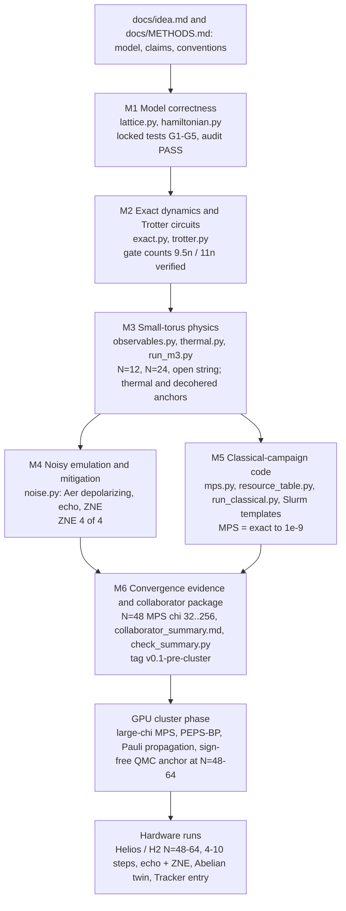

# su2qc-qcadvantage: project report for Digonto

*Prepared 2026-10-06 from the repository state at commit `eab1001` plus the uncommitted background jobs (N=24 batch and N=48 MPS run, still running). All numbers below are read from the committed JSON files in `results/`; nothing was re-computed. Plain English, with every technical term defined at first use.*

## Contents
1. Executive summary
2. The physics and the quantum-advantage argument
3. How the project reaches its goal (pipeline)
4. Repository layout
5. Results by milestone (M1, M2, M3, M4, M5)
6. Data for plotting (every graph, with re-plot code)
7. Known issues and decisions for Digonto
8. What remains (cloud work, then the cluster roadmap)

---

## 1. Executive summary

**What is asked.** The project builds and validates, without a GPU cluster, the code and the evidence for the "SU(2) torus frontier run": simulate a thermalizing quench (a sudden change of the Hamiltonian that sets the system far from equilibrium; it then relaxes) of the minimally truncated $(2+1)$-dimensional SU(2) gauge theory on a periodic lattice (a torus) of 48-64 plaquettes, on trapped-ion quantum computers (Quantinuum Helios and H2) for 7-10 Trotter steps. The aim is a beyond-classical result: a regime where every known classical method is unconverged or inconsistent, while the quantum result is validated by an independent ladder of checks. The cloud phase (milestones M1-M6) stops at tag `v0.1-pre-cluster`; the cluster and hardware phase comes afterwards.

**What was done, by milestone** (status as given by the coordinator):

| Milestone | Content | Status |
|---|---|---|
| M1 | Lattice and Hamiltonian | tests green; independent audit PASS (`reports/audits/m1_audit.md`) |
| M2 | Exact evolution, Trotter circuits, gate counts | tests green; claim of 9.5 two-qubit gates per plaquette per step verified exactly |
| M3 | Small-torus physics (N=12, N=24, open string) | N=12 (18 runs) and open-string done; N=24: three of six runs finished (SU(2) vacuum, neel_half, stripe); the SU(2)-vacuum-abelian run and the other abelian runs are still computing; `summary.json`, figures and `reports/m3_physics.md` do not exist yet |
| M4 | Noisy emulation and error mitigation | tests green; zero-noise extrapolation (ZNE) passes 4 of 4 configurations |
| M5 | MPS code and resource table for the cluster | tests green; MPS equals exact to $1-F\sim10^{-9}$ at N=12 and N=24 |
| M6 | N=48 convergence and collaborator package | tests locked and scripts written (`analyze_convergence.py`, `check_summary.py`, `make_figures.py`, `roadmap.json`); the N=48 MPS run has only just started; `reports/collaborator_summary.md` is not yet written |

**Headline numbers.**
- Two-qubit gates per plaquette per first-order step on a torus: **9.5** (native ZZ) and **11.0** (CZ hardware), exactly as claimed in `docs/idea.md`.
- The 48-plaquette torus needs 456 native-ZZ gates per step; 8 steps are 3648 gates. Raw circuit fidelity $e^{-p_2N_{2q}}$ at 4 steps is 23.7% (Helios, $p_2=7.9\times10^{-4}$), at 10 steps 2.7%.
- Zero-noise extrapolation reduces the electric-energy error by a factor 5.8 to 15 (ZNE error is 0.065 to 0.172 of the raw error, recomputed from the JSON) at 2-10 steps; echo rescaling makes the error 2.6 to 3.8 times worse.
- MPS at bond dimension $\chi=256$ (bond dimension: the size cap on the matrices of the tensor-network state, which sets how much entanglement it can hold) matches the exact N=24 statevector with infidelity $1.1\times10^{-9}$.
- At N=24, $g=1.25$, the stripe and neel_half initial states have exactly the decohered electric energy ($10.5469$), so the thermal and decohered values coincide (inverse temperature $\beta\approx0$). Their electric energy is therefore a poor discriminator at this size (flagged). The vacuum start is the clean case: thermal $E_E=5.154$ against decohered $10.547$.

---

## 2. The physics and the quantum-advantage argument

### 2.1 The model
The model is pure SU(2) Yang-Mills theory in two space dimensions on a **triangular lattice**, in the minimal truncation of Ciavarella, de Putter, Younis and Rrapaj (arXiv:2608.28752). In Hamiltonian lattice gauge theory (LGT) the gauge field lives on the links of the lattice, and the energy has an *electric* part (a cost for flux on each link) and a *magnetic* part (an operator that flips the flux around a *plaquette*, the smallest closed loop; here a triangle). *Gauss's law* forbids flux lines from ending in empty space. The **truncation** keeps only link spins $j\le 1/2$; the **local Krylov** construction generates the allowed states by acting with plaquette operators on the vacuum, so Gauss's law holds automatically.

**One qubit per plaquette.** Qubit $p$ describes plaquette $p$: $|0\rangle$ is unexcited, $|1\rangle$ is excited ($n_p=1$, $Z_p=-1$). The basis index is $b=\sum_p n_p2^p$ (Qiskit little-endian). The number of qubits equals the number of plaquettes, $n=N=2L_1L_2$.

**The honeycomb plaquette graph.** Each triangle shares a link with exactly three others, so the plaquettes form a **honeycomb graph** (bipartite: "up" triangles = sublattice A, "down" triangles = sublattice B). Each unit cell $(i,j)$ owns two plaquettes, with index $p=2(iL_2+j)+\text{kind}$ and $\mathrm{up}(i,j)$ bonded to $\mathrm{down}(i,j)$, $\mathrm{down}(i-1,j)$ and $\mathrm{down}(i,j-1)$. Indices wrap on the torus. Tori used: $N=12$ is $3\times2$, $N=24$ is $4\times3$, the frontier tori are $4\times6$ (48), $4\times7$ (56), $4\times8$ (64) and $6\times8$ (96). The open lattice for the string-breaking check is $3\times4$.

**Hamiltonian.** With $\langle pq\rangle$ the bonds and $nb(p)$ the three neighbours of $p$:

$$H_E=\frac{3g^2}{16}\sum_{\langle pq\rangle}(1-Z_pZ_q)=\frac{g^2}{2}\sum_{\langle pq\rangle}E^2_{pq},\qquad E^2_{pq}=\tfrac38(1-Z_pZ_q),$$

$$H_B=\sum_p a_p X_p,\qquad a_p=-\frac1{g^2}\prod_{q\in nb(p)}c(n_q),\quad c(0)=1,\ c(1)=\tfrac12 .$$

$H_E$ is a ferromagnetic Ising coupling (a flux line is a domain wall). $H_B$ flips plaquette $p$ with amplitude $1/g^2$ **halved for every excited neighbour**; that factor $\tfrac12$ is the SU(2) recoupling and is the only place where the non-Abelian structure survives at this truncation. In Pauli form $c(n_q)=(3+Z_q)/4$, so $H_B=-\frac1{g^2}\sum_p X_p\prod_q\frac{3+Z_q}{4}$. $H_B$ splits into $H_B^A$ and $H_B^B$ (flips on one sublattice each); each part is a sum of mutually commuting terms because the controls sit on the other sublattice.

**The abelian twin.** Setting $c\equiv1$ gives the transverse-field Ising model on the honeycomb graph (the Wegner dual of the $\mathbb Z_2$ gauge theory). It runs on identical qubits at identical depth; the only difference is the factor $\tfrac12$. Comparing the two isolates the non-Abelian effect.

**Stoquastic.** $H$ has only non-positive off-diagonal elements in the $Z$ basis, so its *thermal* properties can be computed classically by sign-free quantum Monte Carlo at any size, while its real-time dynamics cannot.

### 2.2 Circuits and cost
A **Trotter step** approximates $e^{-iH\delta t}$ by a product of exponentials of the parts. Order 1: $U(\delta t)=U_B(\delta t)\,U_A(\delta t)\,U_E(\delta t)$ with $U_E$ first. Order 2: $U_E(\tfrac{\delta t}2)U_A(\tfrac{\delta t}2)U_B(\delta t)U_A(\tfrac{\delta t}2)U_E(\tfrac{\delta t}2)$. $U_E$ is one `rzz` per bond (1.5 per plaquette). Each flip is a *uniformly controlled* $R_z$ (a rotation whose angle depends on the control qubits) built by a Gray code with $2^3=8$ `cx` per plaquette. Total $8+1.5=9.5$ native-ZZ gates per plaquette per step; on CZ hardware an `rzz` costs 2, giving 11.

### 2.3 Observables and anchors
Observables: $\langle Z_p\rangle$, link energies $\langle E^2_{pq}\rangle$, connected $\langle Z_pZ_q\rangle_c$, $\langle H_E\rangle$ (written $E_E$), $\langle H_B\rangle$ ($E_B$), and the closed hexagon string $\langle\prod_{p\in\mathrm{hex}}X_p\rangle$. The total energy $E_E+E_B$ is conserved by the exact dynamics.

Initial product states (all gauge-invariant): `vacuum` (nothing excited), `neel_half` (up plaquettes with $i<\lfloor L_1/2\rfloor$), `stripe` (up plaquettes with even $i$), `string` (a line of excited plaquettes across the open lattice).

**Decohered (infinite-temperature) anchor.** A fully decohered device would give link energy $3/8$, so $\langle H_E\rangle_\infty=\frac{g^2}{2}\cdot\frac38\cdot n_\text{bonds}$ and zero for the other observables. An observable whose true late-time value is close to this cannot show quantum signal over noise, so it is **flagged** if its late-time value is within 10% of the decohered value (the criterion of R. Farrell for the Quantum Advantage Tracker).

**Thermal anchor.** After a quench the system should thermalize (the eigenstate thermalization hypothesis, ETH: a closed chaotic system relaxes to thermal values). The expected late-time value is the canonical average at the inverse temperature $\beta$ for which $\langle H\rangle_\beta$ equals the initial energy ($\beta$ may be negative, which means a state above infinite temperature). For $n\le14$ this uses full diagonalization; for $n=24$ it uses quantum typicality (a random vector $\psi$ gives $\langle\psi|e^{-\beta H/2}Oe^{-\beta H/2}|\psi\rangle/\langle\psi|e^{-\beta H}|\psi\rangle\approx$ the thermal value) with 4 random vectors and at most 8 root-search steps; the energy match is required to 2%.

### 2.4 Why this is a quantum-advantage candidate
No theorem says that real-time dynamics of a Kogut-Susskind gauge theory is hard classically, so "advantage" here means the empirical standard of the 2026 beyond-classical papers: a regime where every known classical method is shown unconverged or mutually inconsistent, while the quantum data pass an independent trust ladder and are posted publicly for classical attack. The case rests on:
- 1+1D SU(2) is already lost to MPS (a laptop MPS with $\chi=800$ reproduced the 120-qubit IBM run).
- Open lattices on 156-qubit IBM chips stay within MPS reach (min-cut $\le13$ bonds). A torus doubles the cut, which is where Quantinuum's 56-qubit periodic Ising run already defeated $\chi=4000$ MPS beyond 9 steps.
- All-to-all trapped-ion connectivity makes the torus free. Helios has 98 qubits at two-qubit infidelity $7.9\times10^{-4}$; H2 has 56 qubits at about $10^{-3}$; IBM Heron has about $1.5\times10^{-3}$.
- The step choice $2\delta t/g^2\approx0.9$ rad, 7-9 steps, reaches $t/g^2\approx3$-4, past the point where classical large-scale methods disagree for near-critical 2D quenches.
- The 96-plaquette torus (about 8000 two-qubit gates for 9 steps) escapes MPS by construction but needs two-qubit error near $4$-$5\times10^{-4}$.

The honest risk, stated in `docs/idea.md`: with 48-64 plaquettes and 7-9 steps the run sits at the same scale as the existing Quantinuum claim, and a very large MPS ($\chi\sim10^5$) might still reproduce it. The claim is about the truncated Hamiltonian ($j_{\max}=1/2$), not the continuum theory.

---

## 3. How the project reaches its goal



**Role of each milestone.**
- **M1** fixes the model and the conventions (bit order, neighbour rule, hexagons). Everything downstream is only as trustworthy as this.
- **M2** provides the exact-time-evolution tools (Chebyshev expansion and `expm_multiply`, both of which apply $e^{-iHt}$ to a vector without building the matrix) and the Trotter circuits, and measures the true gate counts.
- **M3** gives the exact small-size anchors: dynamics at $N=12$ and $N=24$ with thermal and decohered lines, used to choose the coupling, initial state and observables (the flagging step).
- **M4** tests, on the 12-plaquette torus, whether noise at the hardware level can be mitigated at the full-depth frontier gate counts.
- **M5** makes the same circuits runnable as an MPS (classical baseline) and produces the resource table (gates and raw fidelity) for the frontier tori, plus config-driven entry points and Slurm templates with placeholders only.
- **M6** measures where MPS stops converging at N=48 and packages everything (summary, figures, number checker, roadmap).

**Process: builder, reviewer, fixer, and locked tests.**
- The *builder/coordinator* (main session, Sonnet 5.5) writes the code, unit tests, runs, commits and `notes/STATUS.md`.
- The *reviewer* (Opus 5.5) writes the acceptance tests for M4-M6 from the PLAN criteria *before* any implementation, and gives an independent physics and numerics audit at each gate (so far `reports/audits/m1_audit.md`).
- The *fixer* (Opus 5.5) is called only after 3 failed attempts on the same test; if it also fails, the build stops.
- **Locked tests**: acceptance tests for M1-M6 are hashed (sha256) in `tests/acceptance/LOCK.json`; a hook protects them, `tools/check_lock.py` must print `LOCK OK`, and the builder may never edit a locked test (if one looks wrong, the evidence goes to STATUS and the run stops).
- Stop rules: after 3+fixer failures, an uninstallable package, a job beyond 12 GB RAM or 2 h CPU, or a failure of G2, G3, G5 or G8 (which would mean the model or cost claim in `idea.md` is wrong), and after M6.

---

## 4. Repository layout

```text
su2qc-qcadvantage/
├── CLAUDE.md                  project instructions for the coding agent (roles, build loop, stop rules)
├── README.md                  overview and how to reproduce
├── START_HERE.md              how to upload the repo to GitHub and start a cloud session
├── pytest.ini, requirements.txt
├── .gitignore, .claude/       settings, agents (reviewer, fixer), guard hook (protected)
├── claude-setup-backup/       copy of .claude/ and gitignore in case hidden folders are lost
├── docs/
│   ├── idea.md                motivation, hardware fit, resource estimates, 6-9 month plan, references
│   └── METHODS.md             binding specification: lattice, H, circuits, observables, thermal anchors, output schema
├── plan/PLAN.md               milestones M1-M6 with acceptance criteria
├── notes/STATUS.md            progress record, attempt log, decisions waiting for Digonto
├── su2torus/                  the package
│   ├── __init__.py
│   ├── lattice.py             honeycomb plaquette graph on tori/open patches, hexagons, bonds, initial states
│   ├── hamiltonian.py         H_E, H_B, parts H_B^A/H_B^B; sparse, Pauli (Qiskit) and matrix-free numba apply_h (0.55 s/matvec at n=24)
│   ├── exact.py               product states, exact time evolution (Chebyshev, expm_multiply), spectral bounds
│   ├── trotter.py             order-1 and order-2 Trotter circuits (Gray-code controlled Rz, rzz), two-qubit counting
│   ├── observables.py         Z_p, link energies, ZZ connected, H_E, H_B, hexagon X-string; parallel numba kernels above 16 qubits
│   ├── thermal.py             thermal anchors: full diagonalization (n<=14), typicality with Chebyshev exp(-beta H/2) (n=24), root search for beta
│   ├── noise.py               Aer depolarizing + readout noise model, density-matrix emulation, Loschmidt echo, gate folding, ZNE
│   └── mps.py                 quimb CircuitMPS simulation of the same circuits, snake ordering, chi and cutoff, error estimate, GPU flag
├── scripts/
│   ├── gate_counts.py         M2: counts two-qubit gates -> results/m2/gate_counts.json
│   ├── run_m3.py              M3 parts: n12, n24 STATE MODEL, string, assemble (summary.json + figures)
│   ├── run_m3_batch.sh        M3 batch: N=12, string, six N=24 runs, assemble
│   ├── run_m4.py              M4 noisy runs -> results/m4/noise_runs.json (+ figure)
│   ├── resource_table.py      M5: gate and fidelity table for N=48,56,64,96 -> results/m5/resources.json
│   ├── run_m5_check.py        M5: MPS (chi=256) versus exact at N=12, 24 -> results/m5/mps_check.json
│   ├── run_classical.py       config-driven MPS runs (cluster entry point, --dry-run)
│   ├── analyze_convergence.py M6: per-step chi convergence -> results/m6/convergence.json
│   ├── make_figures.py        M6: figures fig1-fig5 -> reports/figures/
│   ├── check_summary.py       M6: verifies every <!--num:FILE#PATH-->VALUE marker in the collaborator summary
│   └── slurm/mps_cpu.sbatch, mps_gpu.sbatch   Slurm templates with <PARTITION>, <ACCOUNT>, <ENV> placeholders
├── configs/
│   ├── n48_stripe_g1.25.json        N=48, dt=0.703125, 8 steps, chi 32/64/128/256, numpy
│   └── n96_stripe_g1.25_gpu.json    N=96 (6x8), chi 256..2048, cupy (cluster)
├── tests/
│   ├── acceptance/            locked: m1 (lattice, H), m2 (exact, Trotter), m3 (observables, outputs), m4, m5, m6; _ref.py, conftest.py, LOCK.json
│   └── unit/                  builder's unit tests (exact, hamiltonian, observables, thermal)
├── tools/                     check_lock.py (verify hashes), lock.py (lock a new milestone)
├── logs/                      m3.log, m4.log, m5_check.log, m6_n48.log (not committed)
├── results/
│   ├── m2/gate_counts.json            16 entries: lattice, model, order, counts per step and per plaquette-step
│   ├── m3/parts/n12.json              18 runs (3 g x 3 states x 2 models), 41 time points each
│   ├── m3/parts/n24_{state}_su2.json  N=24 runs finished so far (25 time points); abelian runs pending
│   ├── m3/parts/bounds_n24_su2.json   spectral bounds of H at N=24 su2: [-5.735, 25.079]
│   ├── m3/parts/string_open_3x4_g1.4.json  open-lattice string quench (29 bonds, 24 plaquettes)
│   ├── m4/noise_runs.json, figures/noise_mitigation.png   noisy emulation + mitigation
│   ├── m5/resources.json              168 rows: torus x gate set x steps x p2
│   ├── m5/mps_check.json              MPS versus exact at N=12, 24
│   └── m6/roadmap.json                five cluster/hardware items
└── reports/
    ├── m2_gate_counts.md      gate-count report
    ├── m4_noise.md            noise and mitigation report
    ├── audits/m1_audit.md     independent M1 audit (PASS)
    ├── figures/               (empty; fig1-fig5 are written by make_figures.py)
    └── project_report.md      this file
```

Not yet existing: `results/m3/summary.json` and `results/m3/figures/` (written by `run_m3.py assemble` after the N=24 batch), `reports/m3_physics.md`, `results/m6/n48_stripe_g1.25.json`, `results/m6/convergence.json`, `reports/collaborator_summary.md`.

---

## 5. Results by milestone

### 5.1 M1: validation facts
(from `reports/audits/m1_audit.md`, verdict **PASS**, no blocking findings)
- Bit order $b=\sum_pn_p2^p$ matches the brute-force reference to about $4\times10^{-15}$ on open (3,3) and (2,3) lattices and on the locked tori.
- Neighbour rule follows METHODS exactly; the graph is bipartite; the hexagon cyclic order was checked by hand (each consecutive pair shares a link).
- $H_E$ equals $(3g^2/8)\times$(number of cut bonds); on a torus it is identical to the $3n_p-\sum n_pn_q$ form (difference 0 on the $3\times2$ torus).
- Flip amplitude $-(1/g^2)\,2^{-m}$ with $m$ the number of excited neighbours; Pauli coefficients $-(1/g^2)\,3^{k-|S|}/4^k$.
- The matrix-free `apply_h` gives numba versus numpy difference 0.0, hermiticity defect $<6\times10^{-17}$ at $n=24$; 0.55 s per warm call with numba, 6-10 s with the numpy fallback.
- Test counts at audit time: 51 passed in `tests/acceptance/m1` plus `tests/unit`; the 9 failures and 24 errors then seen were all in the not-yet-implemented M3.
- Non-blocking: N1 open-lattice $H_E$ ambiguity (see section 7), N2 degenerate tori (fixed: error for $L<2$), N3 memory guard for sparse builders at $n>20$ (fixed), N4 open-lattice hexagons only where complete (convention).

### 5.2 M2: gate counts
Two-qubit gates per plaquette per step, from `results/m2/gate_counts.json` (counted with `count_ops` on the untranspiled circuit; `cx` and `rzz` each 1 for native ZZ, `rzz` = 2 for CZ hardware):

| lattice | model | order | native ZZ / (n step) | CZ / (n step) | per step at n=12 / 24 / 48 (native ZZ) |
|---|---|---|---|---|---|
| torus | SU(2) | 1 | **9.5** | **11.0** | 114 / 228 / 456 |
| torus | SU(2) | 2 | 15.0 | 18.0 | 180 / 360 / 720 |
| torus | abelian | 1 | 1.5 | 3.0 | 18 / 36 / 72 |
| torus | abelian | 2 | 3.0 | 6.0 | 36 / 72 / 144 |
| open 3x4 (n=24) | SU(2) | 1 | 7.0417 | 8.25 | 169 |
| open 3x4 (n=24) | SU(2) | 2 | 11.1667 | 13.583 | 268 |
| open 3x4 (n=24) | abelian | 1 | 1.2083 | 2.4167 | 29 |
| open 3x4 (n=24) | abelian | 2 | 2.4167 | 4.8333 | 58 |

- CZ per step for the SU(2) order-1 torus: 132 / 264 / 528 at $n$ = 12 / 24 / 48.
- Order 2 with consecutive steps merged ($U_E$ half-steps fused) is 13.5 (ZZ) / 15.0 (CZ) per plaquette-step (derived, not built).
- Reading: $1.5n$ bonds give $1.5n$ `rzz`; each plaquette's flip costs $2^3=8$ `cx` (the Gray-code minimum for 3 controls), so $8n+1.5n=9.5n$ and $8n+3n=11n$. The claim is verified exactly. Order 2 costs 1.4-1.6 times as much per step and pays only if it allows steps more than about 1.4 times larger at equal accuracy. The abelian twin costs only the `rzz` layer.

### 5.3 M3: small-torus physics

**What the M3 numbers are.** `E_E(0)` is the initial electric energy; the total energy $E_E+E_B$ is conserved and equals $E_E(0)$ because $E_B(0)=0$ for every product state (for the open string it is conserved to $10^{-14}$). $\beta$ is the inverse temperature of the thermal anchor. "Late-time mean" is the average of the last 5 time points. The time grid is $t\in[0,4g^2]$ (41 points at N=12, 25 points at N=24). The "within 10% of decohered" column is my own evaluation of the flag rule on $E_E$ only (the official flags are written by `assemble`, which has not run).

**N=12 torus ($3\times2$), all 18 runs** (the task text said 36; the file holds 18 = 3 couplings x 3 states x 2 models). Thermal method: full diagonalization.

| g | state | model | $E_E(0)$ | $\beta$ | thermal $E_E$ | thermal $E_B$ | late-time mean $E_E$ | decohered $E_E$ | late $E_E$ within 10% of decohered? |
|---|---|---|---|---|---|---|---|---|---|
| 1.1 | vacuum | su2 | 0.0000 | 1.0999 | 2.8833 | -2.8833 | 3.1378 | 4.0838 | no |
| 1.1 | neel_half | su2 | 2.7225 | 0.4519 | 3.6621 | -0.9396 | 3.7947 | 4.0838 | yes (flag) |
| 1.1 | stripe | su2 | 5.4450 | -0.4595 | 4.5076 | 0.9374 | 4.6571 | 4.0838 | no |
| 1.1 | vacuum | abelian | 0.0000 | 0.4771 | 3.6815 | -3.6815 | 2.1190 | 4.0838 | no |
| 1.1 | neel_half | abelian | 2.7225 | 0.1502 | 3.9459 | -1.2234 | 3.4383 | 4.0838 | no |
| 1.1 | stripe | abelian | 5.4450 | -0.1502 | 4.2216 | 1.2234 | 4.7292 | 4.0838 | no |
| 1.25 | vacuum | su2 | 0.0000 | 1.4480 | 2.4881 | -2.4881 | 2.2541 | 5.2734 | no |
| 1.25 | neel_half | su2 | 3.5156 | 0.6182 | 4.2981 | -0.7824 | 4.3696 | 5.2734 | no |
| 1.25 | stripe | su2 | 7.0312 | -0.6320 | 6.2626 | 0.7687 | 6.4495 | 5.2734 | no |
| 1.25 | vacuum | abelian | 0.0000 | 0.9808 | 4.0095 | -4.0095 | 3.1756 | 5.2734 | no |
| 1.25 | neel_half | abelian | 3.5156 | 0.2768 | 4.8535 | -1.3379 | 4.5355 | 5.2734 | no |
| 1.25 | stripe | abelian | 7.0312 | -0.2768 | 5.6934 | 1.3379 | 6.0113 | 5.2734 | no |
| 1.4 | vacuum | su2 | 0.0000 | 1.6244 | 1.7099 | -1.7099 | 0.7672 | 6.6150 | no |
| 1.4 | neel_half | su2 | 4.4100 | 0.6622 | 4.9390 | -0.5290 | 4.8716 | 6.6150 | no |
| 1.4 | stripe | su2 | 8.8200 | -0.6701 | 8.3065 | 0.5135 | 8.5626 | 6.6150 | no |
| 1.4 | vacuum | abelian | 0.0000 | 1.5672 | 3.0672 | -3.0672 | 2.8134 | 6.6150 | no |
| 1.4 | neel_half | abelian | 4.4100 | 0.4084 | 5.6402 | -1.2302 | 5.5388 | 6.6150 | no |
| 1.4 | stripe | abelian | 8.8200 | -0.4084 | 7.5898 | 1.2302 | 7.6912 | 6.6150 | no |

Readings:
- At $g=1.25$ the vacuum thermalizes to $E_E\approx2.25$ (SU(2)) against the thermal value $2.49$; the abelian vacuum reaches $3.18$ against $4.01$. Finite size (12 plaquettes) leaves visible offsets.
- The stripe state has *negative* $\beta$ at N=12 (its energy is above the infinite-temperature energy $5.2734$): its electric energy stays above the decohered line, which is the useful case for discrimination.
- At $g=1.4$ the SU(2) vacuum relaxes to $0.77$ against thermal $1.71$: slow relaxation, as expected deeper in the strong-coupling regime.
- The neel_half runs sit within 10% of the decohered electric energy for $g=1.1$ SU(2) (3.79 vs 4.08, flagged), and for $g=1.25$ SU(2) it is 4.37 vs 5.27 (not flagged).

**N=24 torus ($4\times3$), $g=1.25$, runs finished so far** (SU(2) only; abelian runs and the assembled summary still pending). Thermal method: typicality with Chebyshev $e^{-\beta H/2}$, 4 vectors, seed 1234.

| g | state | model | $E_E(0)$ | $\beta$ | thermal $E_E$ | thermal $E_B$ | late-time mean $E_E$ (last 5 of 25 points, $t\in[2.5,6.25]$) | late-time mean $E_B$ | decohered $E_E$ | late $E_E$ within 10% of decohered? |
|---|---|---|---|---|---|---|---|---|---|---|
| 1.25 | vacuum | su2 | 0.0000 | 1.44008 | 5.1542 | -5.1562 | 4.3244 | -4.3244 | 10.5469 | no |
| 1.25 | neel_half | su2 | 10.5469 | -0.00003 | 10.5469 | -0.0001 | 10.8529 | -0.3061 | 10.5469 | yes (flag) |
| 1.25 | stripe | su2 | 10.5469 | -0.00028 | 10.5477 | 0.0005 | 10.5857 | -0.0388 | 10.5469 | yes (flag) |

Readings:
- The vacuum is the discriminating case: late-time $E_E=4.32$ (still rising at $t=4g^2$; the thermal value is $5.154$) against the decohered $10.547$; $E_B$ late $-4.32$ against thermal $-5.156$.
- For `neel_half` and `stripe`, the initial energy equals the infinite-temperature energy ($E_E(0)=10.5469$), so $\beta\approx0$ ($-3\times10^{-5}$ and $-2.8\times10^{-4}$), the thermal $E_E$ equals the decohered value, and the late-time $E_E$ is within 10% of it: both are flagged for $E_E$. For these starts, $E_E$ cannot separate a thermalized state from a fully decohered device; only observables that are not at their decohered value (for example link-energy profiles, $E_B$ at 0 versus noise, hexagon strings) would help. This bears directly on the "which initial state and coupling" decision (PLAN M3 asks for `reports/m3_physics.md`, not yet written).

**Open $3\times4$ string, $g=1.4$ (SU(2))**, 24 plaquettes, 29 bonds, excited set $\{4,5,12,13,20,21\}$: $E_E(0)=4.41$, rising to a maximum of about $8.42$ at $t\approx1.6$, then settling to about $6.9$ (late $E_E\approx6.9$, $E_B\approx-2.5$, total $4.41$ conserved). Final point $E_E=7.256$, $E_B=-2.846$ at $t=7.84$. Mean $\langle Z\rangle$ falls from 0.50 to a minimum near 0.22 and recovers to about 0.28.

### 5.4 M4: noisy emulation and mitigation (N=12 torus, stripe, $g=1.25$, $\delta t=0.703125=0.45g^2$, order 1)

Noise: depolarizing $p_2$ on every `cx`/`rzz`, $p_1=3\times10^{-5}$ on one-qubit gates, readout flip $10^{-3}$. Definitions: *global fidelity* $F$ is the probability that the whole circuit runs without an error, predicted as $F_\text{pred}=\prod_\text{gates}(1-\epsilon)$ with $\epsilon_{2q}=\tfrac{15}{16}p_2$, $\epsilon_{1q}=\tfrac34p_1$. The *Loschmidt echo* runs the circuit forward and then exactly backward; the return probability $P=F^2+(1-F^2)/D$, $D=2^{12}$, gives $F_\text{echo}=\sqrt{(P-1/D)/(1-1/D)}$. *Echo rescaling* is $O_\text{mit}=O_\infty+(O_\text{noisy}-O_\infty)/F$ with $O_\infty=5.2734$. *ZNE* folds each gate $G\to G(G^{-1}G)^k$ for noise factors 1, 3, 5 and extrapolates with $\langle O\rangle_0=\tfrac{15}8O_1-\tfrac54O_3+\tfrac38O_5$. All values are exact density-matrix results (no shot noise); the "ideal" is the noiseless Trotter circuit.

| steps | $p_2$ | 2q gates | 1q gates | ideal $H_E$ | raw | echo-rescaled | ZNE (folds 1,3,5 values) | ZNE extrapolated | $F_\text{pred}$ | $F_\text{echo}$ |
|---|---|---|---|---|---|---|---|---|---|---|
| 2 | 0.00079 | 228 | 240 | 6.1378 | 6.1019 | 6.2332 | 6.102, 6.040, 5.983 | 6.1343 | 0.840 | 0.863 |
| 4 | 0.001 | 456 | 480 | 6.5661 | 6.4246 | 6.9514 | 6.425, 6.196, 6.014 | 6.5569 | 0.645 | 0.686 |
| 6 | 0.0015 | 684 | 720 | 6.3286 | 6.0836 | 7.1750 | 6.084, 5.764, 5.576 | 6.2925 | 0.376 | 0.426 |
| 10 | 0.001 | 1140 | 1200 | 6.2695 | 6.0087 | 7.2613 | 6.009, 5.686, 5.509 | 6.2245 | 0.334 | 0.370 |

| steps | $p_2$ | raw error | echo-rescaled error | ZNE error | ZNE error / raw error |
|---|---|---|---|---|---|
| 2 | 0.00079 | 0.0359 | 0.0954 | 0.0035 | 0.099 |
| 4 | 0.001 | 0.1414 | 0.3853 | 0.0091 | 0.065 |
| 6 | 0.0015 | 0.2450 | 0.8464 | 0.0361 | 0.147 |
| 10 | 0.001 | 0.2608 | 0.9918 | 0.0450 | 0.172 |

Reading: $F_\text{echo}$ is within 3-13% of $F_\text{pred}$ (criterion 25%); ZNE meets the "error $\le0.5\times$ raw" criterion in 4 of 4 configurations (needed 3 of 4), with error reductions of 5.8-15 times (recomputed from the JSON and the table above; `reports/m4_noise.md` quotes 7-28, which does not match its own table). Echo rescaling fails (see section 7). A seeded 4000-shot run at 2 steps, $p_2=10^{-3}$ reproduces bit-for-bit (raw $H_E=6.0943$). The $N=16$ lattice and the full $(\text{steps},p_2)$ grid were not run (cost of 6-45 min per density-matrix configuration).

### 5.5 M5: MPS and resource table

**MPS check** (`results/m5/mps_check.json`): $\chi=256$, 4 first-order steps, $g=1.25$, $\delta t=0.2$, stripe, SU(2), cutoff $10^{-12}$. The discarded-weight estimate is the sum of squared singular values dropped during truncation; it is reported per run and decreases with $\chi$ (tested at $\chi=2..64$ in the acceptance test).

| $N$ | torus | state fidelity | $1-F$ | discarded-weight estimate | max bond reached | wall time (s) |
|---|---|---|---|---|---|---|
| 12 | 3x2 | 0.999999999794 | 2.06e-10 | 4.37e-10 | 41 | 2.3 |
| 24 | 4x3 | 0.999999998871 | 1.13e-09 | 3.39e-09 | 204 | 61.4 |

```csv
N,step,time,electric_energy_mps
12,0,0.00,7.031250
12,1,0.20,6.977495
12,2,0.40,6.831862
12,3,0.60,6.632843
12,4,0.80,6.428198
24,0,0.00,10.546875
24,1,0.20,10.560195
24,2,0.40,10.613678
24,3,0.60,10.727234
24,4,0.80,10.902782
```

**Resource table** (`results/m5/resources.json`; first-order SU(2); steps 4-10; $p_2\in\{7.9\times10^{-4},10^{-3},1.5\times10^{-3}\}$ for Helios, H2, Heron; raw fidelity $=e^{-p_2N_{2q}}$ with $N_{2q}$ the total two-qubit count):

| $N$ | torus | native-ZZ gates/step | CZ gates/step | native-ZZ, 4 steps | native-ZZ, 10 steps | CZ, 4 steps | CZ, 10 steps |
|---|---|---|---|---|---|---|---|
| 48 | 4x6 | 456 | 528 | 1824 | 4560 | 2112 | 5280 |
| 56 | 4x7 | 532 | 616 | 2128 | 5320 | 2464 | 6160 |
| 64 | 4x8 | 608 | 704 | 2432 | 6080 | 2816 | 7040 |
| 96 | 6x8 | 912 | 1056 | 3648 | 9120 | 4224 | 10560 |

Raw fidelity $e^{-p_2N_{2q}}$ (percent) for each $p_2$, native-ZZ counting (CZ in brackets):

| $N$ | steps | $p_2=7.9\times10^{-4}$ | $p_2=10^{-3}$ | $p_2=1.5\times10^{-3}$ |
|---|---|---|---|---|
| 48 | 4 | 23.67 (18.85) | 16.14 (12.10) | 6.48 (4.21) |
| 48 | 10 | 2.73 (1.54) | 1.05 (0.51) | 0.11 (0.04) |
| 56 | 4 | 18.62 (14.28) | 11.91 (8.51) | 4.11 (2.48) |
| 56 | 10 | 1.50 (0.77) | 0.49 (0.21) | 0.03 (0.01) |
| 64 | 4 | 14.64 (10.81) | 8.79 (5.98) | 2.60 (1.46) |
| 64 | 10 | 0.82 (0.38) | 0.23 (0.09) | 0.01 (0.00) |
| 96 | 4 | 5.60 (3.55) | 2.60 (1.46) | 0.42 (0.18) |
| 96 | 10 | 0.07 (0.02) | 0.01 (0.00) | 0.00 (0.00) |

Reading: the table equals the M2 per-plaquette counts times $N$ times steps. At $p_2=7.9\times10^{-4}$ the 48-plaquette torus keeps 23.7% raw fidelity at 4 steps and 2.7% at 10 steps; the 96-plaquette torus keeps 5.6% at 4 steps and 0.07% at 10. CZ hardware is about 16% more expensive. Local observables are attenuated less than the global fidelity suggests.

### 5.6 M6 (pending)
`results/m6/roadmap.json` exists (section 8). The N=48 MPS run (config `configs/n48_stripe_g1.25.json`, $g=1.25$, $\delta t=0.703125$, so $2\delta t/g^2=0.9$, 8 first-order steps, $\chi\in\{32,64,128,256\}$) has just started as a background job. `analyze_convergence.py` will then compute, per step, the differences between successive $\chi$: $\Delta E=|E_{\chi'}-E_\chi|$ and $\max_p|\Delta\langle Z_p\rangle|$; converged means $\Delta E\le0.2109$ (1% of the decohered 21.09375) and $\max\Delta Z\le0.01$. The headline is the last step at which $\chi=256$ agrees with $\chi=128$.

---

## 6. Data for plotting

Figures that exist: `results/m4/figures/noise_mitigation.png` only. `results/m3/figures/` has not been created yet (it is written by `python3 scripts/run_m3.py assemble` after the N=24 batch), and `reports/figures/` is empty. Below, every graph is given as data you can paste into any plotting program, then as matplotlib code that reads the JSON files directly. Run snippets from the repository root.

### 6.1 M3 time series (fig 1 and the M3 figures)

**N=12, $g=1.25$, electric energy $E_E(t)$** (columns: `{model}_{state}`; 21 of the 41 points):

```csv
# N=12 torus, g=1.25, E_E(t); t in [0,6.25]; every 2nd of 41 points
t,su2_vacuum,su2_neel_half,su2_stripe,abelian_vacuum,abelian_neel_half,abelian_stripe
0.0000,0.00000,3.51562,7.03125,0.00000,3.51562,7.03125
0.3125,0.78047,3.78608,6.90436,0.78037,3.77575,6.77113
0.6250,2.48465,4.39509,6.59989,2.48107,4.34265,6.20423
0.9375,3.87608,4.92802,6.28806,3.86595,4.80430,5.74258
1.2500,4.20848,5.10460,6.11792,4.25420,4.93393,5.61295
1.5625,3.56975,4.92980,6.14110,3.86205,4.80379,5.74308
1.8750,2.56577,4.60268,6.30740,3.30379,4.61748,5.92939
2.1875,1.85515,4.34902,6.51405,2.98770,4.50955,6.03732
2.5000,1.77889,4.29790,6.66829,2.92327,4.48676,6.06011
2.8125,2.21176,4.43326,6.72368,2.93100,4.49790,6.04898
3.1250,2.75254,4.63410,6.68222,2.90932,4.51155,6.03532
3.4375,3.10363,4.78275,6.57896,2.88610,4.52524,6.02163
3.7500,3.24997,4.84131,6.46348,2.90758,4.53763,6.00924
4.0625,3.29482,4.82538,6.38198,2.96480,4.53984,6.00704
4.3750,3.20847,4.74092,6.35898,3.02376,4.52774,6.01913
4.6875,2.83752,4.58705,6.38730,3.07251,4.51091,6.03596
5.0000,2.20161,4.40816,6.43801,3.11516,4.50596,6.04092
5.3125,1.65754,4.29042,6.48007,3.15315,4.51982,6.02706
5.6250,1.62447,4.28470,6.49068,3.18413,4.53935,6.00752
5.9375,2.18667,4.36330,6.45837,3.19021,4.54155,6.00533
6.2500,3.01641,4.46732,6.39076,3.13800,4.52012,6.02676
```

```csv
# N=12 torus, g=1.25, E_B(t); t in [0,6.25]; every 2nd of 41 points
t,su2_vacuum,su2_neel_half,su2_stripe,abelian_vacuum,abelian_neel_half,abelian_stripe
0.0000,0.00000,0.00000,0.00000,0.00000,0.00000,0.00000
0.3125,-0.78047,-0.27045,0.12689,-0.78037,-0.26012,0.26012
0.6250,-2.48465,-0.87947,0.43136,-2.48107,-0.82702,0.82702
0.9375,-3.87608,-1.41240,0.74319,-3.86595,-1.28867,1.28867
1.2500,-4.20848,-1.58898,0.91333,-4.25420,-1.41830,1.41830
1.5625,-3.56975,-1.41418,0.89015,-3.86205,-1.28817,1.28817
1.8750,-2.56577,-1.08705,0.72385,-3.30379,-1.10186,1.10186
2.1875,-1.85515,-0.83339,0.51720,-2.98770,-0.99393,0.99393
2.5000,-1.77889,-0.78228,0.36296,-2.92327,-0.97114,0.97114
2.8125,-2.21176,-0.91763,0.30757,-2.93100,-0.98227,0.98227
3.1250,-2.75254,-1.11848,0.34903,-2.90932,-0.99593,0.99593
3.4375,-3.10363,-1.26712,0.45229,-2.88610,-1.00962,1.00962
3.7500,-3.24997,-1.32568,0.56777,-2.90758,-1.02201,1.02201
4.0625,-3.29482,-1.30976,0.64927,-2.96480,-1.02421,1.02421
4.3750,-3.20847,-1.22529,0.67227,-3.02376,-1.01212,1.01212
4.6875,-2.83752,-1.07143,0.64395,-3.07251,-0.99529,0.99529
5.0000,-2.20161,-0.89254,0.59324,-3.11516,-0.99033,0.99033
5.3125,-1.65754,-0.77479,0.55118,-3.15315,-1.00419,1.00419
5.6250,-1.62447,-0.76908,0.54057,-3.18413,-1.02373,1.02373
5.9375,-2.18667,-0.84768,0.57288,-3.19021,-1.02592,1.02592
6.2500,-3.01641,-0.95169,0.64049,-3.13800,-1.00449,1.00449
```

```csv
# N=12, g=1.25 horizontal lines: thermal anchor and decohered value
model,state,beta,thermal_EE,thermal_EB,decohered_EE
su2,vacuum,1.44797,2.48808,-2.48808,5.27344
su2,neel_half,0.61822,4.29806,-0.78243,5.27344
su2,stripe,-0.63199,6.26259,0.76866,5.27344
abelian,vacuum,0.98079,4.00946,-4.00946,5.27344
abelian,neel_half,0.27681,4.85352,-1.33789,5.27344
abelian,stripe,-0.27681,5.69336,1.33789,5.27344
```

**N=12 at $g=1.1$ and $g=1.4$, SU(2), $E_E(t)$** (11 of 41 points; the thermal and decohered lines for these couplings are in the table in section 5.3):

```csv
# N=12 su2, g=1.1, E_E(t); every 4th of 41 points (11 points)
t,vacuum,neel_half,stripe
0.0000,0.00000,2.72250,5.44500
0.4840,2.05483,3.44834,5.08694
0.9680,4.34066,4.33446,4.49852
1.4520,4.00928,4.30135,4.34184
1.9360,2.72320,3.89871,4.62439
2.4200,2.40096,3.76775,4.87990
2.9040,3.01208,3.94087,4.88931
3.3880,3.26201,4.01295,4.73547
3.8720,3.12670,3.91861,4.62754
4.3560,3.21050,3.83363,4.64979
4.8400,2.97564,3.75891,4.65355
```
```csv
# N=12 su2, g=1.4, E_E(t); every 4th of 41 points (11 points)
t,vacuum,neel_half,stripe
0.0000,0.00000,4.41000,8.82000
0.7840,2.66924,5.35984,8.36112
1.5680,2.54828,5.42923,8.29956
2.3520,0.89004,4.86117,8.78580
3.1360,2.34450,5.41578,8.67379
3.9200,2.86562,5.61549,8.37415
4.7040,1.18635,4.93454,8.55166
5.4880,1.55014,4.97775,8.62019
6.2720,3.20154,5.43768,8.22996
7.0560,0.75528,4.89105,8.37905
7.8400,1.48914,5.01128,8.68302
```

**N=24, $g=1.25$, SU(2)** (13 of 25 points; the full-resolution data are in `results/m3/parts/n24_*.json`; the abelian N=24 runs will appear once finished):

```csv
# N=24 torus, g=1.25, su2, E_E(t); every 2nd of 25 points
t,vacuum,neel_half,stripe
0.0000,0.00000,10.54688,10.54688
0.5208,3.78366,11.01099,10.65121
1.0417,8.22109,11.33098,11.05991
1.5625,7.09290,10.90966,11.36127
2.0833,4.05383,10.67322,11.21232
2.6042,3.82256,11.02581,10.99887
3.1250,5.56282,11.44404,11.05286
3.6458,6.60961,11.44319,11.22828
4.1667,6.62647,11.13597,11.17385
4.6875,5.36510,10.78260,10.92067
5.2083,3.36504,10.66599,10.66388
5.7292,3.76406,10.87128,10.53440
6.2500,6.34486,11.00590,10.60814
```
```csv
# N=24 torus, g=1.25, su2, E_B(t); every 2nd of 25 points
t,vacuum,neel_half,stripe
0.0000,0.00000,0.00000,0.00000
0.5208,-3.78366,-0.46412,-0.10434
1.0417,-8.22109,-0.78411,-0.51304
1.5625,-7.09290,-0.36278,-0.81439
2.0833,-4.05383,-0.12635,-0.66545
2.6042,-3.82256,-0.47894,-0.45200
3.1250,-5.56282,-0.89717,-0.50598
3.6458,-6.60961,-0.89632,-0.68140
4.1667,-6.62647,-0.58910,-0.62698
4.6875,-5.36510,-0.23572,-0.37379
5.2083,-3.36504,-0.11912,-0.11700
5.7292,-3.76406,-0.32440,0.01248
6.2500,-6.34486,-0.45902,-0.06127
```
```csv
# N=24 horizontal lines
state,beta,thermal_EE,thermal_EB,decohered_EE
vacuum,1.440075,5.15421,-5.15618,10.54688
neel_half,-0.000034,10.54695,-0.00007,10.54688
stripe,-0.000281,10.54771,0.00053,10.54688
```

**Open 3x4 string, $g=1.4$**:

```csv
# Open 3x4 lattice, string state, g=1.4, su2; every 2nd of 41 points
t,E_E,E_B,E_total,Z_mean
0.0000,4.41000,0.00000,4.41000,0.50000
0.3920,5.15157,-0.74157,4.41000,0.46007
0.7840,6.77039,-2.36039,4.41000,0.36705
1.1760,8.08145,-3.67145,4.41000,0.27650
1.5680,8.41559,-4.00559,4.41000,0.22754
1.9600,7.97668,-3.56668,4.41000,0.22256
2.3520,7.36138,-2.95138,4.41000,0.24079
2.7440,6.96636,-2.55636,4.41000,0.26181
3.1360,6.82554,-2.41554,4.41000,0.27676
3.5280,6.81471,-2.40471,4.41000,0.28496
3.9200,6.85372,-2.44372,4.41000,0.28759
4.3120,6.91449,-2.50449,4.41000,0.28594
4.7040,6.96028,-2.55028,4.41000,0.28208
5.0960,6.96449,-2.55449,4.41000,0.27764
5.4880,6.94423,-2.53423,4.41000,0.27244
5.8800,6.92194,-2.51194,4.41000,0.26566
6.2720,6.89460,-2.48460,4.41000,0.25699
6.6640,6.87611,-2.46611,4.41000,0.24591
7.0560,6.92273,-2.51273,4.41000,0.23145
7.4480,7.06920,-2.65920,4.41000,0.21441
7.8400,7.25595,-2.84595,4.41000,0.19939
```

```python
import json, numpy as np, matplotlib.pyplot as plt
R = "results/m3/parts/"
col = {"vacuum": "C0", "neel_half": "C1", "stripe": "C2"}

# (a) N=12 and N=24 electric energy per plaquette, thermal (dashed) and decohered (dotted) lines
runs12 = json.load(open(R + "n12.json"))
runs24 = [json.load(open(R + f"n24_{s}_su2.json")) for s in col]      # add abelian files when done
fig, axs = plt.subplots(2, 2, figsize=(11, 8), sharex=True)
for col_i, (runs, N) in enumerate(((runs12, 12), (runs24, 24))):
    for row_i, model in enumerate(("su2", "abelian")):
        ax = axs[row_i, col_i]
        for r in runs:
            if abs(r["g"] - 1.25) > 1e-9 or r["model"] != model: continue
            c = col[r["state"]]
            ax.plot(np.array(r["times"]) / r["g"]**2, np.array(r["electric_energy"]) / N, c, label=r["state"])
            ax.axhline(r["thermal"]["electric_energy"] / N, color=c, ls="--", lw=1)
            ax.axhline(r["infinite_temperature"]["electric_energy"] / N, color="k", ls=":")
        ax.set_title(f"N={N}, g=1.25, {model}"); ax.set_ylabel(r"$E_E/N$")
        if row_i == 1: ax.set_xlabel(r"$t/g^2$")
axs[0, 0].legend(); plt.tight_layout(); plt.show()

# (b) E_E and E_B together, N=12, SU(2), all three couplings
fig, axs = plt.subplots(1, 3, figsize=(14, 4), sharey=True)
for ax, g in zip(axs, (1.1, 1.25, 1.4)):
    for r in runs12:
        if abs(r["g"] - g) < 1e-9 and r["model"] == "su2":
            ax.plot(r["times"], r["electric_energy"], col[r["state"]], label="E_E " + r["state"])
            ax.plot(r["times"], r["magnetic_energy"], col[r["state"]] + "--")
    ax.set_title(f"g={g}"); ax.set_xlabel("t")
axs[0].legend(fontsize=7); plt.show()

# (c) open-lattice string quench
s = json.load(open(R + "string_open_3x4_g1.4.json"))
plt.plot(s["times"], s["electric_energy"], label="E_E"); plt.plot(s["times"], s["magnetic_energy"], label="E_B")
plt.plot(s["times"], np.array(s["electric_energy"]) + np.array(s["magnetic_energy"]), "k:", label="total")
plt.legend(); plt.xlabel("t"); plt.show()
```

Other per-time arrays in the M3 JSON files for further plots: `link_energies` (per time, per bond), `z` (per time, per plaquette; absent at N=24), `zz_connected_bond0`, `hexagon_x_string`, `times`. Open-string `bonds` lists the 29 bonds.

### 6.2 M4 figure `results/m4/figures/noise_mitigation.png` (also planned fig2)
Left panel: the error $|\langle H_E\rangle-\text{ideal}|$ for raw, echo-rescaled and ZNE per configuration (log scale). The numbers are in the two tables of section 5.4. Raw CSV:

```csv
steps,p2,ideal,raw,rescaled,zne,F_pred,F_echo,zne_fold1,zne_fold3,zne_fold5
2,0.00079,6.13781,6.10188,6.23320,6.13427,0.84002,0.86317,6.10188,6.04041,5.98335
4,0.001,6.56610,6.42463,6.95140,6.55690,0.645,0.686,6.42463,6.19559,6.01394
6,0.0015,6.32860,6.08362,7.17500,6.29250,0.376,0.426,6.08362,5.76434,5.57623
10,0.001,6.26950,6.00872,7.26130,6.22450,0.334,0.370,6.00872,5.68609,5.50881
```
(Values for rows 2-4 are rounded to 4-5 digits from the table in section 5.4; use `results/m4/noise_runs.json` for the full precision.)

```python
import json, numpy as np, matplotlib.pyplot as plt
d = json.load(open("results/m4/noise_runs.json")); cs = d["configs"]
x = np.arange(len(cs)); lab = [f"{c['steps']} steps\np2={c['p2']:g}" for c in cs]
for key, name, off in (("raw_electric_energy", "raw", -0.2), ("rescaled_electric_energy", "echo-rescaled", 0),
                       ("zne_electric_energy", "ZNE", 0.2)):
    plt.bar(x + off, [abs(c[key] - c["ideal_electric_energy"]) for c in cs], 0.2, label=name)
plt.xticks(x, lab); plt.yscale("log"); plt.ylabel("|H_E - ideal|"); plt.legend(); plt.show()
# fidelity panel: c["F_predicted"] vs c["F_echo"]
```

### 6.3 Planned fig3: resource table / raw fidelity (`results/m5/resources.json`)
One line per (torus, gate set, steps); fidelity $=e^{-p_2N_{2q}}$ for $p_2=7.9\times10^{-4},10^{-3},1.5\times10^{-3}$:

```csv
N,gate_set,steps,n_2q,fid_p2_7.9e-4,fid_p2_1e-3,fid_p2_1.5e-3
48,native_zz,4,1824,0.23670,0.16138,0.06483
48,native_zz,5,2280,0.16510,0.10228,0.03271
48,native_zz,6,2736,0.11516,0.06483,0.01651
48,native_zz,7,3192,0.08032,0.04109,0.00833
48,native_zz,8,3648,0.05603,0.02604,0.00420
48,native_zz,9,4104,0.03908,0.01651,0.00212
48,native_zz,10,4560,0.02726,0.01046,0.00107
48,cz,4,2112,0.18853,0.12100,0.04209
48,cz,5,2640,0.12423,0.07136,0.01906
48,cz,6,3168,0.08186,0.04209,0.00863
48,cz,7,3696,0.05394,0.02482,0.00391
48,cz,8,4224,0.03554,0.01464,0.00177
48,cz,9,4752,0.02342,0.00863,0.00080
48,cz,10,5280,0.01543,0.00509,0.00036
56,native_zz,4,2128,0.18617,0.11908,0.04109
56,native_zz,5,2660,0.12229,0.06995,0.01850
56,native_zz,6,3192,0.08032,0.04109,0.00833
56,native_zz,7,3724,0.05276,0.02414,0.00375
56,native_zz,8,4256,0.03466,0.01418,0.00169
56,native_zz,9,4788,0.02277,0.00833,0.00076
56,native_zz,10,5320,0.01495,0.00489,0.00034
56,cz,4,2464,0.14276,0.08509,0.02482
56,cz,5,3080,0.08776,0.04596,0.00985
56,cz,6,3696,0.05394,0.02482,0.00391
56,cz,7,4312,0.03316,0.01341,0.00155
56,cz,8,4928,0.02038,0.00724,0.00062
56,cz,9,5544,0.01253,0.00391,0.00024
56,cz,10,6160,0.00770,0.00211,0.00010
64,native_zz,4,2432,0.14642,0.08786,0.02604
64,native_zz,5,3040,0.09057,0.04783,0.01046
64,native_zz,6,3648,0.05603,0.02604,0.00420
64,native_zz,7,4256,0.03466,0.01418,0.00169
64,native_zz,8,4864,0.02144,0.00772,0.00068
64,native_zz,9,5472,0.01326,0.00420,0.00027
64,native_zz,10,6080,0.00820,0.00229,0.00011
64,cz,4,2816,0.10811,0.05984,0.01464
64,cz,5,3520,0.06199,0.02960,0.00509
64,cz,6,4224,0.03554,0.01464,0.00177
64,cz,7,4928,0.02038,0.00724,0.00062
64,cz,8,5632,0.01169,0.00358,0.00021
64,cz,9,6336,0.00670,0.00177,0.00007
64,cz,10,7040,0.00384,0.00088,0.00003
96,native_zz,4,3648,0.05603,0.02604,0.00420
96,native_zz,5,4560,0.02726,0.01046,0.00107
96,native_zz,6,5472,0.01326,0.00420,0.00027
96,native_zz,7,6384,0.00645,0.00169,0.00007
96,native_zz,8,7296,0.00314,0.00068,0.00002
96,native_zz,9,8208,0.00153,0.00027,0.00000
96,native_zz,10,9120,0.00074,0.00011,0.00000
96,cz,4,4224,0.03554,0.01464,0.00177
96,cz,5,5280,0.01543,0.00509,0.00036
96,cz,6,6336,0.00670,0.00177,0.00007
96,cz,7,7392,0.00291,0.00062,0.00002
96,cz,8,8448,0.00126,0.00021,0.00000
96,cz,9,9504,0.00055,0.00007,0.00000
96,cz,10,10560,0.00024,0.00003,0.00000
```

```python
import json, matplotlib.pyplot as plt
d = json.load(open("results/m5/resources.json"))
fig, axs = plt.subplots(1, 2, figsize=(12, 4.5), sharey=True)
for ax, gs in zip(axs, ("native_zz", "cz")):
    for k, t in enumerate(d["tori"]):
        for p, ls in zip(d["p2_values"], ("-", "--", ":")):
            rows = sorted((r for r in d["rows"] if r["N"] == t["N"] and r["gate_set"] == gs
                           and abs(r["p2"] - p) < 1e-15), key=lambda r: r["steps"])
            ax.plot([r["steps"] for r in rows], [r["raw_fidelity"] for r in rows], ls, color=f"C{k}",
                    label=f"N={t['N']}, p2={p:g}")
    ax.set_yscale("log"); ax.set_xlabel("first-order steps"); ax.set_title(gs)
axs[0].legend(fontsize=7, ncol=2); plt.show()
```

### 6.4 Planned fig1, fig2, fig3, fig4, fig5 and their data sources
| Figure | Planned content | Data source | Status of the data |
|---|---|---|---|
| fig1 `fig1_exact_dynamics.png` | exact N=12 and N=24 $E_E/N$ at $g=1.25$ with thermal and decohered lines, SU(2) and abelian | `results/m3/summary.json` (tables 6.1 above give the same data) | N=12 complete; N=24 SU(2) complete, abelian pending |
| fig2 `fig2_noise_mitigation.png` | raw versus echo-rescaled versus ZNE error, and $F_\text{pred}$ versus $F_\text{echo}$ | `results/m4/noise_runs.json` (section 6.2) | complete |
| fig3 `fig3_resources.png` | raw fidelity versus steps for N=48, 56, 64, 96, native ZZ and CZ | `results/m5/resources.json` (section 6.3) | complete |
| fig4 `fig4_mps_convergence.png` | N=48 $E_E(t)$ per $\chi$, $\Delta E$ and $\max\Delta Z$ between successive $\chi$, discarded weight per step | `results/m6/n48_stripe_g1.25.json`, `results/m6/convergence.json` | **not yet produced**; run in progress |
| fig5 `fig5_cluster_roadmap.png` | table of cluster and hardware items | `results/m6/roadmap.json` (section 8.2) | complete |

Re-plot code for fig4 once the N=48 data exist (schemas fixed by the locked tests: per-$\chi$ runs with `times`, `electric_energy`, `z`, `error_estimate_per_step`; `convergence.json` with `steps[k].d_electric_energy`, `d_z_max`, `pairs`, `tol_electric_energy`, `tol_z`):

```python
import json, numpy as np, matplotlib.pyplot as plt
run = json.load(open("results/m6/n48_stripe_g1.25.json")); conv = json.load(open("results/m6/convergence.json"))
fig, axs = plt.subplots(1, 3, figsize=(15, 4.5))
for r in sorted(run["runs"], key=lambda r: r["chi"]):
    axs[0].plot(r["times"], r["electric_energy"], "o-", ms=3, label=f"chi={r['chi']}")
    axs[2].semilogy(np.maximum(r["error_estimate_per_step"], 1e-16), "o-", ms=3, label=f"chi={r['chi']}")
steps = [s["step"] for s in conv["steps"]]
for i, (a, b) in enumerate(conv["pairs"]):
    axs[1].semilogy(steps, np.maximum([s["d_electric_energy"][i] for s in conv["steps"]], 1e-16), "o-", label=f"dE {a}->{b}")
    axs[1].semilogy(steps, np.maximum([s["d_z_max"][i] for s in conv["steps"]], 1e-16), "s--", label=f"max dZ {a}->{b}")
axs[1].axhline(conv["tol_electric_energy"], color="k"); axs[1].axhline(conv["tol_z"], color="k", ls="--")
for a in axs: a.legend(fontsize=7)
plt.show()
```

The repository's own `python3 scripts/make_figures.py` regenerates all five once the missing JSON files exist.

---

## 7. Known issues and decisions for Digonto

1. **Open-lattice $H_E$ form (audit N1; decision needed).** METHODS writes $H_E=\frac{3g^2}{8}\sum_p(3n_p-\sum_qn_pn_q)$ and equates it to the bond form $\frac{3g^2}{16}\sum_{\langle pq\rangle}(1-Z_pZ_q)$. These are equal only when every plaquette has three neighbours (tori). On an open lattice the $3n_p$ form adds $\frac{3g^2}{8}\sum_p(3-\deg p)n_p$, the energy of the boundary links with vacuum outside (the same assumption the code makes in $H_B$ by setting $c=1$ for missing neighbours). For the open string at $g=1.4$: $E_E(0)=4.41$ (bond form, used by code and locked tests) versus $5.88$ ($3n_p$ form). The code cannot change unilaterally because the locked tests use the bond form. The comparison with Ciavarella's open-lattice string-breaking curves may need the $3n_p$ form (an optional `boundary="vacuum"` flag). The torus runs are unaffected. Also, METHODS should read "= (torus)".
2. **Git tags do not reach the remote.** The proxy accepts branch pushes only; `git push origin <tag>` silently does nothing. Locally, `git tag` currently lists only `m1-done`; tags for M2-M5 are not present, and `v0.1-pre-cluster` will have the same problem. The coordinator will need another way (for example creating the tags through the GitHub interface or the GitHub API) or you accept branch-commit references instead.
3. **Typicality replaced by Chebyshev.** METHODS section 5 asks for `expm_multiply` in the typicality estimate; at $n=24$ it took about 186 s per vector per $\beta$, too slow for the budget. The N=24 anchors use an imaginary-time Chebyshev expansion of $e^{-\beta H/2}$ (same result to $10^{-9}$ in a unit test; spectral bounds $[-5.735,\,25.079]$) with a bracketed false-position (Illinois) root search for $\beta$, at most 8 evaluations. The energy match achieved is better than the 2% requirement (e.g. stripe $E=10.5482$ against target $10.5469$). Typicality uses only 4 random vectors, so the thermal $E_E$ carries a statistical uncertainty that has not been quantified.
4. **Global rescaling fails; ZNE works.** Dividing by the echo fidelity $F$ overcorrects, making the error 2.6-3.8 times larger. A single depolarizing error damages only a few local link energies, so $\langle H_E\rangle$ moves toward its decohered value far more slowly than $F$ decays. Global-fidelity rescaling is therefore not suited to local observables; use ZNE or observable-specific decay factors. The recorded method is `mitigation_method: "zne"`. With real shots, ZNE amplifies statistical noise by about 2.3. Noise in M4 is purely depolarizing and Markovian: coherent errors, crosstalk and leakage are not modelled.
5. **$\delta t=0.2$ in the M5 check versus $\delta t\approx0.7$ in M6.** The $\chi=256$ MPS agreement (infidelity $\sim10^{-9}$, max bond 204 at N=24) was shown with $\delta t=0.2$, where entanglement is small. The frontier choice $2\delta t/g^2\approx0.9$ gives $\delta t=0.703125$, which builds entanglement far faster. The M5 numbers therefore do not predict M6 convergence; they only validate the code. The MPS snake order (lines along the shorter torus side) was chosen from a $\delta t=0.2$ Schmidt-tail comparison.
6. **N=48 runtime risk.** The N=48 MPS run covers 4 values of $\chi$ at $\delta t=0.703125$ for 8 steps. The N=24 $\chi=256$ run took 61 s for 4 steps at $\delta t=0.2$; N=48 with larger entanglement and gate counts (456 per step) can be dramatically slower, and the machine is shared with the N=24 batch (the running N=24 abelian job uses about 6.7 GB resident memory, 40% of RAM). The rule limits each run to 2 h and 12 GB; the MPS itself is small in memory (about $48\cdot2\cdot\chi^2\cdot16$ bytes $\approx100$ MB at $\chi=256$), so time is the risk. If $\chi=256$ exceeds the limit, the per-step record at lower $\chi$ plus a note is the fallback; STOP rules apply.
7. **N=24 stripe and neel_half have $\beta\approx0$** (section 5.3): $E_E$ is flagged for both. Choosing the frontier state needs observables other than $E_E$, or a different coupling/state; this should be decided in `reports/m3_physics.md`.
8. **Smaller points.** The N=16 lattice was not run in M4. N=12 is $3\times2$: with only 3 cells in one direction, finite-size offsets between late-time and thermal values are large. All noise numbers are for 12 qubits; the extrapolation to 48+ qubits rests on the gate-count scaling. `results/m3/summary.json` flags are not yet generated.

---

## 8. What remains

### 8.1 Cloud work (before the stop at `v0.1-pre-cluster`)
1. **Finish M3 at N=24.** Running now: `scripts/run_m3_batch.sh` has finished SU(2) vacuum, neel_half and stripe, and is computing the abelian vacuum (then abelian neel_half and stripe; the typicality step took about 44 min for the stripe run). Then `python3 scripts/run_m3.py assemble` writes `results/m3/summary.json`, the flags and at least six figures to `results/m3/figures/`. Write `reports/m3_physics.md` (what the curves show, flagged observables, the best initial state and coupling for the frontier run). Run the M3 gate (full test suite, reviewer audit).
2. **M6 N=48 $\chi$ convergence.** The background run `scripts/run_classical.py --config configs/n48_stripe_g1.25.json` writes `results/m6/n48_stripe_g1.25.json`; then `scripts/analyze_convergence.py`.
3. **Collaborator summary.** Write `reports/collaborator_summary.md` (plain English, LaTeX, glossary, figures fig1-fig5 each followed by a caption naming its data file, every quoted number tagged `<!--num:FILE#PATH-->VALUE`); run `scripts/make_figures.py` and `scripts/check_summary.py`; update the README reproduction section; run the M4-M6 gates; tag `v0.1-pre-cluster` (see the tag issue in section 7). Then stop.

### 8.2 Cluster and hardware roadmap (`results/m6/roadmap.json`)
| key | title | $N$ | purpose | needs |
|---|---|---|---|---|
| `mps_large_chi` | Large-bond-dimension MPS (GPU) | 48, 56, 64, 96 | push the $\chi$-convergence frontier of the cloud N=48 study ($\chi\le256$) to $\chi=1024$-4096, step by step, to locate where MPS fails for 4-10 first-order steps | GPU nodes (cupy/torch backend of `su2torus.mps`), `configs/n96_stripe_g1.25_gpu.json`, `scripts/slurm/mps_gpu.sbatch` |
| `peps_bp` | PEPS with belief-propagation gauging | 48, 64, 96 | 2D tensor-network simulation of the same circuits (PEPS: a grid-shaped tensor network; belief propagation: an approximate contraction, exact on trees); native to the honeycomb geometry, no long-range MPS bonds across the torus | new PEPS driver, GPU memory for bond dimension $D=4$-16 |
| `pauli_propagation` | Pauli propagation of local observables | 48, 64, 96 | Heisenberg-picture truncated Pauli-path simulation of $\langle Z_p\rangle$ and link energies; failure mode complementary to MPS (operator growth instead of entanglement) | code with weight/coefficient truncation, many CPU cores |
| `qmc_thermal_anchor` | Sign-free QMC thermal anchor | 48, 56, 64 | the late-time thermal value at N=48-64 ($H$ is stoquastic, verified in M1), replacing exact diagonalization and typicality used up to N=24 | stochastic-series-expansion or path-integral QMC for this Hamiltonian; CPU hours |
| `hardware_runs` | Quantum hardware runs | 48, 56, 64 | run 4-10 step circuits (456-608 native-ZZ two-qubit gates per step) with echo and ZNE mitigation and compare with the classical frontier | trapped-ion (native ZZ) or superconducting (CZ) device time; $p_2\le10^{-3}$ for useful raw fidelity at 4 steps |

After the cloud phase, the 6-9 month programme in `docs/idea.md` continues: calibrate on the Quantinuum emulator and the 24-plaquette torus (where exact diagonalization gives ground truth at the frontier depth); frontier runs at N=48 and 56, 6-10 steps, two couplings, 2-3 initial states, the abelian twin at identical depth and to 20-30 steps, the unperturbed echo at full depth; a cross-platform check on IBM Heron (geometric encoding, open 8x8); the classical campaign (MPS $\chi\sim10^4$, PEPS, Pauli propagation) recording where each method stops converging; the trust ladder (controlled noise changes, cross-device reproducibility, convergence in mitigation parameters, agreement with exact N=24, energy conservation); submission to the Quantum Advantage Tracker. The scale-up to 96 plaquettes needs about 8000 two-qubit gates for 9 steps, i.e. two-qubit error near $4$-$5\times10^{-4}$.
